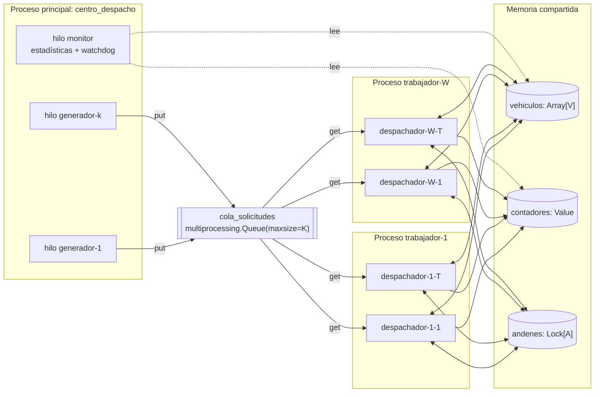

# Bitácora técnica — Proyecto 6: Sistema de despacho y logística

> Documento vivo. Se actualiza al cerrar cada fase. Sirve como fuente para el informe técnico
> y como guía para la demostración/sustentación. Cada sección de fase contiene:
> **Qué se hizo · Decisiones y justificación · Conceptos de SO · Cómo ejecutarlo ·
> Qué observar y cómo explicarlo · Evidencias.**

## Índice
- [0. Contexto, entorno y diseño](#fase-0--contexto-entorno-y-diseño)
- [1. Procesos](#fase-1--procesos) ✅
- [2. Hilos y productor-consumidor](#fase-2--hilos-y-productor-consumidor) *(pendiente)*
- [3. Condición de carrera](#fase-3--condición-de-carrera) *(pendiente)*
- [4. Corrección por sincronización](#fase-4--corrección-por-sincronización) *(pendiente)*
- [5. Interbloqueo](#fase-5--interbloqueo) *(pendiente)*
- [6. CPU y memoria](#fase-6--cpu-y-memoria) *(pendiente)*
- [7. Registro y observación](#fase-7--registro-y-observación) *(pendiente)*
- [8. Experimentos y comparación antes/después](#fase-8--experimentos-y-comparación-antesdespués) *(pendiente)*
- [9. Guion de demostración y sustentación](#fase-9--guion-de-demostración-y-sustentación) *(pendiente)*
- [Anexo A. Matriz de trazabilidad](#anexo-a-matriz-de-trazabilidad)
- [Anexo B. Glosario de comandos del SO usados](#anexo-b-comandos-del-so)

---

## Fase 0 — Contexto, entorno y diseño

### 0.1 Problema
Una empresa de transporte recibe solicitudes de despacho. Cada solicitud debe:
**recibirse → asignarse a un vehículo disponible → procesarse en el centro de despacho →
registrarse como entregada.** En alta demanda aparecen tres síntomas que el sistema debe
reproducir, explicar y corregir:

| Síntoma reportado | Causa de SO que lo explica | Dónde se trata |
|---|---|---|
| Dos solicitudes asignadas al mismo vehículo | Condición de carrera *check-then-act* (TOCTOU) sobre el estado compartido de vehículos | Fases 3 y 4 |
| Despachos que quedan esperando | Interbloqueo por adquisición de recursos en orden distinto (y/o inanición si no hay vehículos) | Fase 5 |
| CPU elevada con muchas solicitudes | Tarea CPU-bound (cálculo de rutas) + espera activa; límites del GIL en hilos | Fases 4 y 6 |

### 0.2 Entorno de ejecución (real, verificado)
| Elemento | Valor |
|---|---|
| SO | Linux (Arch), kernel 7.1.8-arch1-3 |
| CPU | 4 núcleos lógicos (`nproc`) |
| Lenguaje | Python 3.14.7 (CPython) |
| GIL | **Activo** (`sys._is_gil_enabled() → True`) |
| Nombres de hilo | Python 3.14 propaga `Thread(name=...)` al kernel: visible en `/proc/<pid>/task/<tid>/comm`, `ps -L`, `top -H` (verificado) |
| Herramientas | `ps`, `pstree`, `top`, `htop`, `/proc` |

> Nota para el informe: que el nombre del hilo sea visible en el kernel permite relacionar
> **directamente** cada hilo del programa con su LWP en `ps -eLf`, lo que refuerza la evidencia
> de que los hilos de Python son hilos reales del SO (modelo 1:1, `clone()` con `CLONE_THREAD`).

### 0.3 Decisiones de diseño y justificación

**D1. Procesos para los trabajadores.** Cada trabajador es un proceso (`multiprocessing.Process`)
con su propio espacio de direcciones y su propio GIL. Motivos: (a) el enunciado lo exige;
(b) aislamiento de fallos; (c) la tarea intensiva en CPU (cálculo de ruta) sólo se ejecuta en
paralelo real entre procesos, porque con GIL activo los hilos de un mismo proceso no ejecutan
bytecode Python simultáneamente.

**D2. Hilos dentro de cada trabajador.** Cada trabajador lanza T hilos despachadores. Motivo: la
mayor parte del ciclo de vida de una solicitud es **espera** (despacho y entrega simulados con
`sleep`). Durante `sleep` el hilo libera el GIL y queda en estado `S` en el kernel, así que muchos
hilos atienden muchas solicitudes con bajo costo (menos memoria y cambio de contexto más barato
que un proceso por solicitud).

**D3. Estado compartido en memoria compartida real.** Los vehículos se representan con
`multiprocessing.Array('i', V)` (memoria compartida `mmap` heredada por `fork`): `0` = libre,
`n > 0` = id de la solicitud asignada. Se prefiere a `Manager()` porque el `Manager` ejecuta un
proceso servidor que serializa las operaciones y **ocultaría** la condición de carrera; con
memoria compartida la carrera es real entre procesos e hilos.

**D4. Cola productor-consumidor acotada.** `multiprocessing.Queue(maxsize=K)`: los productores
(hilos generadores del proceso principal) se bloquean cuando la cola está llena y los consumidores
(hilos despachadores de los trabajadores) cuando está vacía. Internamente usa un *pipe* y
semáforos del SO. La cota K modela capacidad finita y aplica *backpressure*.

**D5. Llegada simultánea.** Los productores se sincronizan con `threading.Barrier` para liberar
una ráfaga de solicitudes en el mismo instante (requisito 6).

**D6. Fenómenos activables por parámetro.** Un único código con banderas
(`--modo inseguro|seguro`, `--interbloqueo sin_orden|orden|timeout`) preserva la versión con el
problema y la corregida, y garantiza que la comparación antes/después use exactamente la misma
carga (misma `--semilla`).

**D7. Terminación ordenada.** Centinelas (*poison pill*) en la cola y `join()` de todos los
procesos e hilos, para no dejar procesos huérfanos ni zombis. (Implementación del cierre de
procesos y sus casos de fallo: Fase 1, D1.4–D1.8.)

**D8. Método de inicio `fork`.** Python 3.14 usa `forkserver` por defecto en Linux, lo que
cambia el PPID de los trabajadores. Se fija `fork` (ver Fase 1, D1.1 y evidencia E4).

### 0.4 Diagrama de arquitectura



### 0.5 Jerarquía de procesos esperada

```
centro_despacho(P)            ← proceso principal
 ├─{generador-1..k}           ← hilos (mismo PID, distinto TID)
 ├─{monitor}
 ├─trabajador-1(P1, PPID=P)
 │   └─{despachador-1-1..T}
 ├─trabajador-W(PW, PPID=P)
 │   └─{despachador-W-1..T}
 └─(resource_tracker / hilo alimentador de la Queue: auxiliares de multiprocessing)
```
> Explicación esperable en la sustentación: `multiprocessing.Queue` crea un hilo interno
> "feeder" en cada proceso que hace `put` (aparecerá en `ps -L` desde la Fase 2). El proceso
> auxiliar `resource_tracker` sólo aparece con `forkserver`/`spawn`; con `fork` no se crea
> (verificado en la Fase 1, evidencias E1 y E4).

### 0.6 Hilos identificados
| Hilo | Proceso | Rol | Estado típico en el kernel |
|---|---|---|---|
| `generador-i` | principal | Productor: crea solicitudes y las encola | `S` (bloqueado en Barrier o cola llena) |
| `monitor` | principal | Estadísticas periódicas, watchdog de interbloqueo | `S` (sleep) |
| `despachador-w-t` | trabajador w | Consumidor: asigna vehículo, calcula ruta, despacha, entrega | `R` en cálculo de ruta; `S` en sleep/locks |
| `MainThread` | cada proceso | Crea/espera hilos (`join`) | `S` |

### 0.7 Recursos compartidos y secciones críticas
| Recurso | Tipo | Compartido entre | Sección crítica | Mecanismo (versión corregida) |
|---|---|---|---|---|
| `cola_solicitudes` | Cola acotada | Proceso principal y trabajadores | `put`/`get` | Interna de `multiprocessing.Queue` (pipe + lock + semáforo) |
| `vehiculos[V]` | Arreglo compartido | Todos los despachadores de todos los trabajadores | Buscar libre + marcar ocupado; liberar | `multiprocessing.Lock` + `Semaphore(V)` |
| Contadores | `Value`/`Array` | Todos | Incrementos `x += 1` (leer-modificar-escribir) | Lock asociado al `Value` |
| `andenes[A]` | Locks | Despachadores | Carga/descarga | Orden global de adquisición / timeout |

### 0.8 Posibles situaciones de bloqueo (identificadas a priori)
1. **Interbloqueo vehículo↔andén**: despacho toma vehículo y luego andén; retorno toma andén y
   luego vehículo → espera circular posible.
2. **Inanición de solicitudes**: si hay más solicitudes que vehículos y la política no es FIFO,
   una solicitud podría esperar indefinidamente.
3. **Bloqueo en la terminación**: un proceso que termina con datos aún en el búfer de la
   `Queue` puede bloquear el `join` (comportamiento documentado de `multiprocessing`). Se evita
   consumiendo hasta el centinela.
4. **Espera activa** (*busy waiting*) cuando no hay vehículos libres → consumo de CPU sin
   progreso. Se reemplaza por bloqueo en semáforo.

---

## Fase 1 — Procesos

> Rama `fase-1-procesos` · etiqueta `fase-1` · evidencias en `evidencias/fase1/`

### 1.1 Qué se hizo
- Proceso principal `centro_despacho` que crea **W procesos trabajadores**, espera a que estén
  listos, registra la jerarquía leída de `/proc`, los supervisa y los cierra ordenadamente.
- Registro de eventos común a todos los procesos con `PID | PPID | TID | proceso | hilo`.
- Manejo de señales: `SIGINT` (Ctrl+C) y `SIGTERM` en el principal; los trabajadores ignoran
  `SIGINT`. Detección de trabajadores caídos, recolección de zombis, escalamiento
  `SIGTERM → SIGKILL` y detección de orfandad.
- Script de observación del SO (`scripts/observar.sh`) y script que reproduce los escenarios de
  la fase (`scripts/evidencias_fase1.sh`).
- Experimento aislado del hallazgo H1 (`experimentos/h1_event_bloqueado.py`).

### 1.2 Estructura del código
| Archivo | Responsabilidad |
|---|---|
| `main.py` | Punto de entrada: lee argumentos y ejecuta el centro de despacho; su código de salida es el del sistema |
| `despacho/config.py` | Parámetros de la línea de comandos (`Config`, inmutable) |
| `despacho/centro.py` | Proceso principal: creación, sincronización de arranque, supervisión y cierre de trabajadores |
| `despacho/trabajador.py` | Código que ejecuta cada proceso hijo |
| `despacho/registro.py` | Registro con identidad del SO (PID, PPID, TID nativo) a consola y archivo |
| `despacho/so_utils.py` | Acceso a `/proc` (estado, hilos, memoria, CPU), nombre del proceso, volcado de pilas, traducción de señales |
| `scripts/observar.sh` | Captura `pstree`, `ps -o`, `ps -eLf`, `ps -L`, `/proc/<pid>/status` y `smaps_rollup` |
| `scripts/evidencias_fase1.sh` | Reproduce los escenarios E1–E5 y guarda las salidas |

Parámetros disponibles (`python3 main.py --help`):

| Parámetro | Defecto | Significado |
|---|---|---|
| `-w, --trabajadores` | 2 | Número de procesos trabajadores |
| `-d, --duracion` | 5 | Segundos de ejecución; `0` = hasta Ctrl+C o `SIGTERM` |
| `--metodo-inicio` | `fork` | `fork`, `forkserver` o `spawn` |
| `--latido` | 1 | Segundos entre latidos de cada trabajador |
| `--espera-fin` | 3 | Tiempo de gracia antes de `SIGTERM` y luego antes de `SIGKILL` |
| `--log` | `logs/despacho_<fecha>.log` | Archivo de registro |

### 1.3 Ciclo de vida implementado

```mermaid
sequenceDiagram
    participant T as Terminal / kill
    participant P as centro_despacho
    participant W as trabajador-i
    P->>P: nombrar_proceso() → /proc/self/comm
    P->>P: SIGINT = SIG_IGN (temporal)
    P->>W: fork() × W  (hereda SIG_IGN para SIGINT)
    P->>P: restaura SIGINT, instala manejadores SIGINT/SIGTERM
    W->>W: nombrar_proceso(), registro, faulthandler(SIGUSR1)
    W-->>P: listos.release()  (Semaphore)
    P->>P: listos.acquire() × W (máx. 10 s) → SINCRONIZADO
    P->>P: registrar jerarquía (/proc)
    loop cada 0.2 s
        P->>W: is_alive() → waitpid(WNOHANG)
        W->>W: latido; revisa detener y getppid()
    end
    T->>P: SIGINT / SIGTERM / fin de duración
    P->>W: detener.value = 1 (memoria compartida)
    W-->>P: exit(0)
    P->>P: join(espera_fin) → SIGTERM → join → SIGKILL → join
    P->>P: RESUMEN + verificación en /proc
```

### 1.4 Decisiones de diseño de la fase (y su justificación)

**D1.1 Método de inicio `fork` explícito.** *Hallazgo verificado:* en Python 3.14 el método por
defecto en Linux cambió a **`forkserver`**. Con él, el principal lanza (con `exec`) un proceso
servidor y es ese servidor quien hace `fork()` de cada trabajador; el PPID de los trabajadores
es el servidor y no el centro de despacho (evidencia E4). Como el requisito es reconstruir la
jerarquía por PID/PPID, se fija `fork`: el trabajador es hijo directo del principal. La opción
`--metodo-inicio` permite mostrar la diferencia en la demostración.

**D1.2 Crear los procesos antes que cualquier hilo.** `fork()` sólo duplica el hilo que lo
invoca. Si otro hilo del padre tuviera tomado un lock (por ejemplo, el del registro), el hijo
heredaría ese lock tomado sin que exista ningún hilo que lo libere → bloqueo en el hijo. Por eso
los hilos del principal (fases siguientes) se lanzan después de crear los trabajadores. Python
3.12+ incluso emite `DeprecationWarning` si se hace `fork()` con varios hilos activos.

**D1.3 Nombre del proceso en el kernel.** Se escribe en `/proc/self/comm` (máx. 15 caracteres),
así `ps`, `pstree`, `top` y `pgrep -x centro_despacho` muestran nombres con significado en lugar
de `python3`. La línea de comandos (`args`) no cambia: por eso `ps -o comm` y `ps -o args` difieren.

**D1.4 Señales.**
- Ctrl+C envía `SIGINT` a **todo el grupo de procesos en primer plano**, no sólo al principal. Si
  cada trabajador reaccionara por su cuenta, el cierre sería desordenado. Los trabajadores ignoran
  `SIGINT` y sólo el principal coordina.
- Para no dejar una ventana de carrera (un Ctrl+C justo después del `fork` y antes de que el hijo
  ignore la señal), el principal pone `SIGINT = SIG_IGN` **antes** de crear los hijos. Con `fork`
  la disposición de señales se hereda, así que el hijo nace protegido. Después el principal
  restaura su propio manejador.
- El manejador de señales del principal **sólo anota** la señal. Hacer trabajo complejo dentro de
  un manejador (tomar locks, escribir en el log) no es seguro: si la señal interrumpe al hilo
  justo cuando tiene ese lock, se bloquea consigo mismo. El cierre se hace desde el bucle normal.

**D1.5 Supervisión y recolección de zombis.** El bucle del principal llama a `is_alive()` cada
0.2 s, que internamente ejecuta `waitpid(pid, WNOHANG)`: si un hijo terminó, el kernel entrega
su estado de salida y libera su entrada en la tabla de procesos. Mientras nadie lo recoja, el hijo
muerto queda como **zombi** (`Z <defunct>`), evidencia E2.

**D1.6 Escalamiento del cierre.** `join(espera_fin)` → `SIGTERM` → `join(espera_fin)` →
`SIGKILL`. Necesario porque un proceso **detenido** (`SIGSTOP`, estado `T`) no atiende `SIGTERM`:
la señal queda pendiente hasta un `SIGCONT`. `SIGKILL` (igual que `SIGSTOP`) no puede capturarse
ni ignorarse y el kernel la aplica aunque el proceso esté detenido (evidencia E3).

**D1.7 Indicador de parada y semáforo de arranque (resultado del hallazgo H1).** Ver 1.7.

**D1.8 Detección de orfandad (resultado del hallazgo H2).** Ver 1.8.

**D1.9 Registro concurrente.** Todos los procesos escriben el mismo archivo abierto con
`O_APPEND`: el kernel posiciona cada `write()` al final del archivo de forma atómica respecto de
otros escritores, así las líneas de distintos procesos no se sobrescriben. El orden de las líneas
es el orden en que el kernel atendió cada escritura, que puede diferir levemente del orden de las
marcas de tiempo (se observa en los `LATIDO` de procesos distintos): **ese desorden es en sí una
evidencia de ejecución concurrente** y de que el planificador decide quién corre primero.

### 1.5 Cómo ejecutarlo
```bash
python3 main.py --help
python3 main.py -w 3 -d 5                  # 3 trabajadores durante 5 s
python3 main.py -w 3 -d 0                  # hasta Ctrl+C (observar con otra terminal)
scripts/observar.sh                        # en otra terminal, mientras corre
python3 main.py -w 2 -d 0 --metodo-inicio forkserver   # comparar la jerarquía
scripts/evidencias_fase1.sh                # reproduce E1–E5 y guarda evidencias
python3 experimentos/h1_event_bloqueado.py [--corregido]
```
Código de salida del principal: `0` si todos los trabajadores terminaron con `exit(0)`, `1` si
alguno terminó por señal o con error.

### 1.6 Evidencias y cómo explicarlas

**E1 — Jerarquía y observación** (`e1_observacion.txt`, `e1_top.txt`, `e1_ejecucion.log`)
```
centro_despacho(56677)-+-trabajador-1(56680)
                       |-trabajador-2(56681)
                       `-trabajador-3(56683)
```
- *Qué decir:* los tres trabajadores tienen **PPID 56677**, el PID del principal. El PPID del
  principal (56673) es la shell que lo lanzó. Todos comparten **PGID 56677**: el principal es líder
  de su grupo de procesos, y por eso Ctrl+C (o `kill -INT -- -56677`) llega a todos.
- `NLWP = 1` en todos: en esta fase cada proceso tiene un único hilo. En la Fase 2 este número crece.
- `STAT S` y `WCHAN hrtimer_nanosleep`: los procesos están **dormidos** en el temporizador del
  kernel (el `sleep` del bucle de sondeo): no consumen CPU (0.0 %). El principal muestra `Ss`: la
  `s` indica que es líder de sesión (se lanzó con `setsid`).
- **Memoria: RSS vs PSS.** Cada trabajador reporta RSS ≈ 17.8 MB, pero PSS ≈ 5.0 MB. Tras `fork()`
  padre e hijos **comparten las mismas páginas físicas** (copy-on-write) hasta que alguno escribe.
  RSS cuenta cada página compartida completa en cada proceso; PSS la divide entre quienes la
  comparten. Suma RSS ≈ 75 MB (irreal); suma PSS ≈ 21 MB (memoria realmente ocupada).
- El log muestra `SEÑAL SIGINT recibida`, un `FIN` por trabajador con `exit(0)` y la verificación
  "sin zombis ni huérfanos"; código de salida 0.

**E2 — Muerte de un trabajador y estado zombi** (`e2_zombi.txt`, `e2_ejecucion.log`)
```
## kill -KILL 56733; ps inmediatamente después
  56733   56730 Z    trabajador-2 <defunct>
## 0.5 s después (el principal ya hizo waitpid)
  56732   56730 S    trabajador-1
  56734   56730 S    trabajador-3
```
- *Qué decir:* al morir, el proceso libera su memoria pero su entrada en la tabla de procesos
  (PID y código de salida) permanece hasta que el padre la recoja con `wait()`: eso es un
  **zombi**. En menos de 0.2 s el principal hace `waitpid`, registra
  `CAÍDO trabajador-2 (PID 56733): terminado por señal SIGKILL` y el zombi desaparece.
- `exitcode = -9` en `multiprocessing` significa "terminado por la señal 9". El resumen lo traduce
  y el sistema termina con código 1 (con fallos); los trabajadores sanos cierran con `exit(0)`.

**E3 — Trabajador detenido durante el cierre** (`e3_detenido.txt`, `e3_ejecucion.log`)
```
  56770   56768 T    do_signal_stop       trabajador-1
  56771   56768 S    hrtimer_nanosleep    trabajador-2
...
trabajador-1 (PID 56770) no terminó en 1.5 s: se envía SIGTERM
trabajador-1 (PID 56770) ignoró SIGTERM (estado T (stopped)): se envía SIGKILL
```
- *Qué decir:* `T` = detenido por `SIGSTOP`; `wchan do_signal_stop` es la función del kernel donde
  quedó parado. No puede leer el indicador de parada ni atender `SIGTERM`. El principal escala a
  `SIGKILL`, que el kernel aplica siempre. Sin el escalamiento, el cierre quedaría colgado para
  siempre (un ejemplo del síntoma "despachos que quedan esperando").

**E4 — `forkserver` vs `fork`** (`e4_forkserver.txt`)
```
centro_despacho(56837)-+-python3(56839)            ← resource_tracker
                       `-python3(56840)-+-trabajador-1(56861)   ← forkserver
                                        `-trabajador-2(56862)
```
- *Qué decir:* con `forkserver` aparece un nivel intermedio y el PPID de los trabajadores es 56840
  (el servidor), no el principal. También aparece `resource_tracker`, un proceso auxiliar que
  libera semáforos con nombre si alguien muere sin cerrarlos. Esto justifica D1.1.

**E5 — Muerte del principal: huérfanos** (`e5_huerfanos.txt`, `e5_ejecucion.log`)
```
## kill -KILL 56878 (sólo el principal); ps inmediatamente después
  56880    1338 S    trabajador-1
  56881    1338 S    trabajador-2
HUÉRFANO: el principal (PID 56878) terminó; adoptado por PID 1338. Se termina
```
- *Qué decir:* cuando un padre muere, el kernel **re-asigna** (reparenting) a sus hijos. No van a
  PID 1 sino a PID 1338, `systemd --user`, porque se registró como *child subreaper*
  (`prctl(PR_SET_CHILD_SUBREAPER)`): el kernel entrega los huérfanos al ancestro subreaper más
  cercano. Los trabajadores detectan el cambio de PPID y terminan (ver H2).

### 1.7 Hallazgo H1 — `multiprocessing.Event` bloquea al sistema si muere un participante

Prueba de fallo y corrección completa (formato 9.3 del enunciado):

1. **Versión con el problema.** La primera implementación usaba `detener = ctx.Event()`; los
   trabajadores esperaban con `detener.wait(1.0)` y el principal cerraba con `detener.set()`.
   Arranque sincronizado con `ctx.Barrier(W+1)`.
2. **Ejecución controlada.** Escenario E2: 3 trabajadores, `kill -KILL` a `trabajador-2`, luego
   `SIGTERM` al principal.
3. **Evidencia** (`h1_captura_original.txt`): el log termina en
   `SEÑAL SIGTERM recibida: se inicia el cierre ordenado`; no hay `RESUMEN` ni `FIN`.
   ```
     PID    PPID     LWP STAT %CPU     ELAPSED WCHAN                COMMAND
   53948   53869   53948 Ss    0.0       02:39 futex_do_wait        centro_despacho
   53950   53948   53950 S     0.0       02:39 futex_do_wait        trabajador-1
   53952   53948   53952 S     0.0       02:39 futex_do_wait        trabajador-3
   voluntary_ctxt_switches: 16  →  2 s después: 16   (ningún progreso)
   ```
   Todos dormidos en un **futex** (primitiva del kernel sobre la que se construyen los semáforos),
   0 % de CPU, sin cambios de contexto: bloqueo total, no lentitud. Los trabajadores **sanos**
   también dejaron de emitir latidos.
4. **Explicación de la causa.** `Event.set()` llama a `Condition.notify_all()`, que en
   `multiprocessing/synchronize.py` implementa un protocolo de confirmación:
   ```python
   while sleepers < n and self._sleeping_count.acquire(False):
       self._wait_semaphore.release()        # wake up one sleeper
       sleepers += 1
   if sleepers:
       for i in range(sleepers):
           self._woken_count.acquire()       # wait for a sleeper to wake   ← línea 304
   ```
   Cada proceso que entra en `wait()` incrementa `_sleeping_count`; al despertar incrementa
   `_woken_count`. `trabajador-2` murió **dentro** de `wait()`: quedó contado como durmiente pero
   nunca confirmará, así que el principal espera en `_woken_count.acquire()` para siempre. Y como
   lo hace **reteniendo el lock de la Condition**, los trabajadores sanos, cuyo `wait(1.0)` vence
   y necesita re-adquirir ese lock, también se bloquean. La pila capturada con `faulthandler` en
   el experimento aislado lo confirma:
   ```
   File ".../multiprocessing/synchronize.py", line 304 in notify
   File ".../multiprocessing/synchronize.py", line 311 in notify_all
   File ".../multiprocessing/synchronize.py", line 352 in set
   ```
   Concepto de SO: una primitiva de sincronización **compartida entre procesos** cuyo estado
   depende de que todos los participantes completen un protocolo no es tolerante a la muerte de un
   participante (los semáforos POSIX no registran dueño ni se "reparan" solos). Es la misma familia
   de problemas que un proceso que muere reteniendo un mutex compartido.
5. **Modificación implementada.**
   - `detener`: `ctx.RawValue("b", 0)`, un byte en memoria compartida. Sólo el principal escribe
     (escritor único) y la escritura de un byte es atómica, por lo que no hace falta lock. Los
     trabajadores lo consultan cada 0.1 s. No hay protocolo entre participantes: la muerte de uno
     no afecta a los demás.
   - Arranque: `ctx.Semaphore(0)`. Cada trabajador hace un único `release()` (`sem_post`) y el
     principal hace W `acquire(timeout)`. Cada operación es atómica y no deja estado a medias.
   - *Costo aceptado:* el sondeo introduce hasta 0.1 s de latencia en el cierre y despertares
     periódicos (10 por segundo por trabajador, costo de CPU despreciable). En la Fase 2 los
     trabajadores se bloquearán en la cola y la parada normal será por centinelas.
6. **Nueva ejecución.** Mismo escenario E2 con la versión corregida.
7. **Evidencia de la corrección** (`e2_ejecucion.log`): `CAÍDO trabajador-2 ... SIGKILL`, luego
   `SEÑAL SIGTERM recibida`, `FIN trabajador 1`, `FIN trabajador 3`, `RESUMEN`, verificación sin
   zombis; el principal termina en ~0.1 s.
8. **Comparación antes/después** (`h1_reproduccion.txt`, experimento aislado con 3 hijos y
   `SIGKILL` al hijo 2):

   | | `Event` (antes) | `RawValue` (después) |
   |---|---|---|
   | ¿La orden de parada retorna? | No (el vigilante declara bloqueo a los 3 s) | Sí, inmediatamente |
   | Hijos sanos | Bloqueados en el lock de la Condition | Terminan normalmente |
   | Código de salida | 1 (forzado por el vigilante) | 0 |

### 1.8 Hallazgo H2 — trabajadores huérfanos que nunca terminan
1. **Problema:** si el principal muere con `SIGKILL` (no puede capturarla, así que no ejecuta su
   cierre), nadie activa el indicador de parada. Los trabajadores, adoptados por `systemd --user`,
   seguirían ejecutándose indefinidamente consumiendo recursos: observado durante las pruebas
   (procesos con PPID 1338 que hubo que eliminar a mano).
2. **Corrección:** cada trabajador guarda su PPID al arrancar y en cada ciclo compara con
   `os.getppid()`. Si cambió, registra `HUÉRFANO ... adoptado por PID X` y termina.
3. **Evidencia:** E5, ambos trabajadores terminan en ≤ 0.1 s tras la muerte del principal y no
   queda ningún proceso del grupo.
4. *Alternativa conocida:* `prctl(PR_SET_PDEATHSIG, SIGTERM)` hace que el kernel envíe una señal
   al hijo cuando muere el padre. No está en la biblioteca estándar de Python (requiere `ctypes`)
   y tiene sutilezas con hilos: el disparador es la muerte del **hilo** que creó al hijo, no la del
   proceso. Se optó por la comprobación explícita, más simple de explicar y verificar.

### 1.9 Preguntas probables en la sustentación
- **¿Por qué procesos y no sólo hilos?** Aislamiento (un fallo en un trabajador no corrompe la
  memoria de los demás; E2 lo demuestra), paralelismo real de CPU pese al GIL (Fase 6) y porque
  el enunciado exige observar la jerarquía PID/PPID.
- **¿Qué es un zombi y por qué no quedan en su sistema?** E2 + D1.5.
- **¿Qué pasa si se cierra el principal abruptamente?** E5 + H2.
- **¿Por qué `pstree` muestra `python3` con `forkserver`?** Porque ese proceso se creó con
  `exec` de un nuevo intérprete, no con `fork` del principal, y no se renombra (E4).
- **¿Por qué ignorar `SIGINT` en los hijos?** D1.4.
- **¿Qué significa `futex_do_wait` en `wchan`?** El hilo está dormido en el kernel esperando un
  futex (*fast userspace mutex*), la base de los locks y semáforos en Linux: un proceso bloqueado
  en sincronización, no ocupado calculando (H1).

## Fase 2 — Hilos y productor-consumidor
*(pendiente)*

## Fase 3 — Condición de carrera
*(pendiente)*

## Fase 4 — Corrección por sincronización
*(pendiente)*

## Fase 5 — Interbloqueo
*(pendiente)*

## Fase 6 — CPU y memoria
*(pendiente)*

## Fase 7 — Registro y observación
*(pendiente)*

## Fase 8 — Experimentos y comparación antes/después
*(pendiente)*

## Fase 9 — Guion de demostración y sustentación
*(pendiente)*

---

## Anexo A. Matriz de trazabilidad
| # | Requisito del enunciado | Fase | Implementación | Evidencia |
|---|---|---|---|---|
| 1 | Proceso principal administrador | 1 | `main.py` | `pstree -p` |
| 2 | Procesos trabajadores | 1 | `trabajador.py` | `ps --ppid` |
| 3 | Múltiples hilos | 2 | hilos `despachador-w-t` | `ps -eLf`, `top -H` |
| 4 | Info compartida de vehículos | 3 | `multiprocessing.Array` | log de estados |
| 5 | Cola productor-consumidor | 2 | `Queue(maxsize=K)` | log de bloqueos por cola llena/vacía |
| 6 | Llegada simultánea | 2 | `Barrier` | marcas de tiempo idénticas |
| 7 | Carrera en asignación | 3 | `--modo inseguro` | contador de dobles asignaciones > 0 |
| 8 | Corrección por sincronización | 4 | `--modo seguro` | contador = 0 |
| 9 | Tiempos de despacho/entrega | 2 | distribuciones con semilla | log |
| 10 | Recursos en orden distinto | 5 | vehículo↔andén | `wchan`, watchdog |
| 11 | Estrategia anti-interbloqueo | 5 | `--interbloqueo orden/timeout` | ejecución completa |
| 12 | Registro de estadísticas | 7 | hilo `monitor`, CSV | CSV + resumen |
| 13 | Consumo elevado de CPU | 6 | cálculo de ruta | `top -H`, `ps -o pcpu` |
| 14 | Observación de procesos e hilos | 1, 2, 7 | `scripts/observar.sh` | capturas + explicación |
| 15 | Antes/después de sincronizar | 4, 8 | experimentos | tablas y gráficas |
| 9.1 | Diseño | 0 | esta sección | diagramas |
| 9.3 | Prueba de fallo y corrección (8 pasos) | 3, 4, 5, 8 | modos + semilla | antes/después |
| 9.4 | Evidencias del SO | todas | ps, pstree, top, /proc | `evidencias/` |

## Anexo B. Comandos del SO

| Comando | Para qué se usa | Columnas / campos clave |
|---|---|---|
| `pstree -p -t <PID>` | Árbol de procesos e hilos desde el principal | `nombre(PID)`; los hilos aparecen entre `{}` |
| `ps -o pid,ppid,pgid,stat,nlwp,pcpu,pmem,rss,vsz,etime,comm,args -p <PIDs>` | Identidad y recursos por proceso | `PPID` padre; `PGID` grupo (destino de Ctrl+C); `NLWP` n.º de hilos; `RSS` memoria residente (kB); `VSZ` memoria virtual; `comm` nombre del kernel vs `args` línea de comandos |
| `ps -eLf` | Todos los hilos del sistema | `LWP` = TID del kernel (coincide con `TID` del log); `NLWP` hilos del proceso |
| `ps -L -o pid,lwp,stat,pcpu,wchan:24,comm -p <PIDs>` | Hilos con nombre, estado y dónde esperan | `wchan` función del kernel donde duerme el hilo |
| `top -H -b -n 1 -p <PIDs>` | Foto de CPU/memoria por hilo | `S` estado; `%CPU`; `RES`/`SHR` residente y compartida |
| `/proc/<pid>/status` | Estado del proceso según el kernel | `State`, `PPid`, `Threads`, `VmRSS`, `voluntary_ctxt_switches` (bloqueos/esperas) y `nonvoluntary_ctxt_switches` (expropiaciones del planificador) |
| `/proc/<pid>/smaps_rollup` | Memoria real con páginas compartidas | `Pss` (reparte páginas compartidas), `Shared_Clean`, `Private_Dirty` |
| `/proc/<pid>/task/<tid>/comm` | Nombre de cada hilo | — |
| `pgrep -xo centro_despacho`, `pgrep -P <PID>` | Buscar el principal y sus hijos | — |
| `kill -INT -- -<PGID>` | Simular Ctrl+C (señal a todo el grupo) | — |
| `kill -KILL / -STOP / -TERM <PID>` | Provocar escenarios de fallo | — |
| `kill -USR1 <PID>` | Volcado de la pila de todos los hilos (faulthandler) en stderr | — |

**Estados de proceso (`STAT`)**: `R` ejecutando o listo · `S` dormido interrumpible (espera de
un evento: temporizador, lock, E/S) · `D` dormido no interrumpible (E/S de disco) · `T` detenido
(`SIGSTOP`) · `Z` zombi (terminó y el padre aún no lo recogió). Modificadores: `s` líder de
sesión, `l` multihilo, `+` grupo en primer plano, `<`/`N` prioridad alta/baja.
