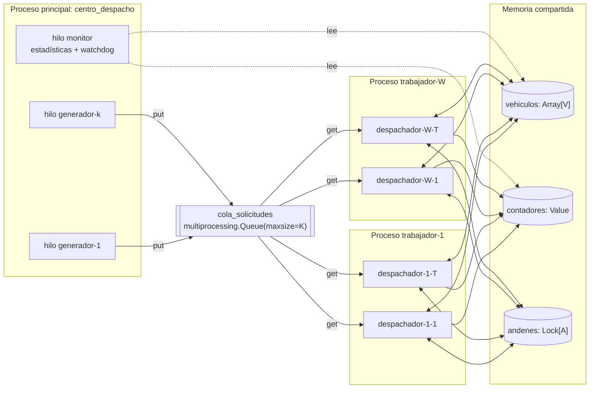

# Bitácora técnica — Proyecto 6: Sistema de despacho y logística

> Documento vivo. Se actualiza al cerrar cada fase. Sirve como fuente para el informe técnico
> y como guía para la demostración/sustentación. Cada sección de fase contiene:
> **Qué se hizo · Decisiones y justificación · Conceptos de SO · Cómo ejecutarlo ·
> Qué observar y cómo explicarlo · Evidencias.**

## Índice
- [0. Contexto, entorno y diseño](#fase-0--contexto-entorno-y-diseño)
- [1. Procesos](#fase-1--procesos) *(pendiente)*
- [2. Hilos y productor-consumidor](#fase-2--hilos-y-productor-consumidor) *(pendiente)*
- [3. Condición de carrera](#fase-3--condición-de-carrera) *(pendiente)*
- [4. Corrección por sincronización](#fase-4--corrección-por-sincronización) *(pendiente)*
- [5. Interbloqueo](#fase-5--interbloqueo) *(pendiente)*
- [6. CPU y memoria](#fase-6--cpu-y-memoria) *(pendiente)*
- [7. Registro y observación](#fase-7--registro-y-observación) *(pendiente)*
- [8. Experimentos y comparación antes/después](#fase-8--experimentos-y-comparación-antesdespués) *(pendiente)*
- [9. Guion de demostración y sustentación](#fase-9--guion-de-demostración-y-sustentación) *(pendiente)*
- [Anexo A. Matriz de trazabilidad](#anexo-a-matriz-de-trazabilidad)
- [Anexo B. Glosario de comandos del SO usados](#anexo-b-comandos-del-so)

---

## Fase 0 — Contexto, entorno y diseño

### 0.1 Problema
Una empresa de transporte recibe solicitudes de despacho. Cada solicitud debe:
**recibirse → asignarse a un vehículo disponible → procesarse en el centro de despacho →
registrarse como entregada.** En alta demanda aparecen tres síntomas que el sistema debe
reproducir, explicar y corregir:

| Síntoma reportado | Causa de SO que lo explica | Dónde se trata |
|---|---|---|
| Dos solicitudes asignadas al mismo vehículo | Condición de carrera *check-then-act* (TOCTOU) sobre el estado compartido de vehículos | Fases 3 y 4 |
| Despachos que quedan esperando | Interbloqueo por adquisición de recursos en orden distinto (y/o inanición si no hay vehículos) | Fase 5 |
| CPU elevada con muchas solicitudes | Tarea CPU-bound (cálculo de rutas) + espera activa; límites del GIL en hilos | Fases 4 y 6 |

### 0.2 Entorno de ejecución (real, verificado)
| Elemento | Valor |
|---|---|
| SO | Linux (Arch), kernel 7.1.8-arch1-3 |
| CPU | 4 núcleos lógicos (`nproc`) |
| Lenguaje | Python 3.14.7 (CPython) |
| GIL | **Activo** (`sys._is_gil_enabled() → True`) |
| Nombres de hilo | Python 3.14 propaga `Thread(name=...)` al kernel: visible en `/proc/<pid>/task/<tid>/comm`, `ps -L`, `top -H` (verificado) |
| Herramientas | `ps`, `pstree`, `top`, `htop`, `/proc` |

> Nota para el informe: que el nombre del hilo sea visible en el kernel permite relacionar
> **directamente** cada hilo del programa con su LWP en `ps -eLf`, lo que refuerza la evidencia
> de que los hilos de Python son hilos reales del SO (modelo 1:1, `clone()` con `CLONE_THREAD`).

### 0.3 Decisiones de diseño y justificación

**D1. Procesos para los trabajadores.** Cada trabajador es un proceso (`multiprocessing.Process`)
con su propio espacio de direcciones y su propio GIL. Motivos: (a) el enunciado lo exige;
(b) aislamiento de fallos; (c) la tarea intensiva en CPU (cálculo de ruta) sólo se ejecuta en
paralelo real entre procesos, porque con GIL activo los hilos de un mismo proceso no ejecutan
bytecode Python simultáneamente.

**D2. Hilos dentro de cada trabajador.** Cada trabajador lanza T hilos despachadores. Motivo: la
mayor parte del ciclo de vida de una solicitud es **espera** (despacho y entrega simulados con
`sleep`). Durante `sleep` el hilo libera el GIL y queda en estado `S` en el kernel, así que muchos
hilos atienden muchas solicitudes con bajo costo (menos memoria y cambio de contexto más barato
que un proceso por solicitud).

**D3. Estado compartido en memoria compartida real.** Los vehículos se representan con
`multiprocessing.Array('i', V)` (memoria compartida `mmap` heredada por `fork`): `0` = libre,
`n > 0` = id de la solicitud asignada. Se prefiere a `Manager()` porque el `Manager` ejecuta un
proceso servidor que serializa las operaciones y **ocultaría** la condición de carrera; con
memoria compartida la carrera es real entre procesos e hilos.

**D4. Cola productor-consumidor acotada.** `multiprocessing.Queue(maxsize=K)`: los productores
(hilos generadores del proceso principal) se bloquean cuando la cola está llena y los consumidores
(hilos despachadores de los trabajadores) cuando está vacía. Internamente usa un *pipe* y
semáforos del SO. La cota K modela capacidad finita y aplica *backpressure*.

**D5. Llegada simultánea.** Los productores se sincronizan con `threading.Barrier` para liberar
una ráfaga de solicitudes en el mismo instante (requisito 6).

**D6. Fenómenos activables por parámetro.** Un único código con banderas
(`--modo inseguro|seguro`, `--interbloqueo sin_orden|orden|timeout`) preserva la versión con el
problema y la corregida, y garantiza que la comparación antes/después use exactamente la misma
carga (misma `--semilla`).

**D7. Terminación ordenada.** Centinelas (*poison pill*) en la cola y `join()` de todos los
procesos e hilos, para no dejar procesos huérfanos ni zombis.

### 0.4 Diagrama de arquitectura



### 0.5 Jerarquía de procesos esperada

```
centro_despacho(P)            ← proceso principal
 ├─{generador-1..k}           ← hilos (mismo PID, distinto TID)
 ├─{monitor}
 ├─trabajador-1(P1, PPID=P)
 │   └─{despachador-1-1..T}
 ├─trabajador-W(PW, PPID=P)
 │   └─{despachador-W-1..T}
 └─(resource_tracker / hilo alimentador de la Queue: auxiliares de multiprocessing)
```
> Explicación esperable en la sustentación: `multiprocessing.Queue` crea un hilo interno
> "feeder" en cada proceso que hace `put`; y puede aparecer un proceso auxiliar
> `resource_tracker`. Aparecerán en `pstree`/`ps -L` y hay que saber identificarlos.

### 0.6 Hilos identificados
| Hilo | Proceso | Rol | Estado típico en el kernel |
|---|---|---|---|
| `generador-i` | principal | Productor: crea solicitudes y las encola | `S` (bloqueado en Barrier o cola llena) |
| `monitor` | principal | Estadísticas periódicas, watchdog de interbloqueo | `S` (sleep) |
| `despachador-w-t` | trabajador w | Consumidor: asigna vehículo, calcula ruta, despacha, entrega | `R` en cálculo de ruta; `S` en sleep/locks |
| `MainThread` | cada proceso | Crea/espera hilos (`join`) | `S` |

### 0.7 Recursos compartidos y secciones críticas
| Recurso | Tipo | Compartido entre | Sección crítica | Mecanismo (versión corregida) |
|---|---|---|---|---|
| `cola_solicitudes` | Cola acotada | Proceso principal y trabajadores | `put`/`get` | Interna de `multiprocessing.Queue` (pipe + lock + semáforo) |
| `vehiculos[V]` | Arreglo compartido | Todos los despachadores de todos los trabajadores | Buscar libre + marcar ocupado; liberar | `multiprocessing.Lock` + `Semaphore(V)` |
| Contadores | `Value`/`Array` | Todos | Incrementos `x += 1` (leer-modificar-escribir) | Lock asociado al `Value` |
| `andenes[A]` | Locks | Despachadores | Carga/descarga | Orden global de adquisición / timeout |

### 0.8 Posibles situaciones de bloqueo (identificadas a priori)
1. **Interbloqueo vehículo↔andén**: despacho toma vehículo y luego andén; retorno toma andén y
   luego vehículo → espera circular posible.
2. **Inanición de solicitudes**: si hay más solicitudes que vehículos y la política no es FIFO,
   una solicitud podría esperar indefinidamente.
3. **Bloqueo en la terminación**: un proceso que termina con datos aún en el búfer de la
   `Queue` puede bloquear el `join` (comportamiento documentado de `multiprocessing`). Se evita
   consumiendo hasta el centinela.
4. **Espera activa** (*busy waiting*) cuando no hay vehículos libres → consumo de CPU sin
   progreso. Se reemplaza por bloqueo en semáforo.

---

## Fase 1 — Procesos
*(pendiente)*

## Fase 2 — Hilos y productor-consumidor
*(pendiente)*

## Fase 3 — Condición de carrera
*(pendiente)*

## Fase 4 — Corrección por sincronización
*(pendiente)*

## Fase 5 — Interbloqueo
*(pendiente)*

## Fase 6 — CPU y memoria
*(pendiente)*

## Fase 7 — Registro y observación
*(pendiente)*

## Fase 8 — Experimentos y comparación antes/después
*(pendiente)*

## Fase 9 — Guion de demostración y sustentación
*(pendiente)*

---

## Anexo A. Matriz de trazabilidad
| # | Requisito del enunciado | Fase | Implementación | Evidencia |
|---|---|---|---|---|
| 1 | Proceso principal administrador | 1 | `main.py` | `pstree -p` |
| 2 | Procesos trabajadores | 1 | `trabajador.py` | `ps --ppid` |
| 3 | Múltiples hilos | 2 | hilos `despachador-w-t` | `ps -eLf`, `top -H` |
| 4 | Info compartida de vehículos | 3 | `multiprocessing.Array` | log de estados |
| 5 | Cola productor-consumidor | 2 | `Queue(maxsize=K)` | log de bloqueos por cola llena/vacía |
| 6 | Llegada simultánea | 2 | `Barrier` | marcas de tiempo idénticas |
| 7 | Carrera en asignación | 3 | `--modo inseguro` | contador de dobles asignaciones > 0 |
| 8 | Corrección por sincronización | 4 | `--modo seguro` | contador = 0 |
| 9 | Tiempos de despacho/entrega | 2 | distribuciones con semilla | log |
| 10 | Recursos en orden distinto | 5 | vehículo↔andén | `wchan`, watchdog |
| 11 | Estrategia anti-interbloqueo | 5 | `--interbloqueo orden/timeout` | ejecución completa |
| 12 | Registro de estadísticas | 7 | hilo `monitor`, CSV | CSV + resumen |
| 13 | Consumo elevado de CPU | 6 | cálculo de ruta | `top -H`, `ps -o pcpu` |
| 14 | Observación de procesos e hilos | 1, 2, 7 | `scripts/observar.sh` | capturas + explicación |
| 15 | Antes/después de sincronizar | 4, 8 | experimentos | tablas y gráficas |
| 9.1 | Diseño | 0 | esta sección | diagramas |
| 9.3 | Prueba de fallo y corrección (8 pasos) | 3, 4, 5, 8 | modos + semilla | antes/después |
| 9.4 | Evidencias del SO | todas | ps, pstree, top, /proc | `evidencias/` |

## Anexo B. Comandos del SO
*(se completa a medida que se usan, con la explicación de cada columna relevante)*
