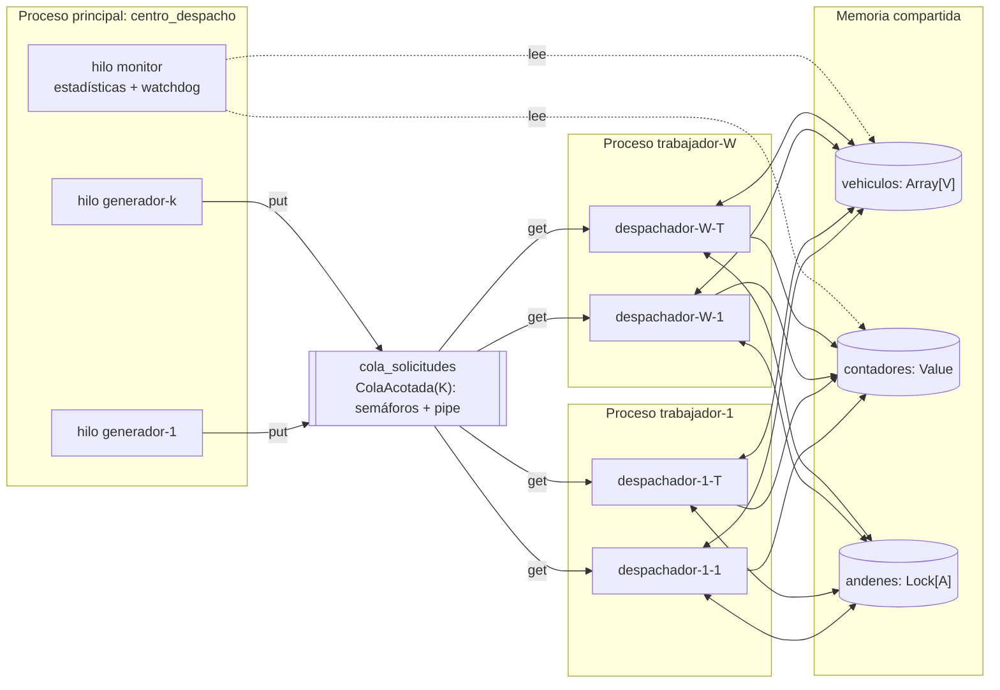
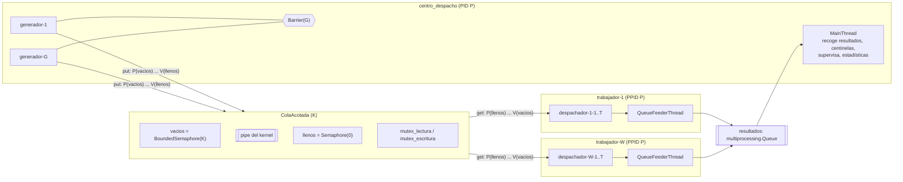
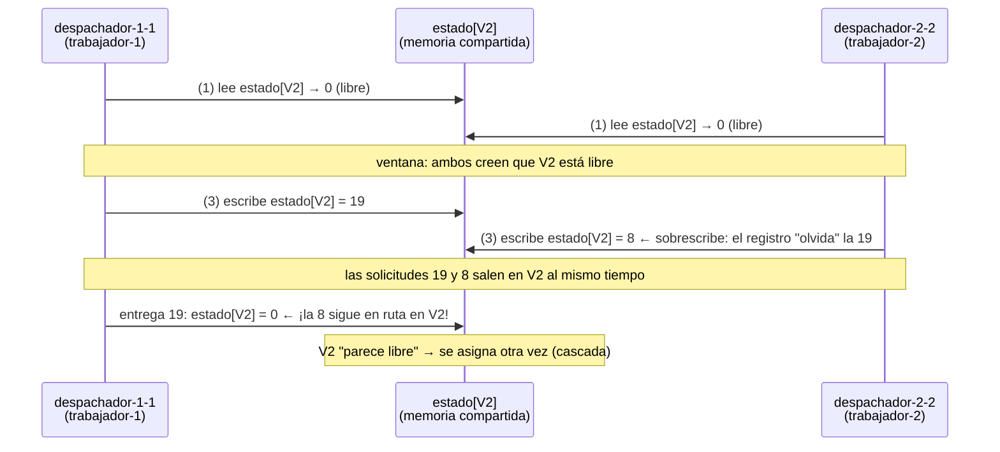

# Bitácora técnica — Proyecto 6: Sistema de despacho y logística

> Documento vivo. Se actualiza al cerrar cada fase. Sirve como fuente para el informe técnico
> y como guía para la demostración/sustentación. Cada sección de fase contiene:
> **Qué se hizo · Decisiones y justificación · Conceptos de SO · Cómo ejecutarlo ·
> Qué observar y cómo explicarlo · Evidencias.**

## Índice
- [0. Contexto, entorno y diseño](#fase-0--contexto-entorno-y-diseño)
- [1. Procesos](#fase-1--procesos) ✅
- [2. Hilos y productor-consumidor](#fase-2--hilos-y-productor-consumidor) ✅
- [3. Condición de carrera](#fase-3--condición-de-carrera) ✅
- [4. Corrección por sincronización](#fase-4--corrección-por-sincronización) ✅
- [5. Interbloqueo](#fase-5--interbloqueo) *(pendiente)*
- [6. CPU y memoria](#fase-6--cpu-y-memoria) *(pendiente)*
- [7. Registro y observación](#fase-7--registro-y-observación) *(pendiente)*
- [8. Experimentos y comparación antes/después](#fase-8--experimentos-y-comparación-antesdespués) *(pendiente)*
- [9. Guion de demostración y sustentación](#fase-9--guion-de-demostración-y-sustentación) *(pendiente)*
- [Anexo A. Matriz de trazabilidad](#anexo-a-matriz-de-trazabilidad)
- [Anexo B. Glosario de comandos del SO usados](#anexo-b-comandos-del-so)

---

## Fase 0 — Contexto, entorno y diseño

### 0.1 Problema
Una empresa de transporte recibe solicitudes de despacho. Cada solicitud debe:
**recibirse → asignarse a un vehículo disponible → procesarse en el centro de despacho →
registrarse como entregada.** En alta demanda aparecen tres síntomas que el sistema debe
reproducir, explicar y corregir:

| Síntoma reportado | Causa de SO que lo explica | Dónde se trata |
|---|---|---|
| Dos solicitudes asignadas al mismo vehículo | Condición de carrera *check-then-act* (TOCTOU) sobre el estado compartido de vehículos | Fases 3 y 4 |
| Despachos que quedan esperando | Interbloqueo por adquisición de recursos en orden distinto (y/o inanición si no hay vehículos) | Fase 5 |
| CPU elevada con muchas solicitudes | Tarea CPU-bound (cálculo de rutas) + espera activa; límites del GIL en hilos | Fases 4 y 6 |

### 0.2 Entorno de ejecución (real, verificado)
| Elemento | Valor |
|---|---|
| SO | Linux (Arch), kernel 7.1.8-arch1-3 |
| CPU | 4 núcleos lógicos (`nproc`) |
| Lenguaje | Python 3.14.7 (CPython) |
| GIL | **Activo** (`sys._is_gil_enabled() → True`) |
| Nombres de hilo | Python 3.14 propaga `Thread(name=...)` al kernel: visible en `/proc/<pid>/task/<tid>/comm`, `ps -L`, `top -H` (verificado) |
| Herramientas | `ps`, `pstree`, `top`, `htop`, `/proc` |

> Nota para el informe: que el nombre del hilo sea visible en el kernel permite relacionar
> **directamente** cada hilo del programa con su LWP en `ps -eLf`, lo que refuerza la evidencia
> de que los hilos de Python son hilos reales del SO (modelo 1:1, `clone()` con `CLONE_THREAD`).

### 0.3 Decisiones de diseño y justificación

**D1. Procesos para los trabajadores.** Cada trabajador es un proceso (`multiprocessing.Process`)
con su propio espacio de direcciones y su propio GIL. Motivos: (a) el enunciado lo exige;
(b) aislamiento de fallos; (c) la tarea intensiva en CPU (cálculo de ruta) sólo se ejecuta en
paralelo real entre procesos, porque con GIL activo los hilos de un mismo proceso no ejecutan
bytecode Python simultáneamente.

**D2. Hilos dentro de cada trabajador.** Cada trabajador lanza T hilos despachadores. Motivo: la
mayor parte del ciclo de vida de una solicitud es **espera** (despacho y entrega simulados con
`sleep`). Durante `sleep` el hilo libera el GIL y queda en estado `S` en el kernel, así que muchos
hilos atienden muchas solicitudes con bajo costo (menos memoria y cambio de contexto más barato
que un proceso por solicitud).

**D3. Estado compartido en memoria compartida real.** Los vehículos se representan con
`multiprocessing.Array('i', V)` (memoria compartida `mmap` heredada por `fork`): `0` = libre,
`n > 0` = id de la solicitud asignada. Se prefiere a `Manager()` porque el `Manager` ejecuta un
proceso servidor que serializa las operaciones y **ocultaría** la condición de carrera; con
memoria compartida la carrera es real entre procesos e hilos.

**D4. Cola productor-consumidor acotada.** Los productores (hilos generadores del proceso
principal) se bloquean cuando la cola está llena y los consumidores (hilos despachadores de los
trabajadores) cuando está vacía. La cota K modela capacidad finita y aplica *backpressure*.
Diseño inicial: `multiprocessing.Queue(maxsize=K)`. Implementación final: `ColaAcotada` propia
con semáforos `vacios`/`llenos` + mutex sobre un pipe (Fase 2, D2.3 y hallazgo H3).

**D5. Llegada simultánea.** Los productores se sincronizan con `threading.Barrier` para liberar
una ráfaga de solicitudes en el mismo instante (requisito 6).

**D6. Fenómenos activables por parámetro.** Un único código con banderas
(`--modo inseguro|seguro`, `--interbloqueo sin_orden|orden|timeout`) preserva la versión con el
problema y la corregida, y garantiza que la comparación antes/después use exactamente la misma
carga (misma `--semilla`).

**D7. Terminación ordenada.** Centinelas (*poison pill*) en la cola y `join()` de todos los
procesos e hilos, para no dejar procesos huérfanos ni zombis. (Implementación del cierre de
procesos y sus casos de fallo: Fase 1, D1.4–D1.8.)

**D8. Método de inicio `fork`.** Python 3.14 usa `forkserver` por defecto en Linux, lo que
cambia el PPID de los trabajadores. Se fija `fork` (ver Fase 1, D1.1 y evidencia E4).

### 0.4 Diagrama de arquitectura



### 0.5 Jerarquía de procesos esperada

```
centro_despacho(P)            ← proceso principal
 ├─{generador-1..k}           ← hilos (mismo PID, distinto TID)
 ├─{monitor}
 ├─trabajador-1(P1, PPID=P)
 │   └─{despachador-1-1..T}
 ├─trabajador-W(PW, PPID=P)
 │   └─{despachador-W-1..T}
 └─(resource_tracker / hilo alimentador de la Queue: auxiliares de multiprocessing)
```
> Explicación esperable en la sustentación: `multiprocessing.Queue` crea un hilo interno
> "feeder" en cada proceso que hace `put` (aparecerá en `ps -L` desde la Fase 2). El proceso
> auxiliar `resource_tracker` sólo aparece con `forkserver`/`spawn`; con `fork` no se crea
> (verificado en la Fase 1, evidencias E1 y E4).

### 0.6 Hilos identificados
| Hilo | Proceso | Rol | Estado típico en el kernel |
|---|---|---|---|
| `generador-i` | principal | Productor: crea solicitudes y las encola | `S` (bloqueado en Barrier o cola llena) |
| `monitor` | principal | Estadísticas periódicas, watchdog de interbloqueo | `S` (sleep) |
| `despachador-w-t` | trabajador w | Consumidor: asigna vehículo, calcula ruta, despacha, entrega | `R` en cálculo de ruta; `S` en sleep/locks |
| `MainThread` | cada proceso | Crea/espera hilos (`join`) | `S` |

### 0.7 Recursos compartidos y secciones críticas
| Recurso | Tipo | Compartido entre | Sección crítica | Mecanismo (versión corregida) |
|---|---|---|---|---|
| `cola_solicitudes` | Cola acotada | Proceso principal y trabajadores | `put`/`get` | `ColaAcotada`: `vacios`, `llenos`, `mutex_lectura`, `mutex_escritura` (Fase 2) |
| `resultados` | Cola sin límite | Trabajadores → principal | `put`/`get` | Interna de `multiprocessing.Queue` (un solo lector: el principal) |
| `vehiculos[V]` | Arreglo compartido (`RawArray`, `/dev/shm`) | Todos los despachadores de todos los trabajadores | Buscar libre + marcar ocupado; liberar | Fase 3: ninguno (versión con el problema). Fase 4: `multiprocessing.Lock` + `Semaphore(V)` |
| Contadores | `Value`/`Array` | Todos | Incrementos `x += 1` (leer-modificar-escribir) | Lock asociado al `Value` |
| `andenes[A]` | Locks | Despachadores | Carga/descarga | Orden global de adquisición / timeout |

### 0.8 Posibles situaciones de bloqueo (identificadas a priori)
1. **Interbloqueo vehículo↔andén**: despacho toma vehículo y luego andén; retorno toma andén y
   luego vehículo → espera circular posible.
2. **Inanición de solicitudes**: si hay más solicitudes que vehículos y la política no es FIFO,
   una solicitud podría esperar indefinidamente.
3. **Bloqueo en la terminación**: un proceso que termina con datos aún en el búfer de la
   `Queue` puede bloquear el `join` (comportamiento documentado de `multiprocessing`). Se evita
   consumiendo hasta el centinela.
4. **Espera activa** (*busy waiting*) cuando no hay vehículos libres → consumo de CPU sin
   progreso. Se reemplaza por bloqueo en semáforo.

---

## Fase 1 — Procesos

> Rama `fase-1-procesos` · etiqueta `fase-1` · evidencias en `evidencias/fase1/`

### 1.1 Qué se hizo
- Proceso principal `centro_despacho` que crea **W procesos trabajadores**, espera a que estén
  listos, registra la jerarquía leída de `/proc`, los supervisa y los cierra ordenadamente.
- Registro de eventos común a todos los procesos con `PID | PPID | TID | proceso | hilo`.
- Manejo de señales: `SIGINT` (Ctrl+C) y `SIGTERM` en el principal; los trabajadores ignoran
  `SIGINT`. Detección de trabajadores caídos, recolección de zombis, escalamiento
  `SIGTERM → SIGKILL` y detección de orfandad.
- Script de observación del SO (`scripts/observar.sh`) y script que reproduce los escenarios de
  la fase (`scripts/evidencias_fase1.sh`).
- Experimento aislado del hallazgo H1 (`experimentos/h1_event_bloqueado.py`).

### 1.2 Estructura del código
| Archivo | Responsabilidad |
|---|---|
| `main.py` | Punto de entrada: lee argumentos y ejecuta el centro de despacho; su código de salida es el del sistema |
| `despacho/config.py` | Parámetros de la línea de comandos (`Config`, inmutable) |
| `despacho/centro.py` | Proceso principal: creación, sincronización de arranque, supervisión y cierre de trabajadores |
| `despacho/trabajador.py` | Código que ejecuta cada proceso hijo |
| `despacho/registro.py` | Registro con identidad del SO (PID, PPID, TID nativo) a consola y archivo |
| `despacho/so_utils.py` | Acceso a `/proc` (estado, hilos, memoria, CPU), nombre del proceso, volcado de pilas, traducción de señales |
| `scripts/observar.sh` | Captura `pstree`, `ps -o`, `ps -eLf`, `ps -L`, `/proc/<pid>/status` y `smaps_rollup` |
| `scripts/evidencias_fase1.sh` | Reproduce los escenarios E1–E5 y guarda las salidas |

Parámetros disponibles (`python3 main.py --help`):

| Parámetro | Defecto | Significado |
|---|---|---|
| `-w, --trabajadores` | 2 | Número de procesos trabajadores |
| `-d, --duracion` | 5 | Segundos de ejecución; `0` = hasta Ctrl+C o `SIGTERM` |
| `--metodo-inicio` | `fork` | `fork`, `forkserver` o `spawn` |
| `--latido` | 1 | Segundos entre latidos de cada trabajador |
| `--espera-fin` | 3 | Tiempo de gracia antes de `SIGTERM` y luego antes de `SIGKILL` |
| `--log` | `logs/despacho_<fecha>.log` | Archivo de registro |

### 1.3 Ciclo de vida implementado

```mermaid
sequenceDiagram
    participant T as Terminal / kill
    participant P as centro_despacho
    participant W as trabajador-i
    P->>P: nombrar_proceso() → /proc/self/comm
    P->>P: SIGINT = SIG_IGN (temporal)
    P->>W: fork() × W  (hereda SIG_IGN para SIGINT)
    P->>P: restaura SIGINT, instala manejadores SIGINT/SIGTERM
    W->>W: nombrar_proceso(), registro, faulthandler(SIGUSR1)
    W-->>P: listos.release()  (Semaphore)
    P->>P: listos.acquire() × W (máx. 10 s) → SINCRONIZADO
    P->>P: registrar jerarquía (/proc)
    loop cada 0.2 s
        P->>W: is_alive() → waitpid(WNOHANG)
        W->>W: latido; revisa detener y getppid()
    end
    T->>P: SIGINT / SIGTERM / fin de duración
    P->>W: detener.value = 1 (memoria compartida)
    W-->>P: exit(0)
    P->>P: join(espera_fin) → SIGTERM → join → SIGKILL → join
    P->>P: RESUMEN + verificación en /proc
```

### 1.4 Decisiones de diseño de la fase (y su justificación)

**D1.1 Método de inicio `fork` explícito.** *Hallazgo verificado:* en Python 3.14 el método por
defecto en Linux cambió a **`forkserver`**. Con él, el principal lanza (con `exec`) un proceso
servidor y es ese servidor quien hace `fork()` de cada trabajador; el PPID de los trabajadores
es el servidor y no el centro de despacho (evidencia E4). Como el requisito es reconstruir la
jerarquía por PID/PPID, se fija `fork`: el trabajador es hijo directo del principal. La opción
`--metodo-inicio` permite mostrar la diferencia en la demostración.

**D1.2 Crear los procesos antes que cualquier hilo.** `fork()` sólo duplica el hilo que lo
invoca. Si otro hilo del padre tuviera tomado un lock (por ejemplo, el del registro), el hijo
heredaría ese lock tomado sin que exista ningún hilo que lo libere → bloqueo en el hijo. Por eso
los hilos del principal (fases siguientes) se lanzan después de crear los trabajadores. Python
3.12+ incluso emite `DeprecationWarning` si se hace `fork()` con varios hilos activos.

**D1.3 Nombre del proceso en el kernel.** Se escribe en `/proc/self/comm` (máx. 15 caracteres),
así `ps`, `pstree`, `top` y `pgrep -x centro_despacho` muestran nombres con significado en lugar
de `python3`. La línea de comandos (`args`) no cambia: por eso `ps -o comm` y `ps -o args` difieren.

**D1.4 Señales.**
- Ctrl+C envía `SIGINT` a **todo el grupo de procesos en primer plano**, no sólo al principal. Si
  cada trabajador reaccionara por su cuenta, el cierre sería desordenado. Los trabajadores ignoran
  `SIGINT` y sólo el principal coordina.
- Para no dejar una ventana de carrera (un Ctrl+C justo después del `fork` y antes de que el hijo
  ignore la señal), el principal pone `SIGINT = SIG_IGN` **antes** de crear los hijos. Con `fork`
  la disposición de señales se hereda, así que el hijo nace protegido. Después el principal
  restaura su propio manejador.
- El manejador de señales del principal **sólo anota** la señal. Hacer trabajo complejo dentro de
  un manejador (tomar locks, escribir en el log) no es seguro: si la señal interrumpe al hilo
  justo cuando tiene ese lock, se bloquea consigo mismo. El cierre se hace desde el bucle normal.

**D1.5 Supervisión y recolección de zombis.** El bucle del principal llama a `is_alive()` cada
0.2 s, que internamente ejecuta `waitpid(pid, WNOHANG)`: si un hijo terminó, el kernel entrega
su estado de salida y libera su entrada en la tabla de procesos. Mientras nadie lo recoja, el hijo
muerto queda como **zombi** (`Z <defunct>`), evidencia E2.

**D1.6 Escalamiento del cierre.** `join(espera_fin)` → `SIGTERM` → `join(espera_fin)` →
`SIGKILL`. Necesario porque un proceso **detenido** (`SIGSTOP`, estado `T`) no atiende `SIGTERM`:
la señal queda pendiente hasta un `SIGCONT`. `SIGKILL` (igual que `SIGSTOP`) no puede capturarse
ni ignorarse y el kernel la aplica aunque el proceso esté detenido (evidencia E3).

**D1.7 Indicador de parada y semáforo de arranque (resultado del hallazgo H1).** Ver 1.7.

**D1.8 Detección de orfandad (resultado del hallazgo H2).** Ver 1.8.

**D1.9 Registro concurrente.** Todos los procesos escriben el mismo archivo abierto con
`O_APPEND`: el kernel posiciona cada `write()` al final del archivo de forma atómica respecto de
otros escritores, así las líneas de distintos procesos no se sobrescriben. El orden de las líneas
es el orden en que el kernel atendió cada escritura, que puede diferir levemente del orden de las
marcas de tiempo (se observa en los `LATIDO` de procesos distintos): **ese desorden es en sí una
evidencia de ejecución concurrente** y de que el planificador decide quién corre primero.

### 1.5 Cómo ejecutarlo
```bash
python3 main.py --help
python3 main.py -w 3 -d 5                  # 3 trabajadores durante 5 s
python3 main.py -w 3 -d 0                  # hasta Ctrl+C (observar con otra terminal)
scripts/observar.sh                        # en otra terminal, mientras corre
python3 main.py -w 2 -d 0 --metodo-inicio forkserver   # comparar la jerarquía
scripts/evidencias_fase1.sh                # reproduce E1–E5 y guarda evidencias
python3 experimentos/h1_event_bloqueado.py [--corregido]
```
Código de salida del principal: `0` si todos los trabajadores terminaron con `exit(0)`, `1` si
alguno terminó por señal o con error.

### 1.6 Evidencias y cómo explicarlas

**E1 — Jerarquía y observación** (`e1_observacion.txt`, `e1_top.txt`, `e1_ejecucion.log`)
```
centro_despacho(56677)-+-trabajador-1(56680)
                       |-trabajador-2(56681)
                       `-trabajador-3(56683)
```
- *Qué decir:* los tres trabajadores tienen **PPID 56677**, el PID del principal. El PPID del
  principal (56673) es la shell que lo lanzó. Todos comparten **PGID 56677**: el principal es líder
  de su grupo de procesos, y por eso Ctrl+C (o `kill -INT -- -56677`) llega a todos.
- `NLWP = 1` en todos: en esta fase cada proceso tiene un único hilo. En la Fase 2 este número crece.
- `STAT S` y `WCHAN hrtimer_nanosleep`: los procesos están **dormidos** en el temporizador del
  kernel (el `sleep` del bucle de sondeo): no consumen CPU (0.0 %). El principal muestra `Ss`: la
  `s` indica que es líder de sesión (se lanzó con `setsid`).
- **Memoria: RSS vs PSS.** Cada trabajador reporta RSS ≈ 17.8 MB, pero PSS ≈ 5.0 MB. Tras `fork()`
  padre e hijos **comparten las mismas páginas físicas** (copy-on-write) hasta que alguno escribe.
  RSS cuenta cada página compartida completa en cada proceso; PSS la divide entre quienes la
  comparten. Suma RSS ≈ 75 MB (irreal); suma PSS ≈ 21 MB (memoria realmente ocupada).
- El log muestra `SEÑAL SIGINT recibida`, un `FIN` por trabajador con `exit(0)` y la verificación
  "sin zombis ni huérfanos"; código de salida 0.

**E2 — Muerte de un trabajador y estado zombi** (`e2_zombi.txt`, `e2_ejecucion.log`)
```
## kill -KILL 56733; ps inmediatamente después
  56733   56730 Z    trabajador-2 <defunct>
## 0.5 s después (el principal ya hizo waitpid)
  56732   56730 S    trabajador-1
  56734   56730 S    trabajador-3
```
- *Qué decir:* al morir, el proceso libera su memoria pero su entrada en la tabla de procesos
  (PID y código de salida) permanece hasta que el padre la recoja con `wait()`: eso es un
  **zombi**. En menos de 0.2 s el principal hace `waitpid`, registra
  `CAÍDO trabajador-2 (PID 56733): terminado por señal SIGKILL` y el zombi desaparece.
- `exitcode = -9` en `multiprocessing` significa "terminado por la señal 9". El resumen lo traduce
  y el sistema termina con código 1 (con fallos); los trabajadores sanos cierran con `exit(0)`.

**E3 — Trabajador detenido durante el cierre** (`e3_detenido.txt`, `e3_ejecucion.log`)
```
  56770   56768 T    do_signal_stop       trabajador-1
  56771   56768 S    hrtimer_nanosleep    trabajador-2
...
trabajador-1 (PID 56770) no terminó en 1.5 s: se envía SIGTERM
trabajador-1 (PID 56770) ignoró SIGTERM (estado T (stopped)): se envía SIGKILL
```
- *Qué decir:* `T` = detenido por `SIGSTOP`; `wchan do_signal_stop` es la función del kernel donde
  quedó parado. No puede leer el indicador de parada ni atender `SIGTERM`. El principal escala a
  `SIGKILL`, que el kernel aplica siempre. Sin el escalamiento, el cierre quedaría colgado para
  siempre (un ejemplo del síntoma "despachos que quedan esperando").

**E4 — `forkserver` vs `fork`** (`e4_forkserver.txt`)
```
centro_despacho(56837)-+-python3(56839)            ← resource_tracker
                       `-python3(56840)-+-trabajador-1(56861)   ← forkserver
                                        `-trabajador-2(56862)
```
- *Qué decir:* con `forkserver` aparece un nivel intermedio y el PPID de los trabajadores es 56840
  (el servidor), no el principal. También aparece `resource_tracker`, un proceso auxiliar que
  libera semáforos con nombre si alguien muere sin cerrarlos. Esto justifica D1.1.

**E5 — Muerte del principal: huérfanos** (`e5_huerfanos.txt`, `e5_ejecucion.log`)
```
## kill -KILL 56878 (sólo el principal); ps inmediatamente después
  56880    1338 S    trabajador-1
  56881    1338 S    trabajador-2
HUÉRFANO: el principal (PID 56878) terminó; adoptado por PID 1338. Se termina
```
- *Qué decir:* cuando un padre muere, el kernel **re-asigna** (reparenting) a sus hijos. No van a
  PID 1 sino a PID 1338, `systemd --user`, porque se registró como *child subreaper*
  (`prctl(PR_SET_CHILD_SUBREAPER)`): el kernel entrega los huérfanos al ancestro subreaper más
  cercano. Los trabajadores detectan el cambio de PPID y terminan (ver H2).

### 1.7 Hallazgo H1 — `multiprocessing.Event` bloquea al sistema si muere un participante

Prueba de fallo y corrección completa (formato 9.3 del enunciado):

1. **Versión con el problema.** La primera implementación usaba `detener = ctx.Event()`; los
   trabajadores esperaban con `detener.wait(1.0)` y el principal cerraba con `detener.set()`.
   Arranque sincronizado con `ctx.Barrier(W+1)`.
2. **Ejecución controlada.** Escenario E2: 3 trabajadores, `kill -KILL` a `trabajador-2`, luego
   `SIGTERM` al principal.
3. **Evidencia** (`h1_captura_original.txt`): el log termina en
   `SEÑAL SIGTERM recibida: se inicia el cierre ordenado`; no hay `RESUMEN` ni `FIN`.
   ```
     PID    PPID     LWP STAT %CPU     ELAPSED WCHAN                COMMAND
   53948   53869   53948 Ss    0.0       02:39 futex_do_wait        centro_despacho
   53950   53948   53950 S     0.0       02:39 futex_do_wait        trabajador-1
   53952   53948   53952 S     0.0       02:39 futex_do_wait        trabajador-3
   voluntary_ctxt_switches: 16  →  2 s después: 16   (ningún progreso)
   ```
   Todos dormidos en un **futex** (primitiva del kernel sobre la que se construyen los semáforos),
   0 % de CPU, sin cambios de contexto: bloqueo total, no lentitud. Los trabajadores **sanos**
   también dejaron de emitir latidos.
4. **Explicación de la causa.** `Event.set()` llama a `Condition.notify_all()`, que en
   `multiprocessing/synchronize.py` implementa un protocolo de confirmación:
   ```python
   while sleepers < n and self._sleeping_count.acquire(False):
       self._wait_semaphore.release()        # wake up one sleeper
       sleepers += 1
   if sleepers:
       for i in range(sleepers):
           self._woken_count.acquire()       # wait for a sleeper to wake   ← línea 304
   ```
   Cada proceso que entra en `wait()` incrementa `_sleeping_count`; al despertar incrementa
   `_woken_count`. `trabajador-2` murió **dentro** de `wait()`: quedó contado como durmiente pero
   nunca confirmará, así que el principal espera en `_woken_count.acquire()` para siempre. Y como
   lo hace **reteniendo el lock de la Condition**, los trabajadores sanos, cuyo `wait(1.0)` vence
   y necesita re-adquirir ese lock, también se bloquean. La pila capturada con `faulthandler` en
   el experimento aislado lo confirma:
   ```
   File ".../multiprocessing/synchronize.py", line 304 in notify
   File ".../multiprocessing/synchronize.py", line 311 in notify_all
   File ".../multiprocessing/synchronize.py", line 352 in set
   ```
   Concepto de SO: una primitiva de sincronización **compartida entre procesos** cuyo estado
   depende de que todos los participantes completen un protocolo no es tolerante a la muerte de un
   participante (los semáforos POSIX no registran dueño ni se "reparan" solos). Es la misma familia
   de problemas que un proceso que muere reteniendo un mutex compartido.
5. **Modificación implementada.**
   - `detener`: `ctx.RawValue("b", 0)`, un byte en memoria compartida. Sólo el principal escribe
     (escritor único) y la escritura de un byte es atómica, por lo que no hace falta lock. Los
     trabajadores lo consultan cada 0.1 s. No hay protocolo entre participantes: la muerte de uno
     no afecta a los demás.
   - Arranque: `ctx.Semaphore(0)`. Cada trabajador hace un único `release()` (`sem_post`) y el
     principal hace W `acquire(timeout)`. Cada operación es atómica y no deja estado a medias.
   - *Costo aceptado:* el sondeo introduce hasta 0.1 s de latencia en el cierre y despertares
     periódicos (10 por segundo por trabajador, costo de CPU despreciable). En la Fase 2 los
     trabajadores se bloquearán en la cola y la parada normal será por centinelas.
6. **Nueva ejecución.** Mismo escenario E2 con la versión corregida.
7. **Evidencia de la corrección** (`e2_ejecucion.log`): `CAÍDO trabajador-2 ... SIGKILL`, luego
   `SEÑAL SIGTERM recibida`, `FIN trabajador 1`, `FIN trabajador 3`, `RESUMEN`, verificación sin
   zombis; el principal termina en ~0.1 s.
8. **Comparación antes/después** (`h1_reproduccion.txt`, experimento aislado con 3 hijos y
   `SIGKILL` al hijo 2):

   | | `Event` (antes) | `RawValue` (después) |
   |---|---|---|
   | ¿La orden de parada retorna? | No (el vigilante declara bloqueo a los 3 s) | Sí, inmediatamente |
   | Hijos sanos | Bloqueados en el lock de la Condition | Terminan normalmente |
   | Código de salida | 1 (forzado por el vigilante) | 0 |

### 1.8 Hallazgo H2 — trabajadores huérfanos que nunca terminan
1. **Problema:** si el principal muere con `SIGKILL` (no puede capturarla, así que no ejecuta su
   cierre), nadie activa el indicador de parada. Los trabajadores, adoptados por `systemd --user`,
   seguirían ejecutándose indefinidamente consumiendo recursos: observado durante las pruebas
   (procesos con PPID 1338 que hubo que eliminar a mano).
2. **Corrección:** cada trabajador guarda su PPID al arrancar y en cada ciclo compara con
   `os.getppid()`. Si cambió, registra `HUÉRFANO ... adoptado por PID X` y termina.
3. **Evidencia:** E5, ambos trabajadores terminan en ≤ 0.1 s tras la muerte del principal y no
   queda ningún proceso del grupo.
4. *Alternativa conocida:* `prctl(PR_SET_PDEATHSIG, SIGTERM)` hace que el kernel envíe una señal
   al hijo cuando muere el padre. No está en la biblioteca estándar de Python (requiere `ctypes`)
   y tiene sutilezas con hilos: el disparador es la muerte del **hilo** que creó al hijo, no la del
   proceso. Se optó por la comprobación explícita, más simple de explicar y verificar.

### 1.9 Preguntas probables en la sustentación
- **¿Por qué procesos y no sólo hilos?** Aislamiento (un fallo en un trabajador no corrompe la
  memoria de los demás; E2 lo demuestra), paralelismo real de CPU pese al GIL (Fase 6) y porque
  el enunciado exige observar la jerarquía PID/PPID.
- **¿Qué es un zombi y por qué no quedan en su sistema?** E2 + D1.5.
- **¿Qué pasa si se cierra el principal abruptamente?** E5 + H2.
- **¿Por qué `pstree` muestra `python3` con `forkserver`?** Porque ese proceso se creó con
  `exec` de un nuevo intérprete, no con `fork` del principal, y no se renombra (E4).
- **¿Por qué ignorar `SIGINT` en los hijos?** D1.4.
- **¿Qué significa `futex_do_wait` en `wchan`?** El hilo está dormido en el kernel esperando un
  futex (*fast userspace mutex*), la base de los locks y semáforos en Linux: un proceso bloqueado
  en sincronización, no ocupado calculando (H1).

## Fase 2 — Hilos y productor-consumidor

> Rama `fase-2-hilos-cola` · etiqueta `fase-2` · evidencias en `evidencias/fase2/`

### 2.1 Qué se hizo
- **Productores:** G hilos `generador-i` en el proceso principal crean solicitudes (cliente, origen,
  destino, tiempos) y las ponen en la cola. En cada ráfaga se sincronizan con una
  `threading.Barrier` para llegar **simultáneamente** (requisito 6).
- **Consumidores:** cada trabajador lanza T hilos `despachador-w-t`. Todos los hilos de todos los
  trabajadores **compiten** por la misma cola. Cada solicitud pasa por
  `RECIBIDA → DESPACHO (preparación) → EN RUTA → ENTREGADA`, con tiempos aleatorios
  reproducibles (requisito 9).
- **Cola acotada propia** (`despacho/cola.py`): búfer productor-consumidor clásico con semáforos
  entre procesos. Se conserva `--cola mp` (`multiprocessing.Queue`) para reproducir el hallazgo H3.
- **Cola de resultados** (trabajadores → principal) para contabilizar cada solicitud terminada.
- **Cierre normal por centinelas** (*poison pill*): un `None` por hilo despachador cuando terminan
  los generadores. **Cierre anticipado** (Ctrl+C, `SIGTERM`, `--duracion`): se detiene la
  generación y las solicitudes que quedan en la cola se retiran como **canceladas**, así el balance
  siempre cuadra.
- **Estadísticas** al final: balance, bloqueos de productores, espera en cola, servicio,
  rendimiento, concurrencia efectiva y máxima, reparto por trabajador e hilo, CPU consumida y
  cambios de contexto (según el kernel, con `getrusage`).
- La jerarquía registrada al inicio ahora incluye **los hilos de cada proceso** leídos de
  `/proc/<pid>/task/<tid>/`.
- Modo continuo (`-n 0`) para observar el sistema con herramientas del SO mientras corre.
- Hallazgos: **H3** (inanición por muerte de un consumidor con `multiprocessing.Queue`) y
  **H4** (carrera entre `Barrier.wait()` y `Barrier.abort()`), ambos reproducidos, corregidos y
  medidos antes y después.

**Cambios respecto a la Fase 1:** desaparece el "latido" de los trabajadores (ahora su actividad
real son las solicitudes); `--duracion` pasa a ser un tiempo *máximo* (0 = sin límite); el
sistema termina solo cuando se atienden todas las solicitudes.

### 2.2 Estructura del código (nuevo o modificado)
| Archivo | Responsabilidad |
|---|---|
| `despacho/modelo.py` | `Solicitud` y `Resultado`: los datos que viajan entre procesos (serializados con `pickle`) |
| `despacho/generador.py` | Hilos productores, reparto determinista de ids, ráfagas con `Barrier`, bloqueo por cola llena |
| `despacho/cola.py` | `ColaAcotada`: productor-consumidor con semáforos `vacios`/`llenos` + mutex sobre un pipe |
| `despacho/trabajador.py` | Proceso trabajador: crea los hilos `Despachador` (consumidores) y vigila la orfandad |
| `despacho/centro.py` | Crea colas y procesos, lanza generadores, recoge resultados, envía centinelas, estadísticas |
| `scripts/evidencias_fase2.sh` | Reproduce E1–E4 |
| `experimentos/h3_trabajador_caido.sh` | Reproduce y mide H3 con ambas colas |
| `experimentos/h4_barrera_abortada.sh` | Reproduce y mide H4 |

Parámetros nuevos (`python3 main.py --help`):

| Parámetro | Defecto | Significado |
|---|---|---|
| `-t, --hilos` | 3 | Hilos despachadores por trabajador |
| `-g, --generadores` | 2 | Hilos productores |
| `-n, --solicitudes` | 20 | Total a generar; `0` = continuo hasta Ctrl+C |
| `--tam-rafaga` | 0 | Solicitudes por generador en cada ráfaga (`0` = todas en una) |
| `--intervalo` | 1 | Segundos entre ráfagas |
| `-k, --capacidad-cola` | 10 | Capacidad K del búfer |
| `--cola` | `semaforos` | `semaforos` (propia) o `mp` (`multiprocessing.Queue`) |
| `--despacho`, `--entrega` | `0.1-0.3`, `0.2-0.6` | Rango (s) de los tiempos simulados |
| `-s, --semilla` | 42 | Misma semilla = misma carga |
| `-d, --duracion` | 0 | Tiempo máximo (0 = sin límite) |

### 2.3 Arquitectura de la fase



Cada solicitud cruza **dos fronteras de proceso**: de un hilo del principal a un hilo de un
trabajador (por la cola de solicitudes) y de vuelta (por la cola de resultados). La pasan como
bytes por pipes del kernel, porque los procesos no comparten el heap de Python.

### 2.4 Decisiones de diseño de la fase

**D2.1 Productores en el principal, consumidores en los trabajadores.** Los generadores sólo crean
objetos pequeños y esperan (ráfagas, cola llena), así que como hilos cuestan poco. Los
consumidores están repartidos entre procesos para que en la Fase 6 la parte de CPU se ejecute en
paralelo real. Los generadores se lanzan **después** de crear los trabajadores (D1.2).

**D2.2 Una única cola compartida por todos los consumidores.** Es el esquema productor-consumidor
de libro. El reparto de carga es automático: el hilo que queda libre toma la siguiente solicitud.
El reparto observado es equilibrado (E1: 13/11 entre trabajadores, 3–5 por hilo) sin ningún
planificador explícito.

**D2.3 Cola propia con semáforos (`ColaAcotada`) en lugar de `multiprocessing.Queue`.**
```
productor:  P(vacios); P(mutex_escritura); escribir en el pipe; V(mutex_escritura); V(llenos)
consumidor: P(llenos); P(mutex_lectura);   leer del pipe;       V(mutex_lectura);   V(vacios)
```
- `vacios` (inicia en K) impide que haya más de K solicitudes en el búfer: el productor se bloquea
  en `P(vacios)` cuando la cola está llena. `llenos` (inicia en 0) hace que el consumidor se
  bloquee en `P(llenos)` cuando está vacía y garantiza que sólo lee cuando hay un mensaje completo.
  Los mutex evitan que dos lectores lean mitades de mensajes distintos o que dos escritores
  mezclen bytes en el pipe.
- Todos son `multiprocessing.Semaphore`/`Lock`, es decir, **semáforos POSIX en memoria
  compartida** (`sem_wait`/`sem_post` sobre un *futex* del kernel). Funcionan entre hilos y entre
  procesos.
- `qsize()` es el valor del semáforo `llenos` (`sem_getvalue`).
- **Motivo del cambio: hallazgo H3.** `multiprocessing.Queue.get()` retiene su lock de lectores
  durante toda la espera. En `ColaAcotada` el consumidor espera en `llenos` sin retener ningún
  lock, y el mutex sólo se toma durante los microsegundos que dura leer un mensaje.
- La serialización (`pickle.dumps`) se hace **fuera** de la sección crítica, para que sea lo más
  corta posible.

**D2.4 Tiempos reproducibles.** Cada generador usa `random.Random(semilla*1000 + id)`, y cada
solicitud lleva sus tiempos de despacho y entrega desde que se crea. La **carga** (qué solicitudes,
con qué tiempos) es idéntica para la misma semilla, sin importar qué hilo atienda cada una. El
**intercalado** (quién atiende qué y en qué orden) sí varía entre ejecuciones: eso lo decide el
planificador. Es la base para comparar antes y después con la misma entrada.

**D2.5 Llegada simultánea con `Barrier`.** Todos los generadores hacen el mismo número de ráfagas,
aunque alguno tenga lotes vacíos al final, para que ninguno quede esperando solo en la barrera.
La `Barrier` es de `threading`: los generadores son hilos del mismo proceso.

**D2.6 El productor bloqueado se registra.** Se intenta `put_nowait()`; si la cola está llena se
registra `PRODUCTOR BLOQUEADO` y se espera con `put(timeout=0.2)` en un bucle que revisa la orden
de parada. Así el bloqueo queda en el log con su duración y el productor puede abandonar si llega
Ctrl+C.

**D2.7 El principal vacía continuamente la cola de resultados.** Un proceso que escribió en una
`multiprocessing.Queue` no termina hasta que su `QueueFeederThread` entrega todo al pipe. Si el
pipe (64 KiB) se llena porque nadie lee, el trabajador se bloquea al salir y el `join()` del
principal nunca retorna: un interbloqueo entre padre e hijo. Por eso el principal lee resultados
también mientras espera el cierre de los trabajadores (`_esperar_proceso`).

**D2.8 Cierre por centinelas y cancelación contabilizada.** El cierre normal envía W×T centinelas
(`None`) sin bloquear al principal (`put_nowait`). Un centinela sólo puede llegar **detrás** de
todas las solicitudes, porque la cola es FIFO, así que ninguna queda sin atender. En el cierre
anticipado, cada solicitud que sale de la cola se informa como `CANCELADA` y el balance
`generadas = entregadas + canceladas + no atendidas` se verifica siempre. Además se verifica
`generadas = pedidas`; esa verificación fue la que detectó H4.

**D2.9 Robustez del principal.** Cualquier excepción inesperada en el principal se registra y
ejecuta el mismo cierre ordenado. Se añadió después de que una lectura de `/proc` fallara con
`ESRCH`: un hilo terminó entre el listado de `/proc/<pid>/task` y la lectura de su `stat`.
**`/proc` es una vista viva del kernel, no una foto consistente**, y quien la lee debe tolerar
que las tareas desaparezcan.

### 2.5 Cómo ejecutarlo
```bash
python3 main.py                                      # 2 trabajadores x 3 hilos, 20 solicitudes
python3 main.py -w 2 -t 3 -g 4 -n 24 --tam-rafaga 2 --intervalo 0.8 -k 5   # E1: ráfagas
python3 main.py -n 0 --tam-rafaga 3 --intervalo 0.5 --entrega 0.5-1.5       # continuo; Ctrl+C
scripts/observar.sh                                  # en otra terminal
scripts/evidencias_fase2.sh                          # E1–E4 (≈ 3 min)
experimentos/h3_trabajador_caido.sh 10               # H3 (≈ 3 min)
experimentos/h4_barrera_abortada.sh despues 30       # H4
```

### 2.6 Evidencias y cómo explicarlas

**E1 — Llegada simultánea y productor-consumidor** (`e1_rafagas.txt`, `e1_ejecucion.log`)
```
16:01:21.089710 generador-1 | RÁFAGA 1: 4 generadores liberados simultáneamente
16:01:21.090430 generador-1 | RECIBIDA solicitud 1 (ráfaga 1) ...
16:01:21.090105 generador-4 | RECIBIDA solicitud 19 (ráfaga 1) ...
16:01:21.090311 generador-2 | RECIBIDA solicitud 7 (ráfaga 1) ...
16:01:21.092465 generador-2 | RECIBIDA solicitud 8 (ráfaga 1) ...
```
- *Qué decir:* las 8 solicitudes de la ráfaga (4 generadores × 2) llegan en **menos de 3 ms**. La
  barrera liberó a los 4 hilos a la vez. Las líneas no están en orden de marca de tiempo: cada hilo
  toma la hora y luego compite por el lock del registro, y el planificador decide quién escribe
  primero (D1.9).
- Resultado: `generadas=24 entregadas=24 canceladas=0 no atendidas=0`; concurrencia máxima **6** =
  2 trabajadores × 3 hilos; **13.83 s de trabajo en 2.87 s** (concurrencia efectiva 4.82).
- Consumidores: al inicio y entre ráfagas aparecen `CONSUMIDOR ESPERANDO: cola vacía` (bloqueados
  en `P(llenos)`); al final, `CENTINELA recibido: el hilo termina`, uno por hilo.

**E2 — Procesos e hilos vistos desde el SO** (`e2_observacion.txt`, `e2_hilos.txt`)
```
centro_despacho(72899)-+-trabajador-1(72905)-+-{QueueFeederThre}(72915)
                       |                     |-{despachador-1-1}(72907)
                       |                     |-{despachador-1-2}(72908)
                       |                     `-{despachador-1-3}(72909)
                       |-trabajador-2(72906)-+-{QueueFeederThre}(72916)
                       |                     |-{despachador-2-1}(72910) ...
                       |-{generador-1}(72913)
                       `-{generador-2}(72914)
```
- *Qué decir:* en `pstree` los hilos van entre `{}` y **cuelgan del proceso que los contiene**; los
  procesos hijos cuelgan del padre. Cada hilo tiene su propio TID (72907, 72908…) pero comparte el
  PID del proceso. `NLWP`: principal = 3 (MainThread + 2 generadores), cada trabajador = 5
  (MainThread + 3 despachadores + `QueueFeederThread`).
- Los nombres (`despachador-1-1`) son los del programa: Python 3.14 los copia al kernel
  (`/proc/<pid>/task/<tid>/comm`, máx. 15 caracteres; por eso `QueueFeederThre`).
- `QueueFeederThread` no lo creó nuestro código: `multiprocessing.Queue` lo lanza en cada proceso
  que hace `put` en la cola de resultados. Serializa y escribe en el pipe en segundo plano. El
  principal **no** lo tiene, porque `ColaAcotada` escribe en el pipe de forma síncrona.
- `ps -L` (estado y `wchan` de cada hilo) permite ver **en qué está cada hilo**:
  ```
  72899 72899 Ssl poll_schedule_timeout  centro_despacho   ← esperando datos en el pipe de resultados
  72899 72913 Ssl futex_do_wait          generador-1       ← bloqueado en P(vacios): cola llena
  72905 72907 Sl  hrtimer_nanosleep      despachador-1-1   ← "en ruta" (sleep de la entrega)
  72905 72909 Rl  -                      despachador-1-3   ← ejecutándose en ese instante
  72906 72916 Sl  futex_do_wait          QueueFeederThre   ← esperando nuevos resultados
  ```
  `S` = dormido, `R` = ejecutando o listo, `l` = proceso multihilo. `futex_do_wait` = bloqueado en
  una primitiva de sincronización; `hrtimer_nanosleep` = durmiendo por tiempo.
- **Memoria virtual vs residente:** con hilos, la `VSZ` del trabajador sube de ~27 MB (Fase 1) a
  **323 MB** y la del principal a 176 MB, mientras que el `RSS` apenas cambia (19–23 MB). Medido:
  cada hilo reserva **8 MB de pila** (`ulimit -s` = 8192 kB) y glibc reserva una **arena de
  `malloc` de 64 MB** por hilo (regiones `---p` sin páginas físicas). Son ~72 MB **reservados** de
  espacio de direcciones que no ocupan RAM hasta que se tocan. Por eso la memoria de un proceso se
  analiza con RSS/PSS y no con VSZ.
- Ctrl+C con cola llena: `generadas=24 entregadas=21 canceladas=3 no atendidas=0`. Las 3 que
  estaban en la cola se cancelan y quedan contabilizadas; las que estaban "en ruta" se terminan.

**E3 — Escalamiento con la misma carga** (`e3_escalamiento.txt`; 36 solicitudes, semilla 42)

| Procesos | Hilos/proc | Total | Tiempo (s) | Solicitudes/s | Concurrencia efectiva | CPU trabajadores |
|---|---|---|---|---|---|---|
| 1 | 1 | 1 | 22.17 | 1.62 | 1.00 | 0.5 % |
| 1 | 2 | 2 | 11.43 | 3.15 | 1.94 | 0.9 % |
| 1 | 4 | 4 | 5.71 | 6.31 | 3.88 | 1.8 % |
| 1 | 8 | 8 | 3.12 | 11.56 | 7.10 | 3.1 % |
| 2 | 4 | 8 | 3.12 | 11.53 | 7.09 | 3.3 % |
| 4 | 2 | 8 | 3.21 | 11.21 | 6.90 | 3.4 % |
| 4 | 4 | 16 | 1.78 | 20.27 | 12.46 | 6.5 % |

- *Qué decir:* con 1 hilo el sistema es secuencial (22.17 s ≈ suma de los tiempos de servicio).
  Duplicar los hilos casi divide el tiempo a la mitad, hasta 8 hilos (7.1×). El trabajo es
  **espera** (preparación y ruta simuladas con `sleep`): un hilo que duerme libera el GIL y la
  CPU, y otro avanza. La CPU consumida no pasa de 6.5 %.
- **Con la misma cantidad total de hilos (8), da igual repartirlos en 1, 2 o 4 procesos**
  (3.12 / 3.12 / 3.21 s). Para trabajo de espera, los hilos son suficientes y más baratos que los
  procesos. En la Fase 6, con trabajo de CPU, este resultado cambia por el GIL: es el argumento
  central para justificar la arquitectura híbrida.
- La concurrencia efectiva no llega al máximo teórico: al inicio y al final de la carga no todos
  los hilos tienen trabajo.

**E4 — Capacidad de la cola** (`e4_capacidad.txt`; 30 solicitudes en una ráfaga, 1 × 3 hilos)

| K | Bloqueos productor | Tiempo bloqueados (s) | Espera prom. en cola (ms) | Espera máx. (ms) | Tiempo total (s) |
|---|---|---|---|---|---|
| 1 | 26 | 14.17 | 662 | 1474 | 6.35 |
| 3 | 24 | 12.09 | 953 | 1556 | 6.39 |
| 10 | 17 | 8.01 | 1820 | 2871 | 6.48 |
| 30 | 0 | 0.00 | 2796 | 5685 | 6.34 |

- *Qué decir:* el tiempo total no cambia, porque lo limitan los 3 consumidores. La capacidad del
  búfer **decide dónde se espera**. Con K pequeño la espera ocurre **antes de entrar**: el productor
  queda bloqueado en `P(vacios)` (contrapresión, *backpressure*). Con K grande no hay bloqueos,
  pero las solicitudes se acumulan dentro y esperan más en la cola. Un búfer acotado limita la
  memoria y la longitud de la cola a cambio de frenar a los productores.

### 2.7 Hallazgo H3 — inanición de consumidores cuando muere un trabajador (`multiprocessing.Queue`)

1. **Versión con el problema:** `--cola mp`. Los despachadores de todos los trabajadores consumen
   de una `multiprocessing.Queue` con `get(timeout=0.5)`.
2. **Ejecución controlada** (`experimentos/h3_trabajador_caido.sh`): 3 trabajadores × 2 hilos,
   generación continua (2 solicitudes cada 1.5 s), `SIGKILL` a `trabajador-2` con el sistema ocioso
   y 4 s más de observación. 10 repeticiones por tipo de cola.
3. **Evidencia** (`h3/resumen.txt`, `h3/inanicion_mp.txt`):
   ```
   cola=mp:        inanición (0 despachos tras el SIGKILL) en 4 de 10 ejecuciones
   cola=semaforos: inanición (0 despachos tras el SIGKILL) en 0 de 10 ejecuciones
   ```
   En una ejecución con inanición el log muestra la cola creciendo (`en cola ~1` … `~6`) sin
   ningún `DESPACHO` después del `CAÍDO`, y el balance final `entregadas=4 ... no atendidas=6`.
   Todos los despachadores sobrevivientes están en `futex_do_wait`, y `kill -USR1` a
   `trabajador-1` (volcado de pilas con `faulthandler`) muestra a sus dos hilos en:
   ```
   File ".../multiprocessing/queues.py", line 106 in get     ← if not self._rlock.acquire(block, timeout)
   ```
4. **Causa:** `multiprocessing.Queue.get(timeout)` hace `self._rlock.acquire()` y luego, **con el
   lock tomado**, espera datos en el pipe (`self._poll(timeout)`). Con la cola vacía, en todo
   momento hay exactamente un consumidor esperando con el lock tomado. Si ese consumidor pertenece
   al proceso que recibe `SIGKILL`, el lock (un semáforo POSIX sin dueño registrado) **nunca se
   libera**: los demás consumidores esperan el lock, vencen el timeout, reciben `Empty` y vuelven a
   intentar indefinidamente, mientras la cola crece. Es no determinista porque depende de a quién
   pertenecía el lock en ese instante: 2 de los 6 hilos eran de `trabajador-2` (33 % esperado,
   40 % observado).
   - Relación con la teoría: es **inanición**, no interbloqueo. Nadie espera circularmente: todos
     esperan un recurso retenido por un proceso que ya no existe y que el sistema no puede
     **expropiar** (la condición de "no expropiación" de Coffman aplicada a un dueño muerto).
   - Es el síntoma del enunciado *"algunos despachos quedan esperando"*, con una causa real de SO.
5. **Modificación:** `ColaAcotada` (D2.3). El consumidor espera en `P(llenos)` sin retener nada; el
   mutex se toma sólo después, cuando hay un mensaje garantizado, y durante microsegundos.
6. **Nueva ejecución:** el mismo script con `--cola semaforos`.
7. **Evidencia de la corrección:** 10 de 10 ejecuciones despachan las 6 solicitudes posteriores al
   `SIGKILL`, con balance completo.
8. **Comparación:** 4/10 → 0/10 ejecuciones con inanición.
   - *Riesgo residual (honestidad técnica):* si un proceso muere **justo** mientras lee un mensaje
     (con el mutex tomado), el problema reaparecería. La ventana pasa de "todo el tiempo de espera"
     a unos microsegundos. Eliminarla del todo requiere mutex robustos (`PTHREAD_MUTEX_ROBUST`,
     que avisa `EOWNERDEAD` al siguiente que lo toma), que Python no expone.
   - La cola de resultados sigue siendo `multiprocessing.Queue`, pero ahí el único lector es el
     principal, y el riesgo de los escritores (`_wlock`) se limita a la escritura de un mensaje.

### 2.8 Hallazgo H4 — condición de carrera entre `Barrier.wait()` y `Barrier.abort()`

1. **Versión con el problema** (etiqueta `fase2-h4-antes`): al terminar su última ráfaga, cada
   generador llamaba a `barrera.abort()` "por si algún otro generador seguía esperando".
2. **Ejecución controlada** (`experimentos/h4_barrera_abortada.sh`): 4 generadores × 3 ráfagas,
   24 solicitudes, 30 repeticiones.
3. **Evidencia** (`h4/resumen_antes.txt`): **13 de 30** ejecuciones generan 18, 20 o 22 solicitudes
   en lugar de 24; siempre falta la última ráfaga completa de uno o más generadores
   (`generador 3: generadas=4` de 6). Se detectó en E1 gracias a la verificación
   `generadas = pedidas` (D2.8).
4. **Causa:** cuando el último hilo llega a la barrera, `Barrier` cambia su estado a "liberando" y
   despierta a los demás. Pero cada hilo despertado debe **volver a ejecutarse y re-comprobar el
   estado** antes de salir de `wait()`. Si otro generador, que salió antes, termina su lote y llama
   a `abort()` en ese intervalo, el estado pasa a "rota" y el hilo que aún no se había ejecutado
   recibe `BrokenBarrierError` **aunque la barrera sí se completó**. Su ráfaga se pierde. Es un
   *check-then-act*: el estado del objeto compartido cambia entre el aviso y la comprobación, y el
   resultado depende del orden que elija el planificador.
5. **Modificación:** `abort()` sólo se llama si el generador sale por una **parada** (`detener`,
   barrera rota o cola que no acepta); es el único caso en que otro generador puede quedar
   esperando. En una terminación normal todos ya pasaron la última barrera y no hay nadie que
   liberar.
6. **Nueva ejecución:** `experimentos/h4_barrera_abortada.sh despues 30`.
7. **Evidencia** (`h4/resumen_despues.txt`): **0 de 30** ejecuciones con solicitudes faltantes.
8. **Comparación:** 13/30 (43 %) → 0/30. Para reproducir el "antes":
   `git checkout fase2-h4-antes -- despacho/generador.py`, correr el script y restaurar con
   `git checkout HEAD -- despacho/generador.py`.

> H4 es una condición de carrera **real e involuntaria**. Anticipa la de la Fase 3 (asignación de
> vehículos): ambas son un *check-then-act* sobre estado compartido. Aquí el estado compartido es
> el de un objeto de sincronización, no el de un dato del negocio.

### 2.9 Preguntas probables en la sustentación
- **¿Dónde está el productor-consumidor y cómo evita la espera activa?** Productores =
  `generador-i`; consumidores = `despachador-w-t`; búfer = `ColaAcotada`. Ambos lados se
  **bloquean en semáforos** (`futex_do_wait` en `ps -L`, 0 % de CPU), no preguntan en bucle.
- **¿Qué pasa si la cola se llena? ¿Y si se vacía?** E4 y los mensajes `PRODUCTOR BLOQUEADO` /
  `CONSUMIDOR ESPERANDO`.
- **¿Por qué hilos para despachar y no un proceso por solicitud?** E3: el trabajo es espera; los
  hilos comparten memoria, se crean más rápido y consumen menos. 8 hilos rinden lo mismo en 1 o en
  4 procesos.
- **¿Cómo sé que los hilos son hilos del SO?** TID propio en `ps -eLf` (columna LWP), `NLWP`,
  `/proc/<pid>/task/`, `top -H`. Python usa el modelo 1:1 (un `pthread` por `threading.Thread`).
- **¿Cómo terminan los hilos sin quedar colgados?** Centinelas (FIFO: llegan detrás de todas las
  solicitudes) y, en parada anticipada, timeout + indicador compartido.
- **¿Por qué la VSZ es tan grande?** E2: pila + arena de `malloc` por hilo, reservadas pero no
  residentes.
- **¿Qué es `QueueFeederThread`?** E2.
- **¿Qué aprendieron de H3 y H4?** Una primitiva de sincronización puede fallar por el
  **comportamiento de sus participantes** (uno que muere, uno que la rompe a destiempo), no sólo
  por un error de lógica. Ambos fallos eran intermitentes, se midieron con repeticiones y se
  compararon antes y después.

## Fase 3 — Condición de carrera

> Rama `fase-3-condicion-carrera` · etiqueta `fase-3` · evidencias en `evidencias/fase3/`
>
> Esta fase construye deliberadamente la **versión con el problema** (requisitos 4 y 7). La
> corrección es la Fase 4. Ambas versiones quedarán en el mismo código, seleccionables por
> parámetro, para compararlas con la misma carga.

### 3.1 Qué se hizo
- **Flota compartida** (`despacho/flota.py`): `estado[V]` en memoria compartida entre todos los
  procesos (`RawArray`, sin lock). `estado[v] = 0` significa libre; `n > 0` es el id de la
  solicitud asignada.
- Cada despachador, antes de despachar, **asigna un vehículo** con un *check-then-act* sin
  exclusión mutua; al entregar, lo **libera** (`estado[v] = 0`).
- Parámetro `--ventana` (defecto 0.01 s): tiempo de "validación del vehículo" entre verlo libre y
  marcarlo. **No crea la carrera; la ensancha** para que sea reproducible (E3 lo demuestra).
- **Dos detectores independientes** que no corrigen nada, sólo observan:
  1. **Sonda en vivo:** después de marcar el vehículo, con su propio lock, cuenta los ocupantes
     reales. Si ya había otro, registra `DOBLE ASIGNACIÓN` con ambas solicitudes, sus PID/TID y si
     el conflicto fue entre procesos o entre hilos del mismo proceso.
  2. **Auditoría posterior** en el principal: con los intervalos de uso `[asignado, liberado]` que
     reporta cada resultado, busca solapamientos en el mismo vehículo.
- El sistema termina con **código de salida 1** si detecta dobles asignaciones: el resultado es
  incorrecto aunque "haya funcionado".
- `observar.sh` muestra ahora la **memoria compartida desde `/proc/<pid>/maps`**.

Parámetros nuevos: `-v, --vehiculos` (defecto 3) y `--ventana` (defecto 0.01 s).

### 3.2 El código con el problema
```python
def _buscar_y_marcar(self, id_sol):
    inicio = random.randrange(self.n)          # empieza por un vehículo al azar ("el más cercano")
    for i in range(self.n):
        v = (inicio + i) % self.n
        if self.estado[v] == 0:                # (1) CHECK: el vehículo parece libre
            if self.ventana:
                time.sleep(self.ventana)       # (2) validación del vehículo
            self.estado[v] = id_sol            # (3) ACT: se marca como asignado
            return v
    return None

def liberar(self, v, id_sol):
    self.estado[v] = 0                         # libera sin comprobar quién lo tenía
```
**Sección crítica:** las líneas (1) a (3). Deben ejecutarse como una unidad **indivisible** respecto
de los demás despachadores y no lo hacen. Si no hay vehículos libres, el despachador reintenta cada
5 ms (espera activa con retardo); en la Fase 4 se reemplaza por un semáforo.

### 3.3 Anatomía de la carrera



Condiciones que se cumplen simultáneamente, y que la corrección debe romper:
1. **Dato compartido y modificable** por varios flujos de ejecución (`estado[]` en `/dev/shm`).
2. **Operación compuesta no atómica:** leer, decidir y escribir son pasos separados (*check-then-act*
   o TOCTOU, *time-of-check to time-of-use*).
3. **Ejecución concurrente o paralela** de esos pasos: hilos intercalados por el planificador, o
   procesos en núcleos distintos al mismo tiempo.
4. **Sin exclusión mutua** sobre la sección crítica.

Consecuencias observables (los síntomas del enunciado):
- **Doble asignación:** dos o más solicitudes en ruta con el mismo vehículo.
- **Actualización perdida** (*lost update*): la segunda escritura sobrescribe a la primera; el
  registro de la flota "olvida" una solicitud en curso.
- **Liberación prematura y cascada:** la primera entrega pone el vehículo en 0 mientras otra
  solicitud sigue usándolo; el vehículo aparece libre y vuelve a asignarse. Un solo conflicto
  genera varios más.
- **Registros inconsistentes:** al final, `libres=3/3` aunque durante la ejecución hubo hasta 3
  solicitudes a la vez en un mismo vehículo; el estado final "cuadra" y oculta el problema.
- **Rendimiento falso:** nunca hay que esperar vehículo (`reintentos=0`): con 6 despachadores y
  3 vehículos, parte de los hilos debería esperar. La versión insegura rinde más porque usa
  vehículos que no tiene.

### 3.4 Cómo ejecutarlo
```bash
python3 main.py -w 2 -t 3 -g 4 -n 24 -v 3            # demostración (exit code 1)
python3 main.py -w 2 -t 3 -g 4 -n 24 -v 3 --ventana 0 # sin ventana artificial
python3 main.py -w 6 -t 1 -g 6 -n 48 --tam-rafaga 2 --intervalo 0.3 --ventana 0   # sólo procesos
grep "DOBLE ASIGNACIÓN" logs/<archivo>.log           # detecciones en vivo
scripts/evidencias_fase3.sh 10                       # E1–E5 (≈ 10 min)
```

### 3.5 Evidencias y cómo explicarlas

**E1 — Demostración** (`e1_dobles.txt`, `e1_cronologia_V2.txt`, `e1_ejecucion.log`)
```
DOBLE ASIGNACIÓN: vehículo V2 asignado a la solicitud 7 mientras lo usa la solicitud 19 (PID 81639, TID 81641) [mismo proceso]
DOBLE ASIGNACIÓN: vehículo V2 asignado a la solicitud 8 mientras lo usa la solicitud 7 (PID 81639, TID 81642) [entre procesos]
...
FLOTA: 3 vehículos | asignaciones=24 | reparto: V1=5, V2=12, V3=7
espera por vehículo (ms): prom=11 máx=11 | reintentos de búsqueda (espera activa)=0
DOBLES ASIGNACIONES: sonda en vivo=18 | auditoría: asignaciones sobre un vehículo ocupado=18,
                     pares solapados=27 (entre procesos=14, entre hilos del mismo proceso=13)
estado final de la flota: libres=3/3
FIN centro de despacho (con fallos)          → exit code 1
```
- *Qué decir:* **18 de 24 asignaciones** cayeron sobre un vehículo ocupado. Los dos detectores
  independientes coinciden exactamente (18 y 18). La sonda cuenta asignaciones que encontraron
  el vehículo ocupado; "pares solapados" cuenta parejas (3 solicitudes simultáneas = 3 pares).
- La carrera ocurre **entre hilos del mismo proceso y entre procesos**: no es un problema "de
  hilos" ni "de procesos", sino de estado compartido sin exclusión mutua.
- **Cronología de V2** (extracto de `e1_cronologia_V2.txt`):
  ```
  32.401977 despachador-1-1 | ASIGNADO vehículo V2 a la solicitud 19
  32.402278 despachador-1-2 | DOBLE ASIGNACIÓN: V2 → solicitud 7 mientras lo usa la 19
  32.402938 despachador-2-2 | DOBLE ASIGNACIÓN: V2 → solicitud 8 mientras lo usa la 7
  32.628676 despachador-1-1 | EN RUTA solicitud 19 en V2
  32.630196 despachador-1-2 | EN RUTA solicitud 7 en V2      ← tres entregas en V2 a la vez
  32.690763 despachador-2-2 | EN RUTA solicitud 8 en V2
  32.892035 despachador-1-1 | ENTREGADA solicitud 19 | V2 liberado   ← la 7 sigue en ruta
  32.903782 despachador-1-1 | DOBLE ASIGNACIÓN: V2 → solicitud 1 mientras lo usa la 8   ← cascada
  ```
  Las tres asignaciones iniciales ocurren en **menos de 1 ms**, dentro de la misma ventana de
  validación (la espera por vehículo fue de 10–11 ms, que es la ventana).

**E2 — Reproducibilidad** (`e2_reproducibilidad.txt`; misma configuración y semilla)

| Ejecución | 1 | 2 | 3 | 4 | 5 | 6 | 7 | 8 | 9 | 10 |
|---|---|---|---|---|---|---|---|---|---|---|
| Sonda | 19 | 19 | 19 | 17 | 19 | 18 | 16 | 18 | 16 | 16 |
| Auditoría | 19 | 19 | 19 | 17 | 19 | 18 | 16 | 18 | 16 | 16 |
| Exit code | 1 | 1 | 1 | 1 | 1 | 1 | 1 | 1 | 1 | 1 |

- *Qué decir:* el fallo aparece en **10 de 10** ejecuciones (reproducible), pero la cantidad
  exacta varía (16–19): la carga es idéntica por la semilla, el **intercalado** lo decide el
  planificador en cada ejecución. Esa variación es la firma de una condición de carrera.

**E3 — Ancho de la ventana frente a la frecuencia del fallo** (`e3_ventana.txt`)

| Ventana | Ejecuciones con fallo | Dobles promedio | Máximo |
|---|---|---|---|
| 0 (sin `sleep`) | 3/10 | 0.9 | 4 |
| 0.5 ms | 10/10 | 18.3 | 21 |
| 1 ms | 10/10 | 18.1 | 21 |
| 5 ms | 10/10 | 17.8 | 20 |
| 10 ms | 10/10 | 18.0 | 19 |

- *Qué decir:* **la carrera existe sin ninguna ventana artificial** (3 de 10). Es intermitente,
  como en producción: aparece "en periodos de alta demanda" y desaparece al intentar reproducirla.
  Basta medio milisegundo entre el *check* y el *act* para que ocurra siempre. En un sistema real
  esa ventana la ponen una consulta a una base de datos, una llamada de red o una validación.
- Desde 0.5 ms el número de dobles se satura (~18): con 6 despachadores y 3 vehículos, casi toda
  asignación que coincide con otra termina en conflicto, y la cascada hace el resto.

**E4 — Hilos frente a procesos: el GIL no es sincronización** (`e4_hilos_procesos.txt`;
48 solicitudes, 3 vehículos)

| Procesos × hilos | Ventana 0: ejecuciones con fallo (dobles prom.) | Ventana 1 ms: ejecuciones con fallo (dobles prom.) |
|---|---|---|
| 1 × 6 (sólo hilos) | **0/10** (0.0) | 10/10 (**39.8**) |
| 6 × 1 (sólo procesos) | **10/10** (23.0) | 10/10 (37.0) |
| 2 × 3 (híbrido) | 5/10 (3.6) | 10/10 (36.8) |

- *Qué decir:*
  - **Sin ventana y con sólo hilos no hubo fallos en 10 ejecuciones.** Dentro de un proceso sólo
    un hilo ejecuta bytecode a la vez (GIL), y el intérprete cambia de hilo cada ~5 ms
    (`sys.getswitchinterval()`). La probabilidad de que el cambio caiga justo entre el *check* y el
    *act* (unas pocas instrucciones) es muy baja, **pero no es cero**: el GIL no garantiza la
    atomicidad de una secuencia de operaciones.
  - **Sin ventana y con sólo procesos, fallos en 10/10.** Cada proceso tiene su propio intérprete
    y su propio GIL; en los 4 núcleos se ejecutan **en paralelo real** sobre la misma memoria
    compartida. Cuando una ráfaga despierta a varios despachadores a la vez, leen `estado[v]` en el
    mismo instante.
  - **Con 1 ms de ventana, el peor caso es "sólo hilos" (39.8).** `time.sleep()` libera el GIL, igual
    que cualquier E/S o espera: en cuanto hay una operación bloqueante en la sección crítica, otro
    hilo entra con total seguridad.
  - Conclusión: **el GIL no es un mecanismo de sincronización del programa.** Reduce la
    probabilidad de algunas carreras entre hilos, no las elimina, y no existe entre procesos. En
    Python sin GIL (*free-threaded*, 3.13t/3.14t) los hilos se comportarían como los procesos de
    esta tabla. La única garantía es la exclusión mutua explícita (Fase 4).

**E5 — La flota vista desde el SO** (`e5_observacion.txt`, sección 6)
```
-- PID 88898 (centro_despacho)
   inodo 8770     /dev/shm/pym-88898-1t4sp94s (deleted)     ← flota, sonda, indicador de parada
   inodo 8771     /dev/shm/sem.baPddd (deleted)             ← semáforos/locks (9 en total)
   ...
-- PID 88902 (trabajador-1)
   inodo 8770     /dev/shm/pym-88898-1t4sp94s (deleted)     ← el MISMO inodo
```
- *Qué decir:* `multiprocessing.RawArray` crea un archivo en `/dev/shm` (un `tmpfs`: vive en RAM),
  lo mapea con `mmap(MAP_SHARED)` y lo borra del directorio (`deleted`). Por `fork` los hijos
  heredan el mapeo: **el mismo inodo aparece en los tres procesos, así que es la misma memoria
  física.** Por eso una escritura de `trabajador-2` en `estado[v]` es visible inmediatamente para
  `trabajador-1`, y también por eso existe la carrera.
- Los 9 `sem.*` son los semáforos POSIX con nombre de `multiprocessing` (1 de arranque, 4 de
  `ColaAcotada`, 3 de la cola de resultados y 1 de la sonda), también compartidos por inodo.

### 3.6 Decisiones de la fase
- **D3.1 `RawArray` (sin lock) para el estado.** `multiprocessing.Array` trae un lock opcional, y
  usarlo "de pasada" en cada lectura o escritura individual **no** corregiría la carrera: protege
  cada acceso, no la secuencia *check-then-act*. Se usa `RawArray` para que la falta de protección
  sea explícita; la Fase 4 protege la **sección crítica completa**.
- **D3.2 Búsqueda desde un vehículo al azar.** Si todos buscan desde V1, todos chocan en V1 (se
  probó: 24 de 24 asignaciones al V1). Empezar al azar simula elegir el vehículo más cercano y
  hace que la demostración sea realista, no trivial. Tras `fork` el módulo `random` se re-siembra
  en cada hijo, así que los procesos no eligen la misma secuencia.
- **D3.3 La instrumentación no puede ocultar el problema.** La sonda toma su lock **después** del
  paso (3), fuera de la ventana de carrera: no serializa la búsqueda ni el marcado. La auditoría se
  hace con datos que ya existían (tiempos de cada resultado) y es conservadora: `t_asignado` se toma
  después de marcar y `t_liberado` antes de liberar, así que una ejecución correcta nunca produce
  un solapamiento falso.
- **D3.4 Relojes comparables entre procesos.** Los tiempos usan `time.monotonic()`
  (`CLOCK_MONOTONIC`), un reloj del kernel común a todo el sistema, que no retrocede. Por eso los
  intervalos de procesos distintos son comparables.
- **D3.5 Salida con error.** `exit 1` ante dobles asignaciones convierte el fallo en algo
  verificable automáticamente (scripts, repeticiones).

### 3.7 Preguntas probables en la sustentación
- **¿Dónde está exactamente la sección crítica?** Entre la lectura `estado[v] == 0` y la escritura
  `estado[v] = id_sol`: la secuencia completa, no cada acceso.
- **¿La carrera la causa el `sleep`?** No: E3 muestra fallos sin ventana (3/10) y E4 con sólo
  procesos (10/10). El `sleep` sólo la hace reproducible.
- **¿Por qué la cantidad de fallos cambia entre ejecuciones con la misma semilla?** La semilla fija
  la carga, no el orden en que el planificador ejecuta los hilos y procesos (E2).
- **¿Python no tiene GIL? ¿No debería evitar esto?** E4.
- **¿Cómo saben que los dos procesos comparten la memoria?** E5: mismo inodo de `/dev/shm` en
  `/proc/<pid>/maps`.
- **¿Cómo detectan el fallo si el estado final está bien (`libres=3/3`)?** Sonda + auditoría de
  intervalos, dos métodos independientes que coinciden.
- **¿Por qué la versión insegura es "más rápida"?** Porque asigna vehículos ocupados: nunca espera
  (`reintentos=0`). Un resultado rápido e incorrecto no es un mejor resultado (se medirá en la
  Fase 4).

## Fase 4 — Corrección por sincronización

> Rama `fase-4-sincronizacion` · etiqueta `fase-4` · evidencias en `evidencias/fase4/`
>
> Requisitos 8 (corrección) y 15 (antes/después). La versión con el problema **se conserva**
> (`--modo inseguro --espera activa`) y la corregida es la opción por defecto.

### 4.1 Qué se hizo
- **Dos mecanismos de sincronización independientes**, cada uno con su parámetro, para poder medir
  qué aporta cada uno:

  | Mecanismo | Primitiva | Decide | Parámetro |
  |---|---|---|---|
  | Exclusión mutua de la sección crítica | `multiprocessing.Lock` (mutex) | **cuál** vehículo toma cada despachador | `--modo seguro\|inseguro` |
  | Semáforo contador de vehículos libres | `multiprocessing.BoundedSemaphore(V)` | **cuántos** despachadores tienen vehículo, y bloquea sin consumir CPU al que no lo consigue | `--espera bloqueante\|activa` |

- **Sección crítica fina** (defecto): dentro del mutex sólo se busca y se marca el vehículo, que
  son microsegundos. La validación (`--ventana`) se hace **después**, con el vehículo ya reservado.
  `--seccion gruesa` deja la validación dentro del mutex, para medir el costo.
- **Tercer detector:** al liberar, se verifica que el registro siga indicando la solicitud que
  libera. Si no, se registra `REGISTRO INCONSISTENTE` (actualización perdida o liberación ajena).
- **Nuevas métricas:** entregas en ruta simultáneas frente al número de vehículos, espera por el
  mutex, espera por vehículo y reintentos de sondeo. La métrica "servicio" pasa a medirse
  **con vehículo** (desde la asignación hasta la entrega), sin incluir la espera por un vehículo.
- **Ajuste de la sonda:** al liberar, se descuenta el ocupante **antes** de que el vehículo quede
  libre para otro. En el orden inverso, un nuevo ocupante podría registrarse antes que el descuento
  y producir un falso positivo.
- Los scripts de fases anteriores fijan ahora sus parámetros para seguir reproduciendo lo mismo:
  la Fase 3 usa `--modo inseguro --espera activa`; las Fases 1, 2, H3 y H4 usan
  `-v 100 --ventana 0` (flota sin cuello de botella, como en esas fases).
- `observar.sh` y E2 suman los cambios de contexto de **todos los hilos** (ver 4.6, D4.6).

Parámetros nuevos: `--modo` (defecto `seguro`), `--espera` (defecto `bloqueante`), `--seccion`
(defecto `fina`), `--reintento` (defecto 0.005 s, para la espera activa).

### 4.2 El código corregido
```python
def asignar(self, id_sol, detener, log):
    if self.espera == "bloqueante":
        # P(disponibles): si no hay vehículos libres el hilo se bloquea en el kernel (futex)
        while not self._disponibles.acquire(timeout=0.5):
            if detener.value:
                return None, ...
    v, espera = self._buscar_y_marcar(id_sol)
    ...

def _buscar_y_marcar(self, id_sol):
    with self._mutex:                        # ── inicio de la sección crítica
        v = self._primer_libre()             # (1) check
        if v is not None:
            self.estado[v] = id_sol          # (3) act
    #                                        # ── fin de la sección crítica
    if v is not None and self.ventana:
        time.sleep(self.ventana)             # (2) validación: el vehículo ya es exclusivo
    return v, espera

def liberar(self, v, id_sol, log):
    with self._mutex:
        registrado = self.estado[v]          # verificación: ¿sigue siendo mío?
        self.estado[v] = 0
    self._disponibles.release()              # V(disponibles): despierta a un hilo bloqueado
```
Invariante que se mantiene: **valor del semáforo `disponibles` ≤ vehículos con `estado == 0`**.
Quien pasa `P(disponibles)` tiene garantizado al menos un vehículo libre al entrar al mutex.

### 4.3 Por qué cambia el resultado al sincronizar (explicación técnica)
- La carrera de la Fase 3 exige que dos flujos ejecuten el paso (1) antes de que alguno ejecute el
  (3). Con el mutex, (1) y (3) se ejecutan **como una unidad indivisible respecto de los demás**:
  un despachador sólo puede leer `estado[]` cuando nadie está entre (1) y (3). El segundo en
  llegar se bloquea en el `Lock` y, al entrar, **ya ve el vehículo marcado** y elige otro. Rompe
  la condición 4 de la sección 3.3 (sin exclusión mutua) y, con ella, la carrera.
- El `Lock` de `multiprocessing` es un **semáforo POSIX en memoria compartida** (`/dev/shm/sem.*`,
  visto en F3-E5). `sem_wait` es atómico a nivel de hardware (instrucciones atómicas sobre la
  palabra del futex) y, si hay que esperar, el kernel duerme al hilo en `futex_wait`. Funciona
  igual entre hilos de un proceso y entre procesos distintos, que es exactamente lo que se
  necesita aquí.
- El semáforo contador **no** evita la carrera por sí solo (E3): garantiza que como máximo V
  despachadores tengan vehículo, pero no qué vehículo elige cada uno.
- El programa "tarda más" porque ahora respeta la realidad: 3 vehículos para 6 despachadores. La
  versión insegura era más rápida porque ponía hasta 6 entregas en 3 vehículos.

### 4.4 Cómo ejecutarlo
```bash
python3 main.py -w 2 -t 3 -g 4 -n 24 -v 3                              # corregida (exit 0)
python3 main.py -w 2 -t 3 -g 4 -n 24 -v 3 --modo inseguro --espera activa   # antes (exit 1)
python3 main.py -w 4 -t 4 -n 48 -v 2 --ventana 0 --espera activa --reintento 0   # CPU al 175 %
scripts/evidencias_fase4.sh              # E1–E6 (≈ 15 min)
scripts/evidencias_fase4.sh 10 e1 e4     # sólo algunas secciones
```

### 4.5 Evidencias y cómo explicarlas

**E1 — Antes/después con la misma carga y semilla** (`e1_antes_despues.txt`;
`-w 2 -t 3 -g 4 -n 24 -v 3 --ventana 0.01 -s 42`, 10 ejecuciones por versión)

| Métrica (promedio de 10) | Antes (`inseguro` + `activa`) | Después (`seguro` + `bloqueante`) |
|---|---|---|
| Ejecuciones con doble asignación | **10/10** | **0/10** |
| Dobles asignaciones (sonda = auditoría) | 16.8 | **0** |
| Registros inconsistentes al liberar | 17.6 | **0** |
| Entregas en ruta simultáneas (máx.) con 3 vehículos | **6** | 3 |
| Trabajo total con vehículo | 13.83 s | 13.82 s (la misma carga) |
| Tiempo total | 2.61 s | 4.89 s |
| Rendimiento | 9.23 sol/s | 4.91 sol/s |
| Espera por vehículo (prom.) | 12 ms (sólo la ventana) | 522 ms |
| Espera por el mutex (prom.) | — | 0.01 ms |
| CPU media de los trabajadores | 3.2 % | 2.1 % |
| Código de salida | 1 | 0 |

- *Qué decir:* la corrección elimina **todas** las dobles asignaciones y actualizaciones perdidas
  en las 10 ejecuciones, y lo verifican tres detectores independientes (sonda, auditoría y
  verificación al liberar).
- El "trabajo total" es idéntico: la carga es la misma. La diferencia de tiempo **no es un costo
  del mutex** (espera promedio de 0.01 ms), sino de respetar la capacidad real. Antes había hasta
  6 entregas con 3 vehículos; después, 24 entregas con 3 vehículos toman
  ≈ 13.8 s / 3 ≈ 4.6 s + arranque ≈ 4.9 s. La flota trabaja casi al 100 %.
- **Un resultado más rápido pero incorrecto no es mejor:** el rendimiento de "antes" era ficticio.

**E2 — La versión corregida por dentro** (`e2_cronologia_V3.txt`, `e2_hilos_*.txt`)
```
57.048088 despachador-1-1 | ASIGNADO vehículo V3 a la solicitud 19 | libres ~0/3
57.538602 despachador-1-1 | ENTREGADA solicitud 19 | V3 liberado
57.548956 despachador-2-2 | ASIGNADO vehículo V3 a la solicitud 22   ← sólo después de liberarse
57.549476 despachador-2-2 | DESPACHO solicitud 22 en V3 | ... por vehículo 511 ms
58.043039 despachador-2-2 | ENTREGADA solicitud 22 | V3 liberado
58.053343 despachador-1-2 | ASIGNADO vehículo V3 a la solicitud 14
```
- *Qué decir:* cada asignación de V3 ocurre ~10 ms **después** de la entrega anterior: el tiempo de
  `V(disponibles)` → despertar del hilo bloqueado → mutex → marcar. Nunca hay dos solicitudes en V3.
  La espera por vehículo (511 ms) es real: el hilo estuvo bloqueado en el semáforo.
- **Los hilos vistos desde el SO** (12 despachadores, 2 vehículos, observación en vivo):
  ```
  --espera bloqueante                          --espera activa (sondeo cada 5 ms)
  despachador-1-1 Sl 0.0 futex_do_wait         despachador-1-1 Sl 0.0 hrtimer_nanosleep
  despachador-1-2 Sl 0.0 futex_do_wait         despachador-1-2 Sl 0.6 hrtimer_nanosleep
  despachador-1-3 Sl 0.0 futex_do_wait         despachador-1-3 Sl 1.3 hrtimer_nanosleep
  despachador-1-5 Sl 0.0 hrtimer_nanosleep     ...
  En 2 s (todos los hilos de trabajador-1):    En 2 s:
    52 cambios de contexto, 10 ms de CPU         3940 cambios de contexto, 200 ms de CPU
  ```
  Con espera bloqueante, los hilos sin vehículo están en `futex_do_wait` (dormidos en el semáforo
  hasta que otro haga `V()`). Los que tienen vehículo están en `hrtimer_nanosleep` (en ruta). Con
  espera activa **todos** aparecen en `hrtimer_nanosleep`, pero los que esperan despiertan cada
  5 ms a buscar de nuevo: **75 veces más cambios de contexto y 20 veces más CPU** sin hacer
  ningún trabajo útil.

**E3 — Qué corrige cada mecanismo** (`e3_mecanismos.txt`; misma carga que E1, 10 ejecuciones)

| Modo | Espera | Ejecuciones con fallo | Dobles | Inconsistencias | En ruta máx. | Reintentos | Tiempo (s) |
|---|---|---|---|---|---|---|---|
| inseguro | activa | 10/10 | 18.1 | 18.8 | 6/3 | 0 | 2.66 |
| inseguro | **bloqueante** | **8/10** | 2.8 | 3.0 | 3/3 | 0 | 4.90 |
| **seguro** | activa | 0/10 | 0 | 0 | 3/3 | **2372.5** | 4.92 |
| **seguro** | **bloqueante** | **0/10** | **0** | **0** | 3/3 | **0** | 4.94 |

- *Qué decir:*
  - **Sólo semáforo (fila 2):** el semáforo limita a 3 las entregas en ruta, pero **sigue habiendo
    dobles asignaciones** en 8 de 10 ejecuciones. Dos despachadores que pasaron `P()` pueden elegir
    el mismo vehículo mientras otro queda libre. *El semáforo contador controla cuántos, no cuál.*
  - **Sólo mutex (fila 3):** correcto, pero sin semáforo el que no encuentra vehículo sondea: 2372
    búsquedas fallidas por ejecución (cada una toma el mutex y recorre la flota).
  - **Mutex + semáforo (fila 4):** correcto y sin trabajo inútil. Es la solución clásica del
    problema de **recursos múltiples idénticos**: un semáforo contador para la cantidad y un mutex
    para el estado compartido.

**E4 — Costo de la espera activa bajo alta demanda** (`e4_espera_activa.txt`, `e4_top_*.txt`;
16 despachadores compiten por 2 vehículos, 48 solicitudes, modo seguro)

| Espera | Tiempo total (s) | CPU de trabajadores (s) | CPU media (%) | Cambios de contexto voluntarios | Reintentos |
|---|---|---|---|---|---|
| bloqueante (semáforo) | 14.88 | **0.26** | **1.7** | 1 486 | 0 |
| activa, reintento 5 ms | 14.93 | 2.70 | 17.8 | 48 321 | 32 504 |
| activa, sin pausa | 14.84 | **26.44** | **175.1** | **4 362 832** | 2 037 133 |

- *Qué decir:* **el tiempo total es el mismo** (lo limitan los 2 vehículos). La espera activa sólo
  añade consumo. Sin pausa, los hilos que esperan mantienen ocupados casi 2 de los 4 núcleos
  (175 %) y generan 4.3 millones de cambios de contexto: **100 veces más CPU que la espera
  bloqueante para hacer el mismo trabajo en el mismo tiempo**. Es el síntoma del enunciado
  ("aumento considerable en el consumo de CPU cuando se procesan muchas solicitudes").
- `top -H` durante la espera activa (`e4_top_espera_activa.txt`): 11 despachadores entre 10 % y
  20 % de CPU cada uno, varios en estado `R`. Durante la espera bloqueante (`e4_top_bloqueante.txt`),
  todos en `S` y 0.0 %.
- ¿Por qué no llega a 400 %? Cada proceso tiene su GIL: dentro de un trabajador sólo un hilo
  ejecuta Python a la vez, y la contención del mutex de la flota también serializa.

**E5 — Sección crítica fina frente a gruesa** (`e5_seccion_critica.txt`; validación de 50 ms)

| Sección | Tiempo total (s) | Espera por el mutex prom. (ms) | Espera por el mutex máx. (ms) | Dobles |
|---|---|---|---|---|
| fina (validar fuera del mutex) | 5.21 | **0.01** | 0.02 | 0 |
| gruesa (validar dentro) | 5.30 | **6.34** | **101.71** | 0 |

- *Qué decir:* ambas son correctas. Con la sección gruesa, cada validación de 50 ms retiene el mutex
  y **serializa** a todos los que quieren asignar: la espera por el mutex sube 600 veces y un
  despachador llegó a esperar 102 ms (dos validaciones completas). El tiempo total casi no cambia
  porque aquí el cuello de botella son los 3 vehículos, no el mutex. Con más vehículos o
  validaciones más largas, la sección gruesa limitaría el rendimiento.
- Principio: **la sección crítica debe contener sólo lo que necesita exclusión**. Reservar
  primero y validar después es seguro porque, una vez marcado, el vehículo es exclusivo.

**E6 — La corrección es independiente de hilos o procesos** (`e6_hilos_procesos.txt`; la misma
carga que F3-E4, que con la versión insegura fallaba hasta en 10/10)

| Procesos × hilos | Ventana 0 | Ventana 1 ms |
|---|---|---|
| 1 × 6 | 0/5 | 0/5 |
| 6 × 1 | 0/5 | 0/5 |
| 2 × 3 | 0/5 | 0/5 |

- *Qué decir:* el mismo `Lock` protege entre hilos y entre procesos, porque es un semáforo del
  kernel en memoria compartida y no depende del GIL.

### 4.6 Decisiones de la fase
- **D4.1 Dos primitivas con responsabilidades distintas** (E3). Un solo `Lock` bastaría para la
  corrección, pero la espera por vehículo sería activa. Un solo semáforo contador reduciría la
  carrera sin eliminarla.
- **D4.2 `BoundedSemaphore` en lugar de `Semaphore`.** Si por un error se liberara un vehículo
  dos veces, `release()` lanzaría `ValueError` en vez de "crear" un vehículo inexistente.
- **D4.3 Sección crítica fina por defecto** (E5).
- **D4.4 `acquire(timeout=0.5)` en el semáforo:** el hilo sigue bloqueado en el kernel, pero cada
  0.5 s revisa la orden de parada. Un Ctrl+C no queda esperando a que se libere un vehículo.
- **D4.5 La versión insegura sigue en el código**, seleccionable por parámetro, y ambas comparten
  todo lo demás: generadores, cola, tiempos y semilla. La comparación sólo cambia el mecanismo de
  sincronización.
- **D4.6 Cambios de contexto por proceso.** `/proc/<pid>/status` informa
  `voluntary_ctxt_switches` **sólo del hilo líder**. Para un proceso multihilo hay que sumar
  `/proc/<pid>/task/*/status` (lo hacen `observar.sh` y E2). En cambio, `utime`/`stime` de
  `/proc/<pid>/stat` y `getrusage()` sí acumulan todos los hilos. Se detectó porque la primera
  medición de E2 daba cifras casi iguales (20 y 22) en ambos modos.
- **D4.7 Limitación conocida:** si un proceso muere **reteniendo** el mutex de la flota o un
  vehículo, ese recurso no se libera solo (semáforos POSIX sin dueño, como en H3). Se analiza en
  la Fase 5 (retención de recursos y recuperación).

### 4.7 Preguntas probables en la sustentación
- **¿Qué mecanismo usaron y por qué ése?** Mutex para la sección crítica + semáforo contador para
  los vehículos libres (D4.1, E3). Son semáforos POSIX en memoria compartida: valen entre hilos y
  entre procesos (E6).
- **¿Por qué el `Semaphore(3)` solo no basta?** E3, fila 2: cuenta, no elige.
- **¿La versión corregida es más lenta? ¿Es costo del lock?** No: el mutex cuesta 0.01 ms por
  asignación. La diferencia es que ahora se respetan los 3 vehículos (E1).
- **¿Qué es espera activa y por qué es mala?** E4: el mismo tiempo total con 100 veces más CPU.
  En `ps -L`, `futex_do_wait` frente a despertares constantes.
- **¿Qué pasa si la validación va dentro del lock?** E5: sigue siendo correcta, pero serializa.
- **¿Cómo verificaron que la corrección funciona?** 10/10 → 0/10 con tres detectores
  independientes, y 0 fallos en 30 ejecuciones más con hilos, procesos y ventanas distintas (E6).
- **¿Cómo cambia lo que muestra el SO?** Hilos en `futex_do_wait` en lugar de despertares
  periódicos; los cambios de contexto por segundo bajan 75 veces (E2).

## Fase 5 — Interbloqueo
*(pendiente)*

## Fase 6 — CPU y memoria
*(pendiente)*

## Fase 7 — Registro y observación
*(pendiente)*

## Fase 8 — Experimentos y comparación antes/después
*(pendiente)*

## Fase 9 — Guion de demostración y sustentación
*(pendiente)*

---

## Anexo A. Matriz de trazabilidad
| # | Requisito del enunciado | Fase | Implementación | Evidencia |
|---|---|---|---|---|
| 1 | Proceso principal administrador | 1 ✅ | `centro.py` | F1-E1: `pstree -p` |
| 2 | Procesos trabajadores | 1 ✅ | `trabajador.py` | F1-E1..E5 |
| 3 | Múltiples hilos | 2 ✅ | hilos `generador-i`, `despachador-w-t` | F2-E2: `pstree -t`, `ps -L`, `top -H`, `/proc/<pid>/task` |
| 4 | Info compartida de vehículos | 3 ✅ | `Flota`: `RawArray` en `/dev/shm` | F3-E5: mismo inodo en `/proc/<pid>/maps` |
| 5 | Cola productor-consumidor | 2 ✅ | `ColaAcotada` (semáforos) | F2-E1, F2-E4, H3 |
| 6 | Llegada simultánea | 2 ✅ | `threading.Barrier` por ráfaga | F2-E1: 8 llegadas en < 3 ms; H4 |
| 7 | Carrera en asignación | 3 ✅ | *check-then-act* sin exclusión, `--ventana` | F3-E1..E4: sonda = auditoría, 10/10, exit 1 |
| 8 | Corrección por sincronización | 4 ✅ | `--modo seguro` (Lock) + `--espera bloqueante` (BoundedSemaphore) | F4-E1: 10/10 → 0/10; E3, E6 |
| 9 | Tiempos de despacho/entrega | 2 ✅ | `--despacho`, `--entrega`, `--semilla` | log (servicio por solicitud), F2-E3 |
| 10 | Recursos en orden distinto | 5 | vehículo↔andén | `wchan`, watchdog |
| 11 | Estrategia anti-interbloqueo | 5 | `--interbloqueo orden/timeout` | ejecución completa |
| 12 | Registro de estadísticas | 7 | hilo `monitor`, CSV | CSV + resumen |
| 13 | Consumo elevado de CPU | 4, 6 | espera activa (F4-E4); cálculo de ruta (Fase 6) | F4-E4: `top -H`, 175 % CPU |
| 14 | Observación de procesos e hilos | 1, 2, 7 | `scripts/observar.sh` | capturas + explicación |
| 15 | Antes/después de sincronizar | 4 ✅, 8 | misma carga y semilla, modo por parámetro | F4-E1..E5 (tablas); gráficas en la Fase 8 |
| 9.1 | Diseño | 0 | esta sección | diagramas |
| 9.3 | Prueba de fallo y corrección (8 pasos) | 3, 4, 5, 8 | modos + semilla | antes/después |
| 9.4 | Evidencias del SO | todas | ps, pstree, top, /proc | `evidencias/` |

## Anexo B. Comandos del SO

| Comando | Para qué se usa | Columnas / campos clave |
|---|---|---|
| `pstree -p -t <PID>` | Árbol de procesos e hilos desde el principal | `nombre(PID)`; los hilos aparecen entre `{}` |
| `ps -o pid,ppid,pgid,stat,nlwp,pcpu,pmem,rss,vsz,etime,comm,args -p <PIDs>` | Identidad y recursos por proceso | `PPID` padre; `PGID` grupo (destino de Ctrl+C); `NLWP` n.º de hilos; `RSS` memoria residente (kB); `VSZ` memoria virtual; `comm` nombre del kernel vs `args` línea de comandos |
| `ps -eLf` | Todos los hilos del sistema | `LWP` = TID del kernel (coincide con `TID` del log); `NLWP` hilos del proceso |
| `ps -L -o pid,lwp,stat,pcpu,wchan:24,comm -p <PIDs>` | Hilos con nombre, estado y dónde esperan | `wchan` función del kernel donde duerme el hilo |
| `top -H -b -n 1 -p <PIDs>` | Foto de CPU/memoria por hilo | `S` estado; `%CPU`; `RES`/`SHR` residente y compartida |
| `/proc/<pid>/status` | Estado del proceso según el kernel | `State`, `PPid`, `Threads`, `VmRSS`, `voluntary_ctxt_switches` (bloqueos/esperas) y `nonvoluntary_ctxt_switches` (expropiaciones del planificador) |
| `/proc/<pid>/smaps_rollup` | Memoria real con páginas compartidas | `Pss` (reparte páginas compartidas), `Shared_Clean`, `Private_Dirty` |
| `/proc/<pid>/task/<tid>/comm` | Nombre de cada hilo | — |
| `pgrep -xo centro_despacho`, `pgrep -P <PID>` | Buscar el principal y sus hijos | — |
| `kill -INT -- -<PGID>` | Simular Ctrl+C (señal a todo el grupo) | — |
| `kill -KILL / -STOP / -TERM <PID>` | Provocar escenarios de fallo | — |
| `kill -USR1 <PID>` | Volcado de la pila de todos los hilos (faulthandler) en stderr | — |

**Estados de proceso (`STAT`)**: `R` ejecutando o listo · `S` dormido interrumpible (espera de
un evento: temporizador, lock, E/S) · `D` dormido no interrumpible (E/S de disco) · `T` detenido
(`SIGSTOP`) · `Z` zombi (terminó y el padre aún no lo recogió). Modificadores: `s` líder de
sesión, `l` multihilo, `+` grupo en primer plano, `<`/`N` prioridad alta/baja.
