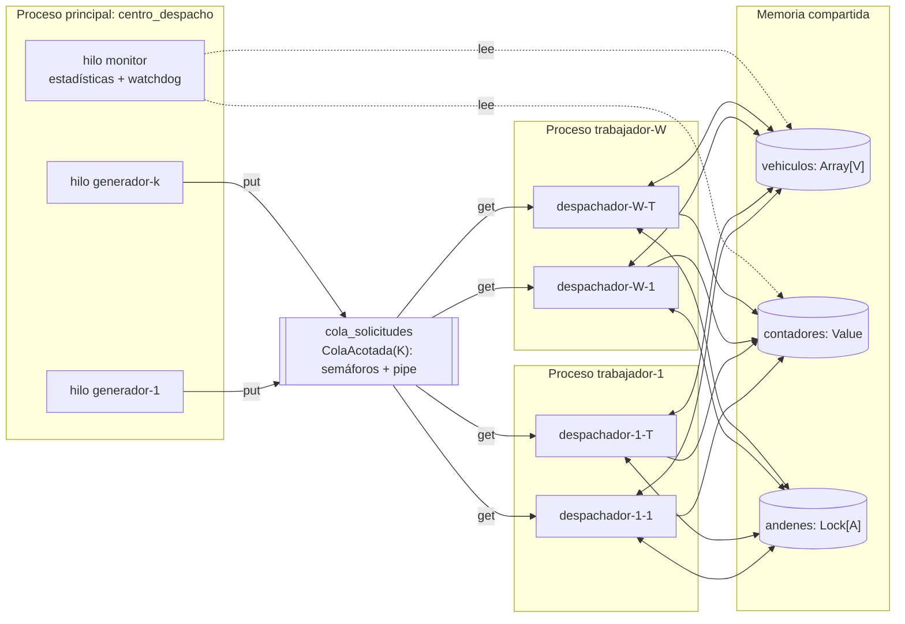
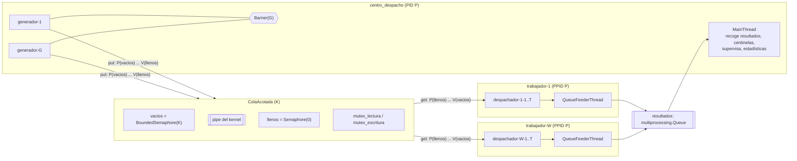
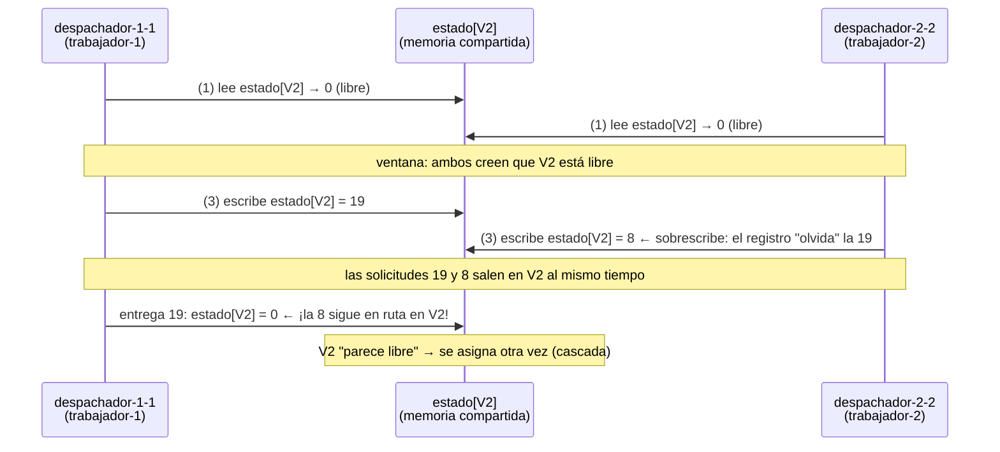
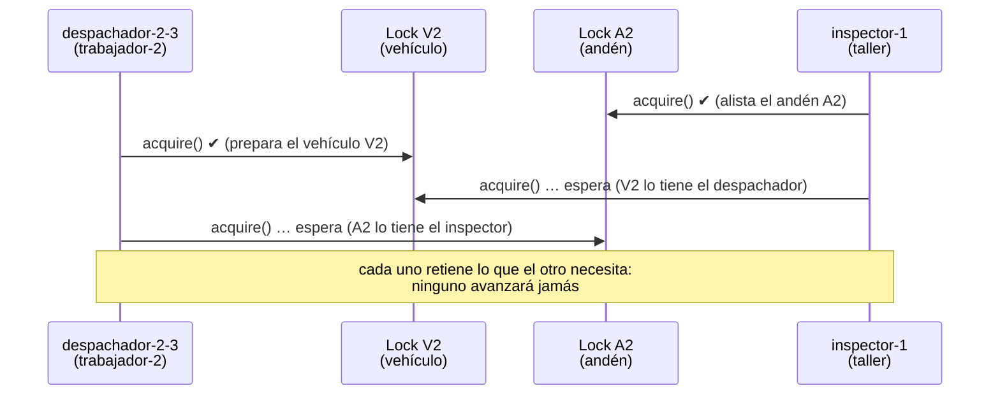
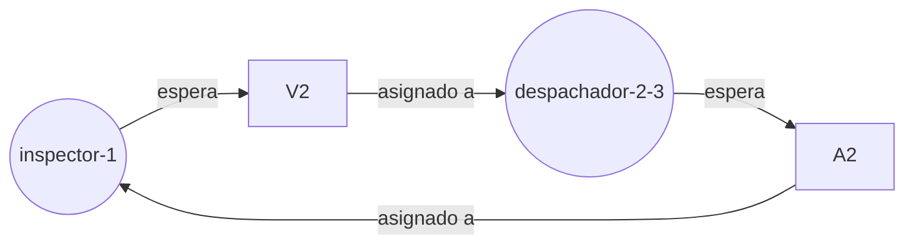

# Bitácora técnica — Proyecto 6: Sistema de despacho y logística

> Documento vivo. Se actualiza al cerrar cada fase. Sirve como fuente para el informe técnico
> y como guía para la demostración/sustentación. Cada sección de fase contiene:
> **Qué se hizo · Decisiones y justificación · Conceptos de SO · Cómo ejecutarlo ·
> Qué observar y cómo explicarlo · Evidencias.**

## Índice
- [0. Contexto, entorno y diseño](#fase-0--contexto-entorno-y-diseño)
- [1. Procesos](#fase-1--procesos) ✅
- [2. Hilos y productor-consumidor](#fase-2--hilos-y-productor-consumidor) ✅
- [3. Condición de carrera](#fase-3--condición-de-carrera) ✅
- [4. Corrección por sincronización](#fase-4--corrección-por-sincronización) ✅
- [5. Interbloqueo](#fase-5--interbloqueo) ✅
- [6. CPU y memoria](#fase-6--cpu-y-memoria) ✅
- [7. Registro y observación](#fase-7--registro-y-observación) ✅
- [8. Experimentos y comparación antes/después](#fase-8--experimentos-y-comparación-antesdespués) ✅
- [9. Guion de demostración y sustentación](#fase-9--guion-de-demostración-y-sustentación) *(pendiente)*
- [Anexo A. Matriz de trazabilidad](#anexo-a-matriz-de-trazabilidad)
- [Anexo B. Glosario de comandos del SO usados](#anexo-b-comandos-del-so)

---

## Fase 0 — Contexto, entorno y diseño

### 0.1 Problema
Una empresa de transporte recibe solicitudes de despacho. Cada solicitud debe:
**recibirse → asignarse a un vehículo disponible → procesarse en el centro de despacho →
registrarse como entregada.** En alta demanda aparecen tres síntomas que el sistema debe
reproducir, explicar y corregir:

| Síntoma reportado | Causa de SO que lo explica | Dónde se trata |
|---|---|---|
| Dos solicitudes asignadas al mismo vehículo | Condición de carrera *check-then-act* (TOCTOU) sobre el estado compartido de vehículos | Fases 3 y 4 |
| Despachos que quedan esperando | Interbloqueo por adquisición de recursos en orden distinto (y/o inanición si no hay vehículos) | Fase 5 |
| CPU elevada con muchas solicitudes | Tarea CPU-bound (cálculo de rutas) + espera activa; límites del GIL en hilos | Fases 4 y 6 |

### 0.2 Entorno de ejecución (real, verificado)
| Elemento | Valor |
|---|---|
| SO | Linux (Arch), kernel 7.1.8-arch1-3 |
| CPU | 4 núcleos lógicos (`nproc`) |
| Lenguaje | Python 3.14.7 (CPython) |
| GIL | **Activo** (`sys._is_gil_enabled() → True`) |
| Nombres de hilo | Python 3.14 propaga `Thread(name=...)` al kernel: visible en `/proc/<pid>/task/<tid>/comm`, `ps -L`, `top -H` (verificado) |
| Herramientas | `ps`, `pstree`, `top`, `htop`, `/proc` |

> Nota para el informe: que el nombre del hilo sea visible en el kernel permite relacionar
> **directamente** cada hilo del programa con su LWP en `ps -eLf`, lo que refuerza la evidencia
> de que los hilos de Python son hilos reales del SO (modelo 1:1, `clone()` con `CLONE_THREAD`).

### 0.3 Decisiones de diseño y justificación

**D1. Procesos para los trabajadores.** Cada trabajador es un proceso (`multiprocessing.Process`)
con su propio espacio de direcciones y su propio GIL. Motivos: (a) el enunciado lo exige;
(b) aislamiento de fallos; (c) la tarea intensiva en CPU (cálculo de ruta) sólo se ejecuta en
paralelo real entre procesos, porque con GIL activo los hilos de un mismo proceso no ejecutan
bytecode Python simultáneamente.

**D2. Hilos dentro de cada trabajador.** Cada trabajador lanza T hilos despachadores. Motivo: la
mayor parte del ciclo de vida de una solicitud es **espera** (despacho y entrega simulados con
`sleep`). Durante `sleep` el hilo libera el GIL y queda en estado `S` en el kernel, así que muchos
hilos atienden muchas solicitudes con bajo costo (menos memoria y cambio de contexto más barato
que un proceso por solicitud).

**D3. Estado compartido en memoria compartida real.** Los vehículos se representan con
`multiprocessing.Array('i', V)` (memoria compartida `mmap` heredada por `fork`): `0` = libre,
`n > 0` = id de la solicitud asignada. Se prefiere a `Manager()` porque el `Manager` ejecuta un
proceso servidor que serializa las operaciones y **ocultaría** la condición de carrera; con
memoria compartida la carrera es real entre procesos e hilos.

**D4. Cola productor-consumidor acotada.** Los productores (hilos generadores del proceso
principal) se bloquean cuando la cola está llena y los consumidores (hilos despachadores de los
trabajadores) cuando está vacía. La cota K modela capacidad finita y aplica *backpressure*.
Diseño inicial: `multiprocessing.Queue(maxsize=K)`. Implementación final: `ColaAcotada` propia
con semáforos `vacios`/`llenos` + mutex sobre un pipe (Fase 2, D2.3 y hallazgo H3).

**D5. Llegada simultánea.** Los productores se sincronizan con `threading.Barrier` para liberar
una ráfaga de solicitudes en el mismo instante (requisito 6).

**D6. Fenómenos activables por parámetro.** Un único código con banderas
(`--modo inseguro|seguro`, `--interbloqueo sin_orden|orden|timeout`) preserva la versión con el
problema y la corregida, y garantiza que la comparación antes/después use exactamente la misma
carga (misma `--semilla`).

**D7. Terminación ordenada.** Centinelas (*poison pill*) en la cola y `join()` de todos los
procesos e hilos, para no dejar procesos huérfanos ni zombis. (Implementación del cierre de
procesos y sus casos de fallo: Fase 1, D1.4–D1.8.)

**D8. Método de inicio `fork`.** Python 3.14 usa `forkserver` por defecto en Linux, lo que
cambia el PPID de los trabajadores. Se fija `fork` (ver Fase 1, D1.1 y evidencia E4).

### 0.4 Diagrama de arquitectura



### 0.5 Jerarquía de procesos esperada

```
centro_despacho(P)            ← proceso principal
 ├─{generador-1..k}           ← hilos (mismo PID, distinto TID)
 ├─{monitor}
 ├─trabajador-1(P1, PPID=P)
 │   └─{despachador-1-1..T}
 ├─trabajador-W(PW, PPID=P)
 │   └─{despachador-W-1..T}
 └─(resource_tracker / hilo alimentador de la Queue: auxiliares de multiprocessing)
```
> Explicación esperable en la sustentación: `multiprocessing.Queue` crea un hilo interno
> "feeder" en cada proceso que hace `put` (aparecerá en `ps -L` desde la Fase 2). El proceso
> auxiliar `resource_tracker` sólo aparece con `forkserver`/`spawn`; con `fork` no se crea
> (verificado en la Fase 1, evidencias E1 y E4).

### 0.6 Hilos identificados
| Hilo | Proceso | Rol | Estado típico en el kernel |
|---|---|---|---|
| `generador-i` | principal | Productor: crea solicitudes y las encola | `S` (bloqueado en Barrier o cola llena) |
| `monitor` | principal | Estadísticas periódicas, watchdog de interbloqueo | `S` (sleep) |
| `despachador-w-t` | trabajador w | Consumidor: asigna vehículo, calcula ruta, despacha, entrega | `R` en cálculo de ruta; `S` en sleep/locks |
| `MainThread` | cada proceso | Crea/espera hilos (`join`) | `S` |

### 0.7 Recursos compartidos y secciones críticas
| Recurso | Tipo | Compartido entre | Sección crítica | Mecanismo (versión corregida) |
|---|---|---|---|---|
| `cola_solicitudes` | Cola acotada | Proceso principal y trabajadores | `put`/`get` | `ColaAcotada`: `vacios`, `llenos`, `mutex_lectura`, `mutex_escritura` (Fase 2) |
| `resultados` | Cola sin límite | Trabajadores → principal | `put`/`get` | Interna de `multiprocessing.Queue` (un solo lector: el principal) |
| `vehiculos[V]` | Arreglo compartido (`RawArray`, `/dev/shm`) | Todos los despachadores de todos los trabajadores | Buscar libre + marcar ocupado; liberar | Fase 3: ninguno (versión con el problema). Fase 4: `multiprocessing.Lock` + `Semaphore(V)` |
| Contadores | `Value`/`Array` | Todos | Incrementos `x += 1` (leer-modificar-escribir) | Lock asociado al `Value` |
| Vehículos (en el patio) y `andenes[A]` | Un `Lock` por recurso + registro de dueños y esperas | Despachadores (trabajadores) e inspectores (taller) | Cargue (vehículo→andén) e inspección (andén→vehículo) | Orden global (defecto) / tiempo límite / detección y recuperación (Fase 5) |

### 0.8 Posibles situaciones de bloqueo (identificadas a priori)
1. **Interbloqueo vehículo↔andén**: despacho toma vehículo y luego andén; retorno toma andén y
   luego vehículo → espera circular posible.
2. **Inanición de solicitudes**: si hay más solicitudes que vehículos y la política no es FIFO,
   una solicitud podría esperar indefinidamente.
3. **Bloqueo en la terminación**: un proceso que termina con datos aún en el búfer de la
   `Queue` puede bloquear el `join` (comportamiento documentado de `multiprocessing`). Se evita
   consumiendo hasta el centinela.
4. **Espera activa** (*busy waiting*) cuando no hay vehículos libres → consumo de CPU sin
   progreso. Se reemplaza por bloqueo en semáforo.

---

## Fase 1 — Procesos

> Rama `fase-1-procesos` · etiqueta `fase-1` · evidencias en `evidencias/fase1/`

### 1.1 Qué se hizo
- Proceso principal `centro_despacho` que crea **W procesos trabajadores**, espera a que estén
  listos, registra la jerarquía leída de `/proc`, los supervisa y los cierra ordenadamente.
- Registro de eventos común a todos los procesos con `PID | PPID | TID | proceso | hilo`.
- Manejo de señales: `SIGINT` (Ctrl+C) y `SIGTERM` en el principal; los trabajadores ignoran
  `SIGINT`. Detección de trabajadores caídos, recolección de zombis, escalamiento
  `SIGTERM → SIGKILL` y detección de orfandad.
- Script de observación del SO (`scripts/observar.sh`) y script que reproduce los escenarios de
  la fase (`scripts/evidencias_fase1.sh`).
- Experimento aislado del hallazgo H1 (`experimentos/h1_event_bloqueado.py`).

### 1.2 Estructura del código
| Archivo | Responsabilidad |
|---|---|
| `main.py` | Punto de entrada: lee argumentos y ejecuta el centro de despacho; su código de salida es el del sistema |
| `despacho/config.py` | Parámetros de la línea de comandos (`Config`, inmutable) |
| `despacho/centro.py` | Proceso principal: creación, sincronización de arranque, supervisión y cierre de trabajadores |
| `despacho/trabajador.py` | Código que ejecuta cada proceso hijo |
| `despacho/registro.py` | Registro con identidad del SO (PID, PPID, TID nativo) a consola y archivo |
| `despacho/so_utils.py` | Acceso a `/proc` (estado, hilos, memoria, CPU), nombre del proceso, volcado de pilas, traducción de señales |
| `scripts/observar.sh` | Captura `pstree`, `ps -o`, `ps -eLf`, `ps -L`, `/proc/<pid>/status` y `smaps_rollup` |
| `scripts/evidencias_fase1.sh` | Reproduce los escenarios E1–E5 y guarda las salidas |

Parámetros disponibles (`python3 main.py --help`):

| Parámetro | Defecto | Significado |
|---|---|---|
| `-w, --trabajadores` | 2 | Número de procesos trabajadores |
| `-d, --duracion` | 5 | Segundos de ejecución; `0` = hasta Ctrl+C o `SIGTERM` |
| `--metodo-inicio` | `fork` | `fork`, `forkserver` o `spawn` |
| `--latido` | 1 | Segundos entre latidos de cada trabajador |
| `--espera-fin` | 3 | Tiempo de gracia antes de `SIGTERM` y luego antes de `SIGKILL` |
| `--log` | `logs/despacho_<fecha>.log` | Archivo de registro |

### 1.3 Ciclo de vida implementado

```mermaid
sequenceDiagram
    participant T as Terminal / kill
    participant P as centro_despacho
    participant W as trabajador-i
    P->>P: nombrar_proceso() → /proc/self/comm
    P->>P: SIGINT = SIG_IGN (temporal)
    P->>W: fork() × W  (hereda SIG_IGN para SIGINT)
    P->>P: restaura SIGINT, instala manejadores SIGINT/SIGTERM
    W->>W: nombrar_proceso(), registro, faulthandler(SIGUSR1)
    W-->>P: listos.release()  (Semaphore)
    P->>P: listos.acquire() × W (máx. 10 s) → SINCRONIZADO
    P->>P: registrar jerarquía (/proc)
    loop cada 0.2 s
        P->>W: is_alive() → waitpid(WNOHANG)
        W->>W: latido; revisa detener y getppid()
    end
    T->>P: SIGINT / SIGTERM / fin de duración
    P->>W: detener.value = 1 (memoria compartida)
    W-->>P: exit(0)
    P->>P: join(espera_fin) → SIGTERM → join → SIGKILL → join
    P->>P: RESUMEN + verificación en /proc
```

### 1.4 Decisiones de diseño de la fase (y su justificación)

**D1.1 Método de inicio `fork` explícito.** *Hallazgo verificado:* en Python 3.14 el método por
defecto en Linux cambió a **`forkserver`**. Con él, el principal lanza (con `exec`) un proceso
servidor y es ese servidor quien hace `fork()` de cada trabajador; el PPID de los trabajadores
es el servidor y no el centro de despacho (evidencia E4). Como el requisito es reconstruir la
jerarquía por PID/PPID, se fija `fork`: el trabajador es hijo directo del principal. La opción
`--metodo-inicio` permite mostrar la diferencia en la demostración.

**D1.2 Crear los procesos antes que cualquier hilo.** `fork()` sólo duplica el hilo que lo
invoca. Si otro hilo del padre tuviera tomado un lock (por ejemplo, el del registro), el hijo
heredaría ese lock tomado sin que exista ningún hilo que lo libere → bloqueo en el hijo. Por eso
los hilos del principal (fases siguientes) se lanzan después de crear los trabajadores. Python
3.12+ incluso emite `DeprecationWarning` si se hace `fork()` con varios hilos activos.

**D1.3 Nombre del proceso en el kernel.** Se escribe en `/proc/self/comm` (máx. 15 caracteres),
así `ps`, `pstree`, `top` y `pgrep -x centro_despacho` muestran nombres con significado en lugar
de `python3`. La línea de comandos (`args`) no cambia: por eso `ps -o comm` y `ps -o args` difieren.

**D1.4 Señales.**
- Ctrl+C envía `SIGINT` a **todo el grupo de procesos en primer plano**, no sólo al principal. Si
  cada trabajador reaccionara por su cuenta, el cierre sería desordenado. Los trabajadores ignoran
  `SIGINT` y sólo el principal coordina.
- Para no dejar una ventana de carrera (un Ctrl+C justo después del `fork` y antes de que el hijo
  ignore la señal), el principal pone `SIGINT = SIG_IGN` **antes** de crear los hijos. Con `fork`
  la disposición de señales se hereda, así que el hijo nace protegido. Después el principal
  restaura su propio manejador.
- El manejador de señales del principal **sólo anota** la señal. Hacer trabajo complejo dentro de
  un manejador (tomar locks, escribir en el log) no es seguro: si la señal interrumpe al hilo
  justo cuando tiene ese lock, se bloquea consigo mismo. El cierre se hace desde el bucle normal.

**D1.5 Supervisión y recolección de zombis.** El bucle del principal llama a `is_alive()` cada
0.2 s, que internamente ejecuta `waitpid(pid, WNOHANG)`: si un hijo terminó, el kernel entrega
su estado de salida y libera su entrada en la tabla de procesos. Mientras nadie lo recoja, el hijo
muerto queda como **zombi** (`Z <defunct>`), evidencia E2.

**D1.6 Escalamiento del cierre.** `join(espera_fin)` → `SIGTERM` → `join(espera_fin)` →
`SIGKILL`. Necesario porque un proceso **detenido** (`SIGSTOP`, estado `T`) no atiende `SIGTERM`:
la señal queda pendiente hasta un `SIGCONT`. `SIGKILL` (igual que `SIGSTOP`) no puede capturarse
ni ignorarse y el kernel la aplica aunque el proceso esté detenido (evidencia E3).

**D1.7 Indicador de parada y semáforo de arranque (resultado del hallazgo H1).** Ver 1.7.

**D1.8 Detección de orfandad (resultado del hallazgo H2).** Ver 1.8.

**D1.9 Registro concurrente.** Todos los procesos escriben el mismo archivo abierto con
`O_APPEND`: el kernel posiciona cada `write()` al final del archivo de forma atómica respecto de
otros escritores, así las líneas de distintos procesos no se sobrescriben. El orden de las líneas
es el orden en que el kernel atendió cada escritura, que puede diferir levemente del orden de las
marcas de tiempo (se observa en los `LATIDO` de procesos distintos): **ese desorden es en sí una
evidencia de ejecución concurrente** y de que el planificador decide quién corre primero.

### 1.5 Cómo ejecutarlo
```bash
python3 main.py --help
python3 main.py -w 3 -d 5                  # 3 trabajadores durante 5 s
python3 main.py -w 3 -d 0                  # hasta Ctrl+C (observar con otra terminal)
scripts/observar.sh                        # en otra terminal, mientras corre
python3 main.py -w 2 -d 0 --metodo-inicio forkserver   # comparar la jerarquía
scripts/evidencias_fase1.sh                # reproduce E1–E5 y guarda evidencias
python3 experimentos/h1_event_bloqueado.py [--corregido]
```
Código de salida del principal: `0` si todos los trabajadores terminaron con `exit(0)`, `1` si
alguno terminó por señal o con error.

### 1.6 Evidencias y cómo explicarlas

**E1 — Jerarquía y observación** (`e1_observacion.txt`, `e1_top.txt`, `e1_ejecucion.log`)
```
centro_despacho(56677)-+-trabajador-1(56680)
                       |-trabajador-2(56681)
                       `-trabajador-3(56683)
```
- *Qué decir:* los tres trabajadores tienen **PPID 56677**, el PID del principal. El PPID del
  principal (56673) es la shell que lo lanzó. Todos comparten **PGID 56677**: el principal es líder
  de su grupo de procesos, y por eso Ctrl+C (o `kill -INT -- -56677`) llega a todos.
- `NLWP = 1` en todos: en esta fase cada proceso tiene un único hilo. En la Fase 2 este número crece.
- `STAT S` y `WCHAN hrtimer_nanosleep`: los procesos están **dormidos** en el temporizador del
  kernel (el `sleep` del bucle de sondeo): no consumen CPU (0.0 %). El principal muestra `Ss`: la
  `s` indica que es líder de sesión (se lanzó con `setsid`).
- **Memoria: RSS vs PSS.** Cada trabajador reporta RSS ≈ 17.8 MB, pero PSS ≈ 5.0 MB. Tras `fork()`
  padre e hijos **comparten las mismas páginas físicas** (copy-on-write) hasta que alguno escribe.
  RSS cuenta cada página compartida completa en cada proceso; PSS la divide entre quienes la
  comparten. Suma RSS ≈ 75 MB (irreal); suma PSS ≈ 21 MB (memoria realmente ocupada).
- El log muestra `SEÑAL SIGINT recibida`, un `FIN` por trabajador con `exit(0)` y la verificación
  "sin zombis ni huérfanos"; código de salida 0.

**E2 — Muerte de un trabajador y estado zombi** (`e2_zombi.txt`, `e2_ejecucion.log`)
```
## kill -KILL 56733; ps inmediatamente después
  56733   56730 Z    trabajador-2 <defunct>
## 0.5 s después (el principal ya hizo waitpid)
  56732   56730 S    trabajador-1
  56734   56730 S    trabajador-3
```
- *Qué decir:* al morir, el proceso libera su memoria pero su entrada en la tabla de procesos
  (PID y código de salida) permanece hasta que el padre la recoja con `wait()`: eso es un
  **zombi**. En menos de 0.2 s el principal hace `waitpid`, registra
  `CAÍDO trabajador-2 (PID 56733): terminado por señal SIGKILL` y el zombi desaparece.
- `exitcode = -9` en `multiprocessing` significa "terminado por la señal 9". El resumen lo traduce
  y el sistema termina con código 1 (con fallos); los trabajadores sanos cierran con `exit(0)`.

**E3 — Trabajador detenido durante el cierre** (`e3_detenido.txt`, `e3_ejecucion.log`)
```
  56770   56768 T    do_signal_stop       trabajador-1
  56771   56768 S    hrtimer_nanosleep    trabajador-2
...
trabajador-1 (PID 56770) no terminó en 1.5 s: se envía SIGTERM
trabajador-1 (PID 56770) ignoró SIGTERM (estado T (stopped)): se envía SIGKILL
```
- *Qué decir:* `T` = detenido por `SIGSTOP`; `wchan do_signal_stop` es la función del kernel donde
  quedó parado. No puede leer el indicador de parada ni atender `SIGTERM`. El principal escala a
  `SIGKILL`, que el kernel aplica siempre. Sin el escalamiento, el cierre quedaría colgado para
  siempre (un ejemplo del síntoma "despachos que quedan esperando").

**E4 — `forkserver` vs `fork`** (`e4_forkserver.txt`)
```
centro_despacho(56837)-+-python3(56839)            ← resource_tracker
                       `-python3(56840)-+-trabajador-1(56861)   ← forkserver
                                        `-trabajador-2(56862)
```
- *Qué decir:* con `forkserver` aparece un nivel intermedio y el PPID de los trabajadores es 56840
  (el servidor), no el principal. También aparece `resource_tracker`, un proceso auxiliar que
  libera semáforos con nombre si alguien muere sin cerrarlos. Esto justifica D1.1.

**E5 — Muerte del principal: huérfanos** (`e5_huerfanos.txt`, `e5_ejecucion.log`)
```
## kill -KILL 56878 (sólo el principal); ps inmediatamente después
  56880    1338 S    trabajador-1
  56881    1338 S    trabajador-2
HUÉRFANO: el principal (PID 56878) terminó; adoptado por PID 1338. Se termina
```
- *Qué decir:* cuando un padre muere, el kernel **re-asigna** (reparenting) a sus hijos. No van a
  PID 1 sino a PID 1338, `systemd --user`, porque se registró como *child subreaper*
  (`prctl(PR_SET_CHILD_SUBREAPER)`): el kernel entrega los huérfanos al ancestro subreaper más
  cercano. Los trabajadores detectan el cambio de PPID y terminan (ver H2).

### 1.7 Hallazgo H1 — `multiprocessing.Event` bloquea al sistema si muere un participante

Prueba de fallo y corrección completa (formato 9.3 del enunciado):

1. **Versión con el problema.** La primera implementación usaba `detener = ctx.Event()`; los
   trabajadores esperaban con `detener.wait(1.0)` y el principal cerraba con `detener.set()`.
   Arranque sincronizado con `ctx.Barrier(W+1)`.
2. **Ejecución controlada.** Escenario E2: 3 trabajadores, `kill -KILL` a `trabajador-2`, luego
   `SIGTERM` al principal.
3. **Evidencia** (`h1_captura_original.txt`): el log termina en
   `SEÑAL SIGTERM recibida: se inicia el cierre ordenado`; no hay `RESUMEN` ni `FIN`.
   ```
     PID    PPID     LWP STAT %CPU     ELAPSED WCHAN                COMMAND
   53948   53869   53948 Ss    0.0       02:39 futex_do_wait        centro_despacho
   53950   53948   53950 S     0.0       02:39 futex_do_wait        trabajador-1
   53952   53948   53952 S     0.0       02:39 futex_do_wait        trabajador-3
   voluntary_ctxt_switches: 16  →  2 s después: 16   (ningún progreso)
   ```
   Todos dormidos en un **futex** (primitiva del kernel sobre la que se construyen los semáforos),
   0 % de CPU, sin cambios de contexto: bloqueo total, no lentitud. Los trabajadores **sanos**
   también dejaron de emitir latidos.
4. **Explicación de la causa.** `Event.set()` llama a `Condition.notify_all()`, que en
   `multiprocessing/synchronize.py` implementa un protocolo de confirmación:
   ```python
   while sleepers < n and self._sleeping_count.acquire(False):
       self._wait_semaphore.release()        # wake up one sleeper
       sleepers += 1
   if sleepers:
       for i in range(sleepers):
           self._woken_count.acquire()       # wait for a sleeper to wake   ← línea 304
   ```
   Cada proceso que entra en `wait()` incrementa `_sleeping_count`; al despertar incrementa
   `_woken_count`. `trabajador-2` murió **dentro** de `wait()`: quedó contado como durmiente pero
   nunca confirmará, así que el principal espera en `_woken_count.acquire()` para siempre. Y como
   lo hace **reteniendo el lock de la Condition**, los trabajadores sanos, cuyo `wait(1.0)` vence
   y necesita re-adquirir ese lock, también se bloquean. La pila capturada con `faulthandler` en
   el experimento aislado lo confirma:
   ```
   File ".../multiprocessing/synchronize.py", line 304 in notify
   File ".../multiprocessing/synchronize.py", line 311 in notify_all
   File ".../multiprocessing/synchronize.py", line 352 in set
   ```
   Concepto de SO: una primitiva de sincronización **compartida entre procesos** cuyo estado
   depende de que todos los participantes completen un protocolo no es tolerante a la muerte de un
   participante (los semáforos POSIX no registran dueño ni se "reparan" solos). Es la misma familia
   de problemas que un proceso que muere reteniendo un mutex compartido.
5. **Modificación implementada.**
   - `detener`: `ctx.RawValue("b", 0)`, un byte en memoria compartida. Sólo el principal escribe
     (escritor único) y la escritura de un byte es atómica, por lo que no hace falta lock. Los
     trabajadores lo consultan cada 0.1 s. No hay protocolo entre participantes: la muerte de uno
     no afecta a los demás.
   - Arranque: `ctx.Semaphore(0)`. Cada trabajador hace un único `release()` (`sem_post`) y el
     principal hace W `acquire(timeout)`. Cada operación es atómica y no deja estado a medias.
   - *Costo aceptado:* el sondeo introduce hasta 0.1 s de latencia en el cierre y despertares
     periódicos (10 por segundo por trabajador, costo de CPU despreciable). En la Fase 2 los
     trabajadores se bloquearán en la cola y la parada normal será por centinelas.
6. **Nueva ejecución.** Mismo escenario E2 con la versión corregida.
7. **Evidencia de la corrección** (`e2_ejecucion.log`): `CAÍDO trabajador-2 ... SIGKILL`, luego
   `SEÑAL SIGTERM recibida`, `FIN trabajador 1`, `FIN trabajador 3`, `RESUMEN`, verificación sin
   zombis; el principal termina en ~0.1 s.
8. **Comparación antes/después** (`h1_reproduccion.txt`, experimento aislado con 3 hijos y
   `SIGKILL` al hijo 2):

   | | `Event` (antes) | `RawValue` (después) |
   |---|---|---|
   | ¿La orden de parada retorna? | No (el vigilante declara bloqueo a los 3 s) | Sí, inmediatamente |
   | Hijos sanos | Bloqueados en el lock de la Condition | Terminan normalmente |
   | Código de salida | 1 (forzado por el vigilante) | 0 |

### 1.8 Hallazgo H2 — trabajadores huérfanos que nunca terminan
1. **Problema:** si el principal muere con `SIGKILL` (no puede capturarla, así que no ejecuta su
   cierre), nadie activa el indicador de parada. Los trabajadores, adoptados por `systemd --user`,
   seguirían ejecutándose indefinidamente consumiendo recursos: observado durante las pruebas
   (procesos con PPID 1338 que hubo que eliminar a mano).
2. **Corrección:** cada trabajador guarda su PPID al arrancar y en cada ciclo compara con
   `os.getppid()`. Si cambió, registra `HUÉRFANO ... adoptado por PID X` y termina.
3. **Evidencia:** E5, ambos trabajadores terminan en ≤ 0.1 s tras la muerte del principal y no
   queda ningún proceso del grupo.
4. *Alternativa conocida:* `prctl(PR_SET_PDEATHSIG, SIGTERM)` hace que el kernel envíe una señal
   al hijo cuando muere el padre. No está en la biblioteca estándar de Python (requiere `ctypes`)
   y tiene sutilezas con hilos: el disparador es la muerte del **hilo** que creó al hijo, no la del
   proceso. Se optó por la comprobación explícita, más simple de explicar y verificar.

### 1.9 Preguntas probables en la sustentación
- **¿Por qué procesos y no sólo hilos?** Aislamiento (un fallo en un trabajador no corrompe la
  memoria de los demás; E2 lo demuestra), paralelismo real de CPU pese al GIL (Fase 6) y porque
  el enunciado exige observar la jerarquía PID/PPID.
- **¿Qué es un zombi y por qué no quedan en su sistema?** E2 + D1.5.
- **¿Qué pasa si se cierra el principal abruptamente?** E5 + H2.
- **¿Por qué `pstree` muestra `python3` con `forkserver`?** Porque ese proceso se creó con
  `exec` de un nuevo intérprete, no con `fork` del principal, y no se renombra (E4).
- **¿Por qué ignorar `SIGINT` en los hijos?** D1.4.
- **¿Qué significa `futex_do_wait` en `wchan`?** El hilo está dormido en el kernel esperando un
  futex (*fast userspace mutex*), la base de los locks y semáforos en Linux: un proceso bloqueado
  en sincronización, no ocupado calculando (H1).

## Fase 2 — Hilos y productor-consumidor

> Rama `fase-2-hilos-cola` · etiqueta `fase-2` · evidencias en `evidencias/fase2/`

### 2.1 Qué se hizo
- **Productores:** G hilos `generador-i` en el proceso principal crean solicitudes (cliente, origen,
  destino, tiempos) y las ponen en la cola. En cada ráfaga se sincronizan con una
  `threading.Barrier` para llegar **simultáneamente** (requisito 6).
- **Consumidores:** cada trabajador lanza T hilos `despachador-w-t`. Todos los hilos de todos los
  trabajadores **compiten** por la misma cola. Cada solicitud pasa por
  `RECIBIDA → DESPACHO (preparación) → EN RUTA → ENTREGADA`, con tiempos aleatorios
  reproducibles (requisito 9).
- **Cola acotada propia** (`despacho/cola.py`): búfer productor-consumidor clásico con semáforos
  entre procesos. Se conserva `--cola mp` (`multiprocessing.Queue`) para reproducir el hallazgo H3.
- **Cola de resultados** (trabajadores → principal) para contabilizar cada solicitud terminada.
- **Cierre normal por centinelas** (*poison pill*): un `None` por hilo despachador cuando terminan
  los generadores. **Cierre anticipado** (Ctrl+C, `SIGTERM`, `--duracion`): se detiene la
  generación y las solicitudes que quedan en la cola se retiran como **canceladas**, así el balance
  siempre cuadra.
- **Estadísticas** al final: balance, bloqueos de productores, espera en cola, servicio,
  rendimiento, concurrencia efectiva y máxima, reparto por trabajador e hilo, CPU consumida y
  cambios de contexto (según el kernel, con `getrusage`).
- La jerarquía registrada al inicio ahora incluye **los hilos de cada proceso** leídos de
  `/proc/<pid>/task/<tid>/`.
- Modo continuo (`-n 0`) para observar el sistema con herramientas del SO mientras corre.
- Hallazgos: **H3** (inanición por muerte de un consumidor con `multiprocessing.Queue`) y
  **H4** (carrera entre `Barrier.wait()` y `Barrier.abort()`), ambos reproducidos, corregidos y
  medidos antes y después.

**Cambios respecto a la Fase 1:** desaparece el "latido" de los trabajadores (ahora su actividad
real son las solicitudes); `--duracion` pasa a ser un tiempo *máximo* (0 = sin límite); el
sistema termina solo cuando se atienden todas las solicitudes.

### 2.2 Estructura del código (nuevo o modificado)
| Archivo | Responsabilidad |
|---|---|
| `despacho/modelo.py` | `Solicitud` y `Resultado`: los datos que viajan entre procesos (serializados con `pickle`) |
| `despacho/generador.py` | Hilos productores, reparto determinista de ids, ráfagas con `Barrier`, bloqueo por cola llena |
| `despacho/cola.py` | `ColaAcotada`: productor-consumidor con semáforos `vacios`/`llenos` + mutex sobre un pipe |
| `despacho/trabajador.py` | Proceso trabajador: crea los hilos `Despachador` (consumidores) y vigila la orfandad |
| `despacho/centro.py` | Crea colas y procesos, lanza generadores, recoge resultados, envía centinelas, estadísticas |
| `scripts/evidencias_fase2.sh` | Reproduce E1–E4 |
| `experimentos/h3_trabajador_caido.sh` | Reproduce y mide H3 con ambas colas |
| `experimentos/h4_barrera_abortada.sh` | Reproduce y mide H4 |

Parámetros nuevos (`python3 main.py --help`):

| Parámetro | Defecto | Significado |
|---|---|---|
| `-t, --hilos` | 3 | Hilos despachadores por trabajador |
| `-g, --generadores` | 2 | Hilos productores |
| `-n, --solicitudes` | 20 | Total a generar; `0` = continuo hasta Ctrl+C |
| `--tam-rafaga` | 0 | Solicitudes por generador en cada ráfaga (`0` = todas en una) |
| `--intervalo` | 1 | Segundos entre ráfagas |
| `-k, --capacidad-cola` | 10 | Capacidad K del búfer |
| `--cola` | `semaforos` | `semaforos` (propia) o `mp` (`multiprocessing.Queue`) |
| `--despacho`, `--entrega` | `0.1-0.3`, `0.2-0.6` | Rango (s) de los tiempos simulados |
| `-s, --semilla` | 42 | Misma semilla = misma carga |
| `-d, --duracion` | 0 | Tiempo máximo (0 = sin límite) |

### 2.3 Arquitectura de la fase



Cada solicitud cruza **dos fronteras de proceso**: de un hilo del principal a un hilo de un
trabajador (por la cola de solicitudes) y de vuelta (por la cola de resultados). La pasan como
bytes por pipes del kernel, porque los procesos no comparten el heap de Python.

### 2.4 Decisiones de diseño de la fase

**D2.1 Productores en el principal, consumidores en los trabajadores.** Los generadores sólo crean
objetos pequeños y esperan (ráfagas, cola llena), así que como hilos cuestan poco. Los
consumidores están repartidos entre procesos para que en la Fase 6 la parte de CPU se ejecute en
paralelo real. Los generadores se lanzan **después** de crear los trabajadores (D1.2).

**D2.2 Una única cola compartida por todos los consumidores.** Es el esquema productor-consumidor
de libro. El reparto de carga es automático: el hilo que queda libre toma la siguiente solicitud.
El reparto observado es equilibrado (E1: 13/11 entre trabajadores, 3–5 por hilo) sin ningún
planificador explícito.

**D2.3 Cola propia con semáforos (`ColaAcotada`) en lugar de `multiprocessing.Queue`.**
```
productor:  P(vacios); P(mutex_escritura); escribir en el pipe; V(mutex_escritura); V(llenos)
consumidor: P(llenos); P(mutex_lectura);   leer del pipe;       V(mutex_lectura);   V(vacios)
```
- `vacios` (inicia en K) impide que haya más de K solicitudes en el búfer: el productor se bloquea
  en `P(vacios)` cuando la cola está llena. `llenos` (inicia en 0) hace que el consumidor se
  bloquee en `P(llenos)` cuando está vacía y garantiza que sólo lee cuando hay un mensaje completo.
  Los mutex evitan que dos lectores lean mitades de mensajes distintos o que dos escritores
  mezclen bytes en el pipe.
- Todos son `multiprocessing.Semaphore`/`Lock`, es decir, **semáforos POSIX en memoria
  compartida** (`sem_wait`/`sem_post` sobre un *futex* del kernel). Funcionan entre hilos y entre
  procesos.
- `qsize()` es el valor del semáforo `llenos` (`sem_getvalue`).
- **Motivo del cambio: hallazgo H3.** `multiprocessing.Queue.get()` retiene su lock de lectores
  durante toda la espera. En `ColaAcotada` el consumidor espera en `llenos` sin retener ningún
  lock, y el mutex sólo se toma durante los microsegundos que dura leer un mensaje.
- La serialización (`pickle.dumps`) se hace **fuera** de la sección crítica, para que sea lo más
  corta posible.

**D2.4 Tiempos reproducibles.** Cada generador usa `random.Random(semilla*1000 + id)`, y cada
solicitud lleva sus tiempos de despacho y entrega desde que se crea. La **carga** (qué solicitudes,
con qué tiempos) es idéntica para la misma semilla, sin importar qué hilo atienda cada una. El
**intercalado** (quién atiende qué y en qué orden) sí varía entre ejecuciones: eso lo decide el
planificador. Es la base para comparar antes y después con la misma entrada.

**D2.5 Llegada simultánea con `Barrier`.** Todos los generadores hacen el mismo número de ráfagas,
aunque alguno tenga lotes vacíos al final, para que ninguno quede esperando solo en la barrera.
La `Barrier` es de `threading`: los generadores son hilos del mismo proceso.

**D2.6 El productor bloqueado se registra.** Se intenta `put_nowait()`; si la cola está llena se
registra `PRODUCTOR BLOQUEADO` y se espera con `put(timeout=0.2)` en un bucle que revisa la orden
de parada. Así el bloqueo queda en el log con su duración y el productor puede abandonar si llega
Ctrl+C.

**D2.7 El principal vacía continuamente la cola de resultados.** Un proceso que escribió en una
`multiprocessing.Queue` no termina hasta que su `QueueFeederThread` entrega todo al pipe. Si el
pipe (64 KiB) se llena porque nadie lee, el trabajador se bloquea al salir y el `join()` del
principal nunca retorna: un interbloqueo entre padre e hijo. Por eso el principal lee resultados
también mientras espera el cierre de los trabajadores (`_esperar_proceso`).

**D2.8 Cierre por centinelas y cancelación contabilizada.** El cierre normal envía W×T centinelas
(`None`) sin bloquear al principal (`put_nowait`). Un centinela sólo puede llegar **detrás** de
todas las solicitudes, porque la cola es FIFO, así que ninguna queda sin atender. En el cierre
anticipado, cada solicitud que sale de la cola se informa como `CANCELADA` y el balance
`generadas = entregadas + canceladas + no atendidas` se verifica siempre. Además se verifica
`generadas = pedidas`; esa verificación fue la que detectó H4.

**D2.9 Robustez del principal.** Cualquier excepción inesperada en el principal se registra y
ejecuta el mismo cierre ordenado. Se añadió después de que una lectura de `/proc` fallara con
`ESRCH`: un hilo terminó entre el listado de `/proc/<pid>/task` y la lectura de su `stat`.
**`/proc` es una vista viva del kernel, no una foto consistente**, y quien la lee debe tolerar
que las tareas desaparezcan.

### 2.5 Cómo ejecutarlo
```bash
python3 main.py                                      # 2 trabajadores x 3 hilos, 20 solicitudes
python3 main.py -w 2 -t 3 -g 4 -n 24 --tam-rafaga 2 --intervalo 0.8 -k 5   # E1: ráfagas
python3 main.py -n 0 --tam-rafaga 3 --intervalo 0.5 --entrega 0.5-1.5       # continuo; Ctrl+C
scripts/observar.sh                                  # en otra terminal
scripts/evidencias_fase2.sh                          # E1–E4 (≈ 3 min)
experimentos/h3_trabajador_caido.sh 10               # H3 (≈ 3 min)
experimentos/h4_barrera_abortada.sh despues 30       # H4
```

### 2.6 Evidencias y cómo explicarlas

**E1 — Llegada simultánea y productor-consumidor** (`e1_rafagas.txt`, `e1_ejecucion.log`)
```
16:01:21.089710 generador-1 | RÁFAGA 1: 4 generadores liberados simultáneamente
16:01:21.090430 generador-1 | RECIBIDA solicitud 1 (ráfaga 1) ...
16:01:21.090105 generador-4 | RECIBIDA solicitud 19 (ráfaga 1) ...
16:01:21.090311 generador-2 | RECIBIDA solicitud 7 (ráfaga 1) ...
16:01:21.092465 generador-2 | RECIBIDA solicitud 8 (ráfaga 1) ...
```
- *Qué decir:* las 8 solicitudes de la ráfaga (4 generadores × 2) llegan en **menos de 3 ms**. La
  barrera liberó a los 4 hilos a la vez. Las líneas no están en orden de marca de tiempo: cada hilo
  toma la hora y luego compite por el lock del registro, y el planificador decide quién escribe
  primero (D1.9).
- Resultado: `generadas=24 entregadas=24 canceladas=0 no atendidas=0`; concurrencia máxima **6** =
  2 trabajadores × 3 hilos; **13.83 s de trabajo en 2.87 s** (concurrencia efectiva 4.82).
- Consumidores: al inicio y entre ráfagas aparecen `CONSUMIDOR ESPERANDO: cola vacía` (bloqueados
  en `P(llenos)`); al final, `CENTINELA recibido: el hilo termina`, uno por hilo.

**E2 — Procesos e hilos vistos desde el SO** (`e2_observacion.txt`, `e2_hilos.txt`)
```
centro_despacho(72899)-+-trabajador-1(72905)-+-{QueueFeederThre}(72915)
                       |                     |-{despachador-1-1}(72907)
                       |                     |-{despachador-1-2}(72908)
                       |                     `-{despachador-1-3}(72909)
                       |-trabajador-2(72906)-+-{QueueFeederThre}(72916)
                       |                     |-{despachador-2-1}(72910) ...
                       |-{generador-1}(72913)
                       `-{generador-2}(72914)
```
- *Qué decir:* en `pstree` los hilos van entre `{}` y **cuelgan del proceso que los contiene**; los
  procesos hijos cuelgan del padre. Cada hilo tiene su propio TID (72907, 72908…) pero comparte el
  PID del proceso. `NLWP`: principal = 3 (MainThread + 2 generadores), cada trabajador = 5
  (MainThread + 3 despachadores + `QueueFeederThread`).
- Los nombres (`despachador-1-1`) son los del programa: Python 3.14 los copia al kernel
  (`/proc/<pid>/task/<tid>/comm`, máx. 15 caracteres; por eso `QueueFeederThre`).
- `QueueFeederThread` no lo creó nuestro código: `multiprocessing.Queue` lo lanza en cada proceso
  que hace `put` en la cola de resultados. Serializa y escribe en el pipe en segundo plano. El
  principal **no** lo tiene, porque `ColaAcotada` escribe en el pipe de forma síncrona.
- `ps -L` (estado y `wchan` de cada hilo) permite ver **en qué está cada hilo**:
  ```
  72899 72899 Ssl poll_schedule_timeout  centro_despacho   ← esperando datos en el pipe de resultados
  72899 72913 Ssl futex_do_wait          generador-1       ← bloqueado en P(vacios): cola llena
  72905 72907 Sl  hrtimer_nanosleep      despachador-1-1   ← "en ruta" (sleep de la entrega)
  72905 72909 Rl  -                      despachador-1-3   ← ejecutándose en ese instante
  72906 72916 Sl  futex_do_wait          QueueFeederThre   ← esperando nuevos resultados
  ```
  `S` = dormido, `R` = ejecutando o listo, `l` = proceso multihilo. `futex_do_wait` = bloqueado en
  una primitiva de sincronización; `hrtimer_nanosleep` = durmiendo por tiempo.
- **Memoria virtual vs residente:** con hilos, la `VSZ` del trabajador sube de ~27 MB (Fase 1) a
  **323 MB** y la del principal a 176 MB, mientras que el `RSS` apenas cambia (19–23 MB). Medido:
  cada hilo reserva **8 MB de pila** (`ulimit -s` = 8192 kB) y glibc reserva una **arena de
  `malloc` de 64 MB** por hilo (regiones `---p` sin páginas físicas). Son ~72 MB **reservados** de
  espacio de direcciones que no ocupan RAM hasta que se tocan. Por eso la memoria de un proceso se
  analiza con RSS/PSS y no con VSZ.
- Ctrl+C con cola llena: `generadas=24 entregadas=21 canceladas=3 no atendidas=0`. Las 3 que
  estaban en la cola se cancelan y quedan contabilizadas; las que estaban "en ruta" se terminan.

**E3 — Escalamiento con la misma carga** (`e3_escalamiento.txt`; 36 solicitudes, semilla 42)

| Procesos | Hilos/proc | Total | Tiempo (s) | Solicitudes/s | Concurrencia efectiva | CPU trabajadores |
|---|---|---|---|---|---|---|
| 1 | 1 | 1 | 22.17 | 1.62 | 1.00 | 0.5 % |
| 1 | 2 | 2 | 11.43 | 3.15 | 1.94 | 0.9 % |
| 1 | 4 | 4 | 5.71 | 6.31 | 3.88 | 1.8 % |
| 1 | 8 | 8 | 3.12 | 11.56 | 7.10 | 3.1 % |
| 2 | 4 | 8 | 3.12 | 11.53 | 7.09 | 3.3 % |
| 4 | 2 | 8 | 3.21 | 11.21 | 6.90 | 3.4 % |
| 4 | 4 | 16 | 1.78 | 20.27 | 12.46 | 6.5 % |

- *Qué decir:* con 1 hilo el sistema es secuencial (22.17 s ≈ suma de los tiempos de servicio).
  Duplicar los hilos casi divide el tiempo a la mitad, hasta 8 hilos (7.1×). El trabajo es
  **espera** (preparación y ruta simuladas con `sleep`): un hilo que duerme libera el GIL y la
  CPU, y otro avanza. La CPU consumida no pasa de 6.5 %.
- **Con la misma cantidad total de hilos (8), da igual repartirlos en 1, 2 o 4 procesos**
  (3.12 / 3.12 / 3.21 s). Para trabajo de espera, los hilos son suficientes y más baratos que los
  procesos. En la Fase 6, con trabajo de CPU, este resultado cambia por el GIL: es el argumento
  central para justificar la arquitectura híbrida.
- La concurrencia efectiva no llega al máximo teórico: al inicio y al final de la carga no todos
  los hilos tienen trabajo.

**E4 — Capacidad de la cola** (`e4_capacidad.txt`; 30 solicitudes en una ráfaga, 1 × 3 hilos)

| K | Bloqueos productor | Tiempo bloqueados (s) | Espera prom. en cola (ms) | Espera máx. (ms) | Tiempo total (s) |
|---|---|---|---|---|---|
| 1 | 26 | 14.17 | 662 | 1474 | 6.35 |
| 3 | 24 | 12.09 | 953 | 1556 | 6.39 |
| 10 | 17 | 8.01 | 1820 | 2871 | 6.48 |
| 30 | 0 | 0.00 | 2796 | 5685 | 6.34 |

- *Qué decir:* el tiempo total no cambia, porque lo limitan los 3 consumidores. La capacidad del
  búfer **decide dónde se espera**. Con K pequeño la espera ocurre **antes de entrar**: el productor
  queda bloqueado en `P(vacios)` (contrapresión, *backpressure*). Con K grande no hay bloqueos,
  pero las solicitudes se acumulan dentro y esperan más en la cola. Un búfer acotado limita la
  memoria y la longitud de la cola a cambio de frenar a los productores.

### 2.7 Hallazgo H3 — inanición de consumidores cuando muere un trabajador (`multiprocessing.Queue`)

1. **Versión con el problema:** `--cola mp`. Los despachadores de todos los trabajadores consumen
   de una `multiprocessing.Queue` con `get(timeout=0.5)`.
2. **Ejecución controlada** (`experimentos/h3_trabajador_caido.sh`): 3 trabajadores × 2 hilos,
   generación continua (2 solicitudes cada 1.5 s), `SIGKILL` a `trabajador-2` con el sistema ocioso
   y 4 s más de observación. 10 repeticiones por tipo de cola.
3. **Evidencia** (`h3/resumen.txt`, `h3/inanicion_mp.txt`):
   ```
   cola=mp:        inanición (0 despachos tras el SIGKILL) en 4 de 10 ejecuciones
   cola=semaforos: inanición (0 despachos tras el SIGKILL) en 0 de 10 ejecuciones
   ```
   En una ejecución con inanición el log muestra la cola creciendo (`en cola ~1` … `~6`) sin
   ningún `DESPACHO` después del `CAÍDO`, y el balance final `entregadas=4 ... no atendidas=6`.
   Todos los despachadores sobrevivientes están en `futex_do_wait`, y `kill -USR1` a
   `trabajador-1` (volcado de pilas con `faulthandler`) muestra a sus dos hilos en:
   ```
   File ".../multiprocessing/queues.py", line 106 in get     ← if not self._rlock.acquire(block, timeout)
   ```
4. **Causa:** `multiprocessing.Queue.get(timeout)` hace `self._rlock.acquire()` y luego, **con el
   lock tomado**, espera datos en el pipe (`self._poll(timeout)`). Con la cola vacía, en todo
   momento hay exactamente un consumidor esperando con el lock tomado. Si ese consumidor pertenece
   al proceso que recibe `SIGKILL`, el lock (un semáforo POSIX sin dueño registrado) **nunca se
   libera**: los demás consumidores esperan el lock, vencen el timeout, reciben `Empty` y vuelven a
   intentar indefinidamente, mientras la cola crece. Es no determinista porque depende de a quién
   pertenecía el lock en ese instante: 2 de los 6 hilos eran de `trabajador-2` (33 % esperado,
   40 % observado).
   - Relación con la teoría: es **inanición**, no interbloqueo. Nadie espera circularmente: todos
     esperan un recurso retenido por un proceso que ya no existe y que el sistema no puede
     **expropiar** (la condición de "no expropiación" de Coffman aplicada a un dueño muerto).
   - Es el síntoma del enunciado *"algunos despachos quedan esperando"*, con una causa real de SO.
5. **Modificación:** `ColaAcotada` (D2.3). El consumidor espera en `P(llenos)` sin retener nada; el
   mutex se toma sólo después, cuando hay un mensaje garantizado, y durante microsegundos.
6. **Nueva ejecución:** el mismo script con `--cola semaforos`.
7. **Evidencia de la corrección:** 10 de 10 ejecuciones despachan las 6 solicitudes posteriores al
   `SIGKILL`, con balance completo.
8. **Comparación:** 4/10 → 0/10 ejecuciones con inanición.
   - *Riesgo residual (honestidad técnica):* si un proceso muere **justo** mientras lee un mensaje
     (con el mutex tomado), el problema reaparecería. La ventana pasa de "todo el tiempo de espera"
     a unos microsegundos. Eliminarla del todo requiere mutex robustos (`PTHREAD_MUTEX_ROBUST`,
     que avisa `EOWNERDEAD` al siguiente que lo toma), que Python no expone.
   - La cola de resultados sigue siendo `multiprocessing.Queue`, pero ahí el único lector es el
     principal, y el riesgo de los escritores (`_wlock`) se limita a la escritura de un mensaje.

### 2.8 Hallazgo H4 — condición de carrera entre `Barrier.wait()` y `Barrier.abort()`

1. **Versión con el problema** (etiqueta `fase2-h4-antes`): al terminar su última ráfaga, cada
   generador llamaba a `barrera.abort()` "por si algún otro generador seguía esperando".
2. **Ejecución controlada** (`experimentos/h4_barrera_abortada.sh`): 4 generadores × 3 ráfagas,
   24 solicitudes, 30 repeticiones.
3. **Evidencia** (`h4/resumen_antes.txt`): **13 de 30** ejecuciones generan 18, 20 o 22 solicitudes
   en lugar de 24; siempre falta la última ráfaga completa de uno o más generadores
   (`generador 3: generadas=4` de 6). Se detectó en E1 gracias a la verificación
   `generadas = pedidas` (D2.8).
4. **Causa:** cuando el último hilo llega a la barrera, `Barrier` cambia su estado a "liberando" y
   despierta a los demás. Pero cada hilo despertado debe **volver a ejecutarse y re-comprobar el
   estado** antes de salir de `wait()`. Si otro generador, que salió antes, termina su lote y llama
   a `abort()` en ese intervalo, el estado pasa a "rota" y el hilo que aún no se había ejecutado
   recibe `BrokenBarrierError` **aunque la barrera sí se completó**. Su ráfaga se pierde. Es un
   *check-then-act*: el estado del objeto compartido cambia entre el aviso y la comprobación, y el
   resultado depende del orden que elija el planificador.
5. **Modificación:** `abort()` sólo se llama si el generador sale por una **parada** (`detener`,
   barrera rota o cola que no acepta); es el único caso en que otro generador puede quedar
   esperando. En una terminación normal todos ya pasaron la última barrera y no hay nadie que
   liberar.
6. **Nueva ejecución:** `experimentos/h4_barrera_abortada.sh despues 30`.
7. **Evidencia** (`h4/resumen_despues.txt`): **0 de 30** ejecuciones con solicitudes faltantes.
8. **Comparación:** 13/30 (43 %) → 0/30. Para reproducir el "antes":
   `git checkout fase2-h4-antes -- despacho/generador.py`, correr el script y restaurar con
   `git checkout HEAD -- despacho/generador.py`.

> H4 es una condición de carrera **real e involuntaria**. Anticipa la de la Fase 3 (asignación de
> vehículos): ambas son un *check-then-act* sobre estado compartido. Aquí el estado compartido es
> el de un objeto de sincronización, no el de un dato del negocio.

### 2.9 Preguntas probables en la sustentación
- **¿Dónde está el productor-consumidor y cómo evita la espera activa?** Productores =
  `generador-i`; consumidores = `despachador-w-t`; búfer = `ColaAcotada`. Ambos lados se
  **bloquean en semáforos** (`futex_do_wait` en `ps -L`, 0 % de CPU), no preguntan en bucle.
- **¿Qué pasa si la cola se llena? ¿Y si se vacía?** E4 y los mensajes `PRODUCTOR BLOQUEADO` /
  `CONSUMIDOR ESPERANDO`.
- **¿Por qué hilos para despachar y no un proceso por solicitud?** E3: el trabajo es espera; los
  hilos comparten memoria, se crean más rápido y consumen menos. 8 hilos rinden lo mismo en 1 o en
  4 procesos.
- **¿Cómo sé que los hilos son hilos del SO?** TID propio en `ps -eLf` (columna LWP), `NLWP`,
  `/proc/<pid>/task/`, `top -H`. Python usa el modelo 1:1 (un `pthread` por `threading.Thread`).
- **¿Cómo terminan los hilos sin quedar colgados?** Centinelas (FIFO: llegan detrás de todas las
  solicitudes) y, en parada anticipada, timeout + indicador compartido.
- **¿Por qué la VSZ es tan grande?** E2: pila + arena de `malloc` por hilo, reservadas pero no
  residentes.
- **¿Qué es `QueueFeederThread`?** E2.
- **¿Qué aprendieron de H3 y H4?** Una primitiva de sincronización puede fallar por el
  **comportamiento de sus participantes** (uno que muere, uno que la rompe a destiempo), no sólo
  por un error de lógica. Ambos fallos eran intermitentes, se midieron con repeticiones y se
  compararon antes y después.

## Fase 3 — Condición de carrera

> Rama `fase-3-condicion-carrera` · etiqueta `fase-3` · evidencias en `evidencias/fase3/`
>
> Esta fase construye deliberadamente la **versión con el problema** (requisitos 4 y 7). La
> corrección es la Fase 4. Ambas versiones quedarán en el mismo código, seleccionables por
> parámetro, para compararlas con la misma carga.

### 3.1 Qué se hizo
- **Flota compartida** (`despacho/flota.py`): `estado[V]` en memoria compartida entre todos los
  procesos (`RawArray`, sin lock). `estado[v] = 0` significa libre; `n > 0` es el id de la
  solicitud asignada.
- Cada despachador, antes de despachar, **asigna un vehículo** con un *check-then-act* sin
  exclusión mutua; al entregar, lo **libera** (`estado[v] = 0`).
- Parámetro `--ventana` (defecto 0.01 s): tiempo de "validación del vehículo" entre verlo libre y
  marcarlo. **No crea la carrera; la ensancha** para que sea reproducible (E3 lo demuestra).
- **Dos detectores independientes** que no corrigen nada, sólo observan:
  1. **Sonda en vivo:** después de marcar el vehículo, con su propio lock, cuenta los ocupantes
     reales. Si ya había otro, registra `DOBLE ASIGNACIÓN` con ambas solicitudes, sus PID/TID y si
     el conflicto fue entre procesos o entre hilos del mismo proceso.
  2. **Auditoría posterior** en el principal: con los intervalos de uso `[asignado, liberado]` que
     reporta cada resultado, busca solapamientos en el mismo vehículo.
- El sistema termina con **código de salida 1** si detecta dobles asignaciones: el resultado es
  incorrecto aunque "haya funcionado".
- `observar.sh` muestra ahora la **memoria compartida desde `/proc/<pid>/maps`**.

Parámetros nuevos: `-v, --vehiculos` (defecto 3) y `--ventana` (defecto 0.01 s).

### 3.2 El código con el problema
```python
def _buscar_y_marcar(self, id_sol):
    inicio = random.randrange(self.n)          # empieza por un vehículo al azar ("el más cercano")
    for i in range(self.n):
        v = (inicio + i) % self.n
        if self.estado[v] == 0:                # (1) CHECK: el vehículo parece libre
            if self.ventana:
                time.sleep(self.ventana)       # (2) validación del vehículo
            self.estado[v] = id_sol            # (3) ACT: se marca como asignado
            return v
    return None

def liberar(self, v, id_sol):
    self.estado[v] = 0                         # libera sin comprobar quién lo tenía
```
**Sección crítica:** las líneas (1) a (3). Deben ejecutarse como una unidad **indivisible** respecto
de los demás despachadores y no lo hacen. Si no hay vehículos libres, el despachador reintenta cada
5 ms (espera activa con retardo); en la Fase 4 se reemplaza por un semáforo.

### 3.3 Anatomía de la carrera



Condiciones que se cumplen simultáneamente, y que la corrección debe romper:
1. **Dato compartido y modificable** por varios flujos de ejecución (`estado[]` en `/dev/shm`).
2. **Operación compuesta no atómica:** leer, decidir y escribir son pasos separados (*check-then-act*
   o TOCTOU, *time-of-check to time-of-use*).
3. **Ejecución concurrente o paralela** de esos pasos: hilos intercalados por el planificador, o
   procesos en núcleos distintos al mismo tiempo.
4. **Sin exclusión mutua** sobre la sección crítica.

Consecuencias observables (los síntomas del enunciado):
- **Doble asignación:** dos o más solicitudes en ruta con el mismo vehículo.
- **Actualización perdida** (*lost update*): la segunda escritura sobrescribe a la primera; el
  registro de la flota "olvida" una solicitud en curso.
- **Liberación prematura y cascada:** la primera entrega pone el vehículo en 0 mientras otra
  solicitud sigue usándolo; el vehículo aparece libre y vuelve a asignarse. Un solo conflicto
  genera varios más.
- **Registros inconsistentes:** al final, `libres=3/3` aunque durante la ejecución hubo hasta 3
  solicitudes a la vez en un mismo vehículo; el estado final "cuadra" y oculta el problema.
- **Rendimiento falso:** nunca hay que esperar vehículo (`reintentos=0`): con 6 despachadores y
  3 vehículos, parte de los hilos debería esperar. La versión insegura rinde más porque usa
  vehículos que no tiene.

### 3.4 Cómo ejecutarlo
```bash
python3 main.py -w 2 -t 3 -g 4 -n 24 -v 3            # demostración (exit code 1)
python3 main.py -w 2 -t 3 -g 4 -n 24 -v 3 --ventana 0 # sin ventana artificial
python3 main.py -w 6 -t 1 -g 6 -n 48 --tam-rafaga 2 --intervalo 0.3 --ventana 0   # sólo procesos
grep "DOBLE ASIGNACIÓN" logs/<archivo>.log           # detecciones en vivo
scripts/evidencias_fase3.sh 10                       # E1–E5 (≈ 10 min)
```

### 3.5 Evidencias y cómo explicarlas

**E1 — Demostración** (`e1_dobles.txt`, `e1_cronologia_V2.txt`, `e1_ejecucion.log`)
```
DOBLE ASIGNACIÓN: vehículo V2 asignado a la solicitud 7 mientras lo usa la solicitud 19 (PID 81639, TID 81641) [mismo proceso]
DOBLE ASIGNACIÓN: vehículo V2 asignado a la solicitud 8 mientras lo usa la solicitud 7 (PID 81639, TID 81642) [entre procesos]
...
FLOTA: 3 vehículos | asignaciones=24 | reparto: V1=5, V2=12, V3=7
espera por vehículo (ms): prom=11 máx=11 | reintentos de búsqueda (espera activa)=0
DOBLES ASIGNACIONES: sonda en vivo=18 | auditoría: asignaciones sobre un vehículo ocupado=18,
                     pares solapados=27 (entre procesos=14, entre hilos del mismo proceso=13)
estado final de la flota: libres=3/3
FIN centro de despacho (con fallos)          → exit code 1
```
- *Qué decir:* **18 de 24 asignaciones** cayeron sobre un vehículo ocupado. Los dos detectores
  independientes coinciden exactamente (18 y 18). La sonda cuenta asignaciones que encontraron
  el vehículo ocupado; "pares solapados" cuenta parejas (3 solicitudes simultáneas = 3 pares).
- La carrera ocurre **entre hilos del mismo proceso y entre procesos**: no es un problema "de
  hilos" ni "de procesos", sino de estado compartido sin exclusión mutua.
- **Cronología de V2** (extracto de `e1_cronologia_V2.txt`):
  ```
  32.401977 despachador-1-1 | ASIGNADO vehículo V2 a la solicitud 19
  32.402278 despachador-1-2 | DOBLE ASIGNACIÓN: V2 → solicitud 7 mientras lo usa la 19
  32.402938 despachador-2-2 | DOBLE ASIGNACIÓN: V2 → solicitud 8 mientras lo usa la 7
  32.628676 despachador-1-1 | EN RUTA solicitud 19 en V2
  32.630196 despachador-1-2 | EN RUTA solicitud 7 en V2      ← tres entregas en V2 a la vez
  32.690763 despachador-2-2 | EN RUTA solicitud 8 en V2
  32.892035 despachador-1-1 | ENTREGADA solicitud 19 | V2 liberado   ← la 7 sigue en ruta
  32.903782 despachador-1-1 | DOBLE ASIGNACIÓN: V2 → solicitud 1 mientras lo usa la 8   ← cascada
  ```
  Las tres asignaciones iniciales ocurren en **menos de 1 ms**, dentro de la misma ventana de
  validación (la espera por vehículo fue de 10–11 ms, que es la ventana).

**E2 — Reproducibilidad** (`e2_reproducibilidad.txt`; misma configuración y semilla)

| Ejecución | 1 | 2 | 3 | 4 | 5 | 6 | 7 | 8 | 9 | 10 |
|---|---|---|---|---|---|---|---|---|---|---|
| Sonda | 19 | 19 | 19 | 17 | 19 | 18 | 16 | 18 | 16 | 16 |
| Auditoría | 19 | 19 | 19 | 17 | 19 | 18 | 16 | 18 | 16 | 16 |
| Exit code | 1 | 1 | 1 | 1 | 1 | 1 | 1 | 1 | 1 | 1 |

- *Qué decir:* el fallo aparece en **10 de 10** ejecuciones (reproducible), pero la cantidad
  exacta varía (16–19): la carga es idéntica por la semilla, el **intercalado** lo decide el
  planificador en cada ejecución. Esa variación es la firma de una condición de carrera.

**E3 — Ancho de la ventana frente a la frecuencia del fallo** (`e3_ventana.txt`)

| Ventana | Ejecuciones con fallo | Dobles promedio | Máximo |
|---|---|---|---|
| 0 (sin `sleep`) | 3/10 | 0.9 | 4 |
| 0.5 ms | 10/10 | 18.3 | 21 |
| 1 ms | 10/10 | 18.1 | 21 |
| 5 ms | 10/10 | 17.8 | 20 |
| 10 ms | 10/10 | 18.0 | 19 |

- *Qué decir:* **la carrera existe sin ninguna ventana artificial** (3 de 10). Es intermitente,
  como en producción: aparece "en periodos de alta demanda" y desaparece al intentar reproducirla.
  Basta medio milisegundo entre el *check* y el *act* para que ocurra siempre. En un sistema real
  esa ventana la ponen una consulta a una base de datos, una llamada de red o una validación.
- Desde 0.5 ms el número de dobles se satura (~18): con 6 despachadores y 3 vehículos, casi toda
  asignación que coincide con otra termina en conflicto, y la cascada hace el resto.

**E4 — Hilos frente a procesos: el GIL no es sincronización** (`e4_hilos_procesos.txt`;
48 solicitudes, 3 vehículos)

| Procesos × hilos | Ventana 0: ejecuciones con fallo (dobles prom.) | Ventana 1 ms: ejecuciones con fallo (dobles prom.) |
|---|---|---|
| 1 × 6 (sólo hilos) | **0/10** (0.0) | 10/10 (**39.8**) |
| 6 × 1 (sólo procesos) | **10/10** (23.0) | 10/10 (37.0) |
| 2 × 3 (híbrido) | 5/10 (3.6) | 10/10 (36.8) |

- *Qué decir:*
  - **Sin ventana y con sólo hilos no hubo fallos en 10 ejecuciones.** Dentro de un proceso sólo
    un hilo ejecuta bytecode a la vez (GIL), y el intérprete cambia de hilo cada ~5 ms
    (`sys.getswitchinterval()`). La probabilidad de que el cambio caiga justo entre el *check* y el
    *act* (unas pocas instrucciones) es muy baja, **pero no es cero**: el GIL no garantiza la
    atomicidad de una secuencia de operaciones.
  - **Sin ventana y con sólo procesos, fallos en 10/10.** Cada proceso tiene su propio intérprete
    y su propio GIL; en los 4 núcleos se ejecutan **en paralelo real** sobre la misma memoria
    compartida. Cuando una ráfaga despierta a varios despachadores a la vez, leen `estado[v]` en el
    mismo instante.
  - **Con 1 ms de ventana, el peor caso es "sólo hilos" (39.8).** `time.sleep()` libera el GIL, igual
    que cualquier E/S o espera: en cuanto hay una operación bloqueante en la sección crítica, otro
    hilo entra con total seguridad.
  - Conclusión: **el GIL no es un mecanismo de sincronización del programa.** Reduce la
    probabilidad de algunas carreras entre hilos, no las elimina, y no existe entre procesos. En
    Python sin GIL (*free-threaded*, 3.13t/3.14t) los hilos se comportarían como los procesos de
    esta tabla. La única garantía es la exclusión mutua explícita (Fase 4).

**E5 — La flota vista desde el SO** (`e5_observacion.txt`, sección 6)
```
-- PID 88898 (centro_despacho)
   inodo 8770     /dev/shm/pym-88898-1t4sp94s (deleted)     ← flota, sonda, indicador de parada
   inodo 8771     /dev/shm/sem.baPddd (deleted)             ← semáforos/locks (9 en total)
   ...
-- PID 88902 (trabajador-1)
   inodo 8770     /dev/shm/pym-88898-1t4sp94s (deleted)     ← el MISMO inodo
```
- *Qué decir:* `multiprocessing.RawArray` crea un archivo en `/dev/shm` (un `tmpfs`: vive en RAM),
  lo mapea con `mmap(MAP_SHARED)` y lo borra del directorio (`deleted`). Por `fork` los hijos
  heredan el mapeo: **el mismo inodo aparece en los tres procesos, así que es la misma memoria
  física.** Por eso una escritura de `trabajador-2` en `estado[v]` es visible inmediatamente para
  `trabajador-1`, y también por eso existe la carrera.
- Los 9 `sem.*` son los semáforos POSIX con nombre de `multiprocessing` (1 de arranque, 4 de
  `ColaAcotada`, 3 de la cola de resultados y 1 de la sonda), también compartidos por inodo.

### 3.6 Decisiones de la fase
- **D3.1 `RawArray` (sin lock) para el estado.** `multiprocessing.Array` trae un lock opcional, y
  usarlo "de pasada" en cada lectura o escritura individual **no** corregiría la carrera: protege
  cada acceso, no la secuencia *check-then-act*. Se usa `RawArray` para que la falta de protección
  sea explícita; la Fase 4 protege la **sección crítica completa**.
- **D3.2 Búsqueda desde un vehículo al azar.** Si todos buscan desde V1, todos chocan en V1 (se
  probó: 24 de 24 asignaciones al V1). Empezar al azar simula elegir el vehículo más cercano y
  hace que la demostración sea realista, no trivial. Tras `fork` el módulo `random` se re-siembra
  en cada hijo, así que los procesos no eligen la misma secuencia.
- **D3.3 La instrumentación no puede ocultar el problema.** La sonda toma su lock **después** del
  paso (3), fuera de la ventana de carrera: no serializa la búsqueda ni el marcado. La auditoría se
  hace con datos que ya existían (tiempos de cada resultado) y es conservadora: `t_asignado` se toma
  después de marcar y `t_liberado` antes de liberar, así que una ejecución correcta nunca produce
  un solapamiento falso.
- **D3.4 Relojes comparables entre procesos.** Los tiempos usan `time.monotonic()`
  (`CLOCK_MONOTONIC`), un reloj del kernel común a todo el sistema, que no retrocede. Por eso los
  intervalos de procesos distintos son comparables.
- **D3.5 Salida con error.** `exit 1` ante dobles asignaciones convierte el fallo en algo
  verificable automáticamente (scripts, repeticiones).

### 3.7 Preguntas probables en la sustentación
- **¿Dónde está exactamente la sección crítica?** Entre la lectura `estado[v] == 0` y la escritura
  `estado[v] = id_sol`: la secuencia completa, no cada acceso.
- **¿La carrera la causa el `sleep`?** No: E3 muestra fallos sin ventana (3/10) y E4 con sólo
  procesos (10/10). El `sleep` sólo la hace reproducible.
- **¿Por qué la cantidad de fallos cambia entre ejecuciones con la misma semilla?** La semilla fija
  la carga, no el orden en que el planificador ejecuta los hilos y procesos (E2).
- **¿Python no tiene GIL? ¿No debería evitar esto?** E4.
- **¿Cómo saben que los dos procesos comparten la memoria?** E5: mismo inodo de `/dev/shm` en
  `/proc/<pid>/maps`.
- **¿Cómo detectan el fallo si el estado final está bien (`libres=3/3`)?** Sonda + auditoría de
  intervalos, dos métodos independientes que coinciden.
- **¿Por qué la versión insegura es "más rápida"?** Porque asigna vehículos ocupados: nunca espera
  (`reintentos=0`). Un resultado rápido e incorrecto no es un mejor resultado (se medirá en la
  Fase 4).

## Fase 4 — Corrección por sincronización

> Rama `fase-4-sincronizacion` · etiqueta `fase-4` · evidencias en `evidencias/fase4/`
>
> Requisitos 8 (corrección) y 15 (antes/después). La versión con el problema **se conserva**
> (`--modo inseguro --espera activa`) y la corregida es la opción por defecto.

### 4.1 Qué se hizo
- **Dos mecanismos de sincronización independientes**, cada uno con su parámetro, para poder medir
  qué aporta cada uno:

  | Mecanismo | Primitiva | Decide | Parámetro |
  |---|---|---|---|
  | Exclusión mutua de la sección crítica | `multiprocessing.Lock` (mutex) | **cuál** vehículo toma cada despachador | `--modo seguro\|inseguro` |
  | Semáforo contador de vehículos libres | `multiprocessing.BoundedSemaphore(V)` | **cuántos** despachadores tienen vehículo, y bloquea sin consumir CPU al que no lo consigue | `--espera bloqueante\|activa` |

- **Sección crítica fina** (defecto): dentro del mutex sólo se busca y se marca el vehículo, que
  son microsegundos. La validación (`--ventana`) se hace **después**, con el vehículo ya reservado.
  `--seccion gruesa` deja la validación dentro del mutex, para medir el costo.
- **Tercer detector:** al liberar, se verifica que el registro siga indicando la solicitud que
  libera. Si no, se registra `REGISTRO INCONSISTENTE` (actualización perdida o liberación ajena).
- **Nuevas métricas:** entregas en ruta simultáneas frente al número de vehículos, espera por el
  mutex, espera por vehículo y reintentos de sondeo. La métrica "servicio" pasa a medirse
  **con vehículo** (desde la asignación hasta la entrega), sin incluir la espera por un vehículo.
- **Ajuste de la sonda:** al liberar, se descuenta el ocupante **antes** de que el vehículo quede
  libre para otro. En el orden inverso, un nuevo ocupante podría registrarse antes que el descuento
  y producir un falso positivo.
- Los scripts de fases anteriores fijan ahora sus parámetros para seguir reproduciendo lo mismo:
  la Fase 3 usa `--modo inseguro --espera activa`; las Fases 1, 2, H3 y H4 usan
  `-v 100 --ventana 0` (flota sin cuello de botella, como en esas fases).
- `observar.sh` y E2 suman los cambios de contexto de **todos los hilos** (ver 4.6, D4.6).

Parámetros nuevos: `--modo` (defecto `seguro`), `--espera` (defecto `bloqueante`), `--seccion`
(defecto `fina`), `--reintento` (defecto 0.005 s, para la espera activa).

### 4.2 El código corregido
```python
def asignar(self, id_sol, detener, log):
    if self.espera == "bloqueante":
        # P(disponibles): si no hay vehículos libres el hilo se bloquea en el kernel (futex)
        while not self._disponibles.acquire(timeout=0.5):
            if detener.value:
                return None, ...
    v, espera = self._buscar_y_marcar(id_sol)
    ...

def _buscar_y_marcar(self, id_sol):
    with self._mutex:                        # ── inicio de la sección crítica
        v = self._primer_libre()             # (1) check
        if v is not None:
            self.estado[v] = id_sol          # (3) act
    #                                        # ── fin de la sección crítica
    if v is not None and self.ventana:
        time.sleep(self.ventana)             # (2) validación: el vehículo ya es exclusivo
    return v, espera

def liberar(self, v, id_sol, log):
    with self._mutex:
        registrado = self.estado[v]          # verificación: ¿sigue siendo mío?
        self.estado[v] = 0
    self._disponibles.release()              # V(disponibles): despierta a un hilo bloqueado
```
Invariante que se mantiene: **valor del semáforo `disponibles` ≤ vehículos con `estado == 0`**.
Quien pasa `P(disponibles)` tiene garantizado al menos un vehículo libre al entrar al mutex.

### 4.3 Por qué cambia el resultado al sincronizar (explicación técnica)
- La carrera de la Fase 3 exige que dos flujos ejecuten el paso (1) antes de que alguno ejecute el
  (3). Con el mutex, (1) y (3) se ejecutan **como una unidad indivisible respecto de los demás**:
  un despachador sólo puede leer `estado[]` cuando nadie está entre (1) y (3). El segundo en
  llegar se bloquea en el `Lock` y, al entrar, **ya ve el vehículo marcado** y elige otro. Rompe
  la condición 4 de la sección 3.3 (sin exclusión mutua) y, con ella, la carrera.
- El `Lock` de `multiprocessing` es un **semáforo POSIX en memoria compartida** (`/dev/shm/sem.*`,
  visto en F3-E5). `sem_wait` es atómico a nivel de hardware (instrucciones atómicas sobre la
  palabra del futex) y, si hay que esperar, el kernel duerme al hilo en `futex_wait`. Funciona
  igual entre hilos de un proceso y entre procesos distintos, que es exactamente lo que se
  necesita aquí.
- El semáforo contador **no** evita la carrera por sí solo (E3): garantiza que como máximo V
  despachadores tengan vehículo, pero no qué vehículo elige cada uno.
- El programa "tarda más" porque ahora respeta la realidad: 3 vehículos para 6 despachadores. La
  versión insegura era más rápida porque ponía hasta 6 entregas en 3 vehículos.

### 4.4 Cómo ejecutarlo
```bash
python3 main.py -w 2 -t 3 -g 4 -n 24 -v 3                              # corregida (exit 0)
python3 main.py -w 2 -t 3 -g 4 -n 24 -v 3 --modo inseguro --espera activa   # antes (exit 1)
python3 main.py -w 4 -t 4 -n 48 -v 2 --ventana 0 --espera activa --reintento 0   # CPU al 175 %
scripts/evidencias_fase4.sh              # E1–E6 (≈ 15 min)
scripts/evidencias_fase4.sh 10 e1 e4     # sólo algunas secciones
```

### 4.5 Evidencias y cómo explicarlas

**E1 — Antes/después con la misma carga y semilla** (`e1_antes_despues.txt`;
`-w 2 -t 3 -g 4 -n 24 -v 3 --ventana 0.01 -s 42`, 10 ejecuciones por versión)

| Métrica (promedio de 10) | Antes (`inseguro` + `activa`) | Después (`seguro` + `bloqueante`) |
|---|---|---|
| Ejecuciones con doble asignación | **10/10** | **0/10** |
| Dobles asignaciones (sonda = auditoría) | 16.8 | **0** |
| Registros inconsistentes al liberar | 17.6 | **0** |
| Entregas en ruta simultáneas (máx.) con 3 vehículos | **6** | 3 |
| Trabajo total con vehículo | 13.83 s | 13.82 s (la misma carga) |
| Tiempo total | 2.61 s | 4.89 s |
| Rendimiento | 9.23 sol/s | 4.91 sol/s |
| Espera por vehículo (prom.) | 12 ms (sólo la ventana) | 522 ms |
| Espera por el mutex (prom.) | — | 0.01 ms |
| CPU media de los trabajadores | 3.2 % | 2.1 % |
| Código de salida | 1 | 0 |

- *Qué decir:* la corrección elimina **todas** las dobles asignaciones y actualizaciones perdidas
  en las 10 ejecuciones, y lo verifican tres detectores independientes (sonda, auditoría y
  verificación al liberar).
- El "trabajo total" es idéntico: la carga es la misma. La diferencia de tiempo **no es un costo
  del mutex** (espera promedio de 0.01 ms), sino de respetar la capacidad real. Antes había hasta
  6 entregas con 3 vehículos; después, 24 entregas con 3 vehículos toman
  ≈ 13.8 s / 3 ≈ 4.6 s + arranque ≈ 4.9 s. La flota trabaja casi al 100 %.
- **Un resultado más rápido pero incorrecto no es mejor:** el rendimiento de "antes" era ficticio.

**E2 — La versión corregida por dentro** (`e2_cronologia_V3.txt`, `e2_hilos_*.txt`)
```
57.048088 despachador-1-1 | ASIGNADO vehículo V3 a la solicitud 19 | libres ~0/3
57.538602 despachador-1-1 | ENTREGADA solicitud 19 | V3 liberado
57.548956 despachador-2-2 | ASIGNADO vehículo V3 a la solicitud 22   ← sólo después de liberarse
57.549476 despachador-2-2 | DESPACHO solicitud 22 en V3 | ... por vehículo 511 ms
58.043039 despachador-2-2 | ENTREGADA solicitud 22 | V3 liberado
58.053343 despachador-1-2 | ASIGNADO vehículo V3 a la solicitud 14
```
- *Qué decir:* cada asignación de V3 ocurre ~10 ms **después** de la entrega anterior: el tiempo de
  `V(disponibles)` → despertar del hilo bloqueado → mutex → marcar. Nunca hay dos solicitudes en V3.
  La espera por vehículo (511 ms) es real: el hilo estuvo bloqueado en el semáforo.
- **Los hilos vistos desde el SO** (12 despachadores, 2 vehículos, observación en vivo):
  ```
  --espera bloqueante                          --espera activa (sondeo cada 5 ms)
  despachador-1-1 Sl 0.0 futex_do_wait         despachador-1-1 Sl 0.0 hrtimer_nanosleep
  despachador-1-2 Sl 0.0 futex_do_wait         despachador-1-2 Sl 0.6 hrtimer_nanosleep
  despachador-1-3 Sl 0.0 futex_do_wait         despachador-1-3 Sl 1.3 hrtimer_nanosleep
  despachador-1-5 Sl 0.0 hrtimer_nanosleep     ...
  En 2 s (todos los hilos de trabajador-1):    En 2 s:
    52 cambios de contexto, 10 ms de CPU         3940 cambios de contexto, 200 ms de CPU
  ```
  Con espera bloqueante, los hilos sin vehículo están en `futex_do_wait` (dormidos en el semáforo
  hasta que otro haga `V()`). Los que tienen vehículo están en `hrtimer_nanosleep` (en ruta). Con
  espera activa **todos** aparecen en `hrtimer_nanosleep`, pero los que esperan despiertan cada
  5 ms a buscar de nuevo: **75 veces más cambios de contexto y 20 veces más CPU** sin hacer
  ningún trabajo útil.

**E3 — Qué corrige cada mecanismo** (`e3_mecanismos.txt`; misma carga que E1, 10 ejecuciones)

| Modo | Espera | Ejecuciones con fallo | Dobles | Inconsistencias | En ruta máx. | Reintentos | Tiempo (s) |
|---|---|---|---|---|---|---|---|
| inseguro | activa | 10/10 | 18.1 | 18.8 | 6/3 | 0 | 2.66 |
| inseguro | **bloqueante** | **8/10** | 2.8 | 3.0 | 3/3 | 0 | 4.90 |
| **seguro** | activa | 0/10 | 0 | 0 | 3/3 | **2372.5** | 4.92 |
| **seguro** | **bloqueante** | **0/10** | **0** | **0** | 3/3 | **0** | 4.94 |

- *Qué decir:*
  - **Sólo semáforo (fila 2):** el semáforo limita a 3 las entregas en ruta, pero **sigue habiendo
    dobles asignaciones** en 8 de 10 ejecuciones. Dos despachadores que pasaron `P()` pueden elegir
    el mismo vehículo mientras otro queda libre. *El semáforo contador controla cuántos, no cuál.*
  - **Sólo mutex (fila 3):** correcto, pero sin semáforo el que no encuentra vehículo sondea: 2372
    búsquedas fallidas por ejecución (cada una toma el mutex y recorre la flota).
  - **Mutex + semáforo (fila 4):** correcto y sin trabajo inútil. Es la solución clásica del
    problema de **recursos múltiples idénticos**: un semáforo contador para la cantidad y un mutex
    para el estado compartido.

**E4 — Costo de la espera activa bajo alta demanda** (`e4_espera_activa.txt`, `e4_top_*.txt`;
16 despachadores compiten por 2 vehículos, 48 solicitudes, modo seguro)

| Espera | Tiempo total (s) | CPU de trabajadores (s) | CPU media (%) | Cambios de contexto voluntarios | Reintentos |
|---|---|---|---|---|---|
| bloqueante (semáforo) | 14.88 | **0.26** | **1.7** | 1 486 | 0 |
| activa, reintento 5 ms | 14.93 | 2.70 | 17.8 | 48 321 | 32 504 |
| activa, sin pausa | 14.84 | **26.44** | **175.1** | **4 362 832** | 2 037 133 |

- *Qué decir:* **el tiempo total es el mismo** (lo limitan los 2 vehículos). La espera activa sólo
  añade consumo. Sin pausa, los hilos que esperan mantienen ocupados casi 2 de los 4 núcleos
  (175 %) y generan 4.3 millones de cambios de contexto: **100 veces más CPU que la espera
  bloqueante para hacer el mismo trabajo en el mismo tiempo**. Es el síntoma del enunciado
  ("aumento considerable en el consumo de CPU cuando se procesan muchas solicitudes").
- `top -H` durante la espera activa (`e4_top_espera_activa.txt`): 11 despachadores entre 10 % y
  20 % de CPU cada uno, varios en estado `R`. Durante la espera bloqueante (`e4_top_bloqueante.txt`),
  todos en `S` y 0.0 %.
- ¿Por qué no llega a 400 %? Cada proceso tiene su GIL: dentro de un trabajador sólo un hilo
  ejecuta Python a la vez, y la contención del mutex de la flota también serializa.

**E5 — Sección crítica fina frente a gruesa** (`e5_seccion_critica.txt`; validación de 50 ms)

| Sección | Tiempo total (s) | Espera por el mutex prom. (ms) | Espera por el mutex máx. (ms) | Dobles |
|---|---|---|---|---|
| fina (validar fuera del mutex) | 5.21 | **0.01** | 0.02 | 0 |
| gruesa (validar dentro) | 5.30 | **6.34** | **101.71** | 0 |

- *Qué decir:* ambas son correctas. Con la sección gruesa, cada validación de 50 ms retiene el mutex
  y **serializa** a todos los que quieren asignar: la espera por el mutex sube 600 veces y un
  despachador llegó a esperar 102 ms (dos validaciones completas). El tiempo total casi no cambia
  porque aquí el cuello de botella son los 3 vehículos, no el mutex. Con más vehículos o
  validaciones más largas, la sección gruesa limitaría el rendimiento.
- Principio: **la sección crítica debe contener sólo lo que necesita exclusión**. Reservar
  primero y validar después es seguro porque, una vez marcado, el vehículo es exclusivo.

**E6 — La corrección es independiente de hilos o procesos** (`e6_hilos_procesos.txt`; la misma
carga que F3-E4, que con la versión insegura fallaba hasta en 10/10)

| Procesos × hilos | Ventana 0 | Ventana 1 ms |
|---|---|---|
| 1 × 6 | 0/5 | 0/5 |
| 6 × 1 | 0/5 | 0/5 |
| 2 × 3 | 0/5 | 0/5 |

- *Qué decir:* el mismo `Lock` protege entre hilos y entre procesos, porque es un semáforo del
  kernel en memoria compartida y no depende del GIL.

### 4.6 Decisiones de la fase
- **D4.1 Dos primitivas con responsabilidades distintas** (E3). Un solo `Lock` bastaría para la
  corrección, pero la espera por vehículo sería activa. Un solo semáforo contador reduciría la
  carrera sin eliminarla.
- **D4.2 `BoundedSemaphore` en lugar de `Semaphore`.** Si por un error se liberara un vehículo
  dos veces, `release()` lanzaría `ValueError` en vez de "crear" un vehículo inexistente.
- **D4.3 Sección crítica fina por defecto** (E5).
- **D4.4 `acquire(timeout=0.5)` en el semáforo:** el hilo sigue bloqueado en el kernel, pero cada
  0.5 s revisa la orden de parada. Un Ctrl+C no queda esperando a que se libere un vehículo.
- **D4.5 La versión insegura sigue en el código**, seleccionable por parámetro, y ambas comparten
  todo lo demás: generadores, cola, tiempos y semilla. La comparación sólo cambia el mecanismo de
  sincronización.
- **D4.6 Cambios de contexto por proceso.** `/proc/<pid>/status` informa
  `voluntary_ctxt_switches` **sólo del hilo líder**. Para un proceso multihilo hay que sumar
  `/proc/<pid>/task/*/status` (lo hacen `observar.sh` y E2). En cambio, `utime`/`stime` de
  `/proc/<pid>/stat` y `getrusage()` sí acumulan todos los hilos. Se detectó porque la primera
  medición de E2 daba cifras casi iguales (20 y 22) en ambos modos.
- **D4.7 Limitación conocida:** si un proceso muere **reteniendo** el mutex de la flota o un
  vehículo, ese recurso no se libera solo (semáforos POSIX sin dueño, como en H3). Se analiza en
  la Fase 5 (retención de recursos y recuperación).

### 4.7 Preguntas probables en la sustentación
- **¿Qué mecanismo usaron y por qué ése?** Mutex para la sección crítica + semáforo contador para
  los vehículos libres (D4.1, E3). Son semáforos POSIX en memoria compartida: valen entre hilos y
  entre procesos (E6).
- **¿Por qué el `Semaphore(3)` solo no basta?** E3, fila 2: cuenta, no elige.
- **¿La versión corregida es más lenta? ¿Es costo del lock?** No: el mutex cuesta 0.01 ms por
  asignación. La diferencia es que ahora se respetan los 3 vehículos (E1).
- **¿Qué es espera activa y por qué es mala?** E4: el mismo tiempo total con 100 veces más CPU.
  En `ps -L`, `futex_do_wait` frente a despertares constantes.
- **¿Qué pasa si la validación va dentro del lock?** E5: sigue siendo correcta, pero serializa.
- **¿Cómo verificaron que la corrección funciona?** 10/10 → 0/10 con tres detectores
  independientes, y 0 fallos en 30 ejecuciones más con hilos, procesos y ventanas distintas (E6).
- **¿Cómo cambia lo que muestra el SO?** Hilos en `futex_do_wait` en lugar de despertares
  periódicos; los cambios de contexto por segundo bajan 75 veces (E2).

## Fase 5 — Interbloqueo

> Rama `fase-5-interbloqueo` · etiqueta `fase-5` · evidencias en `evidencias/fase5/`
>
> Requisitos 10 (dos operaciones que piden recursos en distinto orden, análisis de la
> posibilidad de interbloqueo) y 11 (estrategia para evitarlo).

### 5.1 Qué se hizo
- **Segundo tipo de recurso: andenes de cargue** (`-a`, defecto 2). Junto con los vehículos, son
  recursos físicos del centro protegidos por un `multiprocessing.Lock` cada uno
  (`despacho/recursos.py`).
- **Dos operaciones que necesitan un vehículo y un andén a la vez, en orden opuesto:**

  | Operación | Quién | Orden natural | Qué hace |
  |---|---|---|---|
  | **Cargue** | despachador (proceso trabajador) | **vehículo → andén** | prepara el vehículo en el patio (mitad del tiempo de despacho) y luego lo carga en un andén (la otra mitad) |
  | **Inspección** | inspector (nuevo proceso `taller`) | **andén → vehículo** | alista un andén (`--alistar-anden`, 0.05 s) y luego trae el vehículo para revisarlo (0.05–0.15 s) |

- **Nuevo proceso `taller`** (hijo del principal, `-i` hilos inspectores, defecto 1), con las
  mismas garantías que los trabajadores: ignora `SIGINT`, detecta la orfandad y responde a
  `SIGUSR1` con un volcado de pilas.
- **Registro compartido de recursos** (instrumentación): quién tiene cada recurso y qué espera cada
  hilo. Con él se construye el **grafo de espera**.
- **Hilo `vigilante`** en el principal (`despacho/vigilante.py`): cada 0.5 s toma una foto del
  registro, busca ciclos y actúa según la estrategia.
- **Cuatro estrategias** (`--interbloqueo`, defecto `orden`): `sin_orden` (el problema), `orden`,
  `timeout` y `deteccion`.

Parámetros nuevos: `-a/--andenes`, `-i/--inspectores`, `--intervalo-inspeccion`,
`--alistar-anden`, `--interbloqueo`, `--timeout-recurso` (defecto 0.1 s).

### 5.2 Cómo se forma el interbloqueo



Grafo de asignación de recursos en ese instante (evidencia E1):

Si se eliminan los recursos del grafo queda el **grafo de espera**:
`inspector-1 → despachador-2-3 → inspector-1`. **Un ciclo en el grafo de espera es un
interbloqueo** cuando cada recurso tiene una sola instancia, como aquí, porque cada lock es un
recurso único.

### 5.3 Las cuatro condiciones de Coffman en este sistema

| Condición | Dónde se cumple en el sistema | ¿Qué estrategia la rompe? |
|---|---|---|
| **1. Exclusión mutua** | Un vehículo o un andén sólo puede usarlo una operación a la vez (un `Lock` por recurso) | Ninguna: es inherente al problema (un andén no puede cargar dos camiones) |
| **2. Retención y espera** | El despachador retiene el vehículo mientras espera el andén; el inspector retiene el andén mientras espera el vehículo | **`timeout`**: si el segundo recurso no llega a tiempo, suelta el primero |
| **3. No expropiación** | Un `Lock` sólo lo suelta quien lo tiene; nadie puede quitárselo | **`deteccion`**: el vigilante obliga a una víctima a soltar lo que tiene (expropiación) |
| **4. Espera circular** | Cargue: vehículo → andén; inspección: andén → vehículo. Con órdenes opuestos puede formarse el ciclo | **`orden`**: todos piden en el mismo orden global (vehículos antes que andenes) |

Las cuatro condiciones son **necesarias**: basta romper una para que el interbloqueo sea imposible
(prevención) o para deshacerlo cuando ocurre (recuperación). La dispersión del tiempo de preparación
("retención") es lo que convierte la **posibilidad** del ciclo en una **probabilidad** alta (E2).

### 5.4 El código de cada estrategia
```python
def con_dos(self, slot, primero, segundo, antes, durante, detener, log):
    if self.estrategia == "orden":
        primero, segundo = sorted((primero, segundo))   # ORDEN: V1<V2<V3<A1<A2 para todos
    intentos = 0
    while True:
        if self._tomar(slot, primero, ...):             # retiene el primero...
            try:
                time.sleep(antes)                        # ...mientras trabaja con él
                if self._tomar(slot, segundo, ..., con_limite=True):
                    try:
                        time.sleep(durante)
                        return intentos
                    finally:
                        self._soltar(slot, segundo)
            finally:
                self._soltar(slot, primero)              # TIMEOUT/DETECCIÓN: suelta y reintenta
        intentos += 1
        time.sleep(random.uniform(0, min(0.5, 0.02 * 2 ** intentos)))   # espera aleatoria creciente
```
- `sin_orden` / `orden`: `lock.acquire()` sin límite (el hilo duerme en el kernel hasta obtenerlo).
- `timeout`: el segundo recurso con `lock.acquire(timeout=0.1)`; si vence, se suelta el primero.
- `deteccion`: espera "abortable" (`acquire(timeout=0.05)` en bucle, revisando si fue elegida
  víctima). La víctima suelta lo que retiene y reintenta más tarde.

**Detección de ciclos** (`Recursos.ciclos`): cada hilo espera a lo sumo un recurso, así que cada
nodo del grafo de espera tiene como máximo una arista saliente (`hilo → dueño del recurso que
espera`). Basta seguir las aristas desde cada nodo hasta repetir un nodo (ciclo) o llegar a un hilo
que no espera nada. Es O(n) para n hilos.

### 5.5 Cómo ejecutarlo
```bash
python3 main.py --interbloqueo sin_orden          # se interbloquea (8-10 de cada 10), exit 1
python3 main.py --interbloqueo orden              # prevención por orden global (defecto)
python3 main.py --interbloqueo timeout            # prevención por tiempo límite
python3 main.py --interbloqueo deteccion          # detección y recuperación
python3 main.py --interbloqueo sin_orden --espera-fin 30   # deja 30 s para observarlo:
scripts/observar.sh                               #   en otra terminal
kill -USR1 <PID de trabajador o taller>           #   pila de cada hilo (stderr)
scripts/evidencias_fase5.sh                       # E1–E5 (≈ 12 min)
scripts/evidencias_fase5.sh 10 e1                 # sólo la observación del interbloqueo
```

### 5.6 Evidencias y cómo explicarlas

**E1 — Un interbloqueo real, observado desde el SO** (`e1_observacion.txt`, `e1_cronologia.txt`,
`e1_volcado_pilas.txt`)
```
INTERBLOQUEO DETECTADO (ciclo en el grafo de espera):
  inspector-1 [tiene A2, espera V2] -> despachador-2-3 [tiene V2, espera A2] -> inspector-1

    PID     LWP STAT %CPU WCHAN                  COMMAND
 108115  108122 Sl    0.0 futex_do_wait          despachador-2-3
 108119  108123 Sl    0.0 futex_do_wait          inspector-1
 (y los otros 5 despachadores también en futex_do_wait)

inspector-1      estado=S wchan=futex_do_wait | ctx voluntarios 14 -> 14 | ticks CPU 0 -> 0
despachador-2-3  estado=S wchan=futex_do_wait | ctx voluntarios 11 -> 11 | ticks CPU 0 -> 0
entregas registradas en 2 s: 7 -> 7
```
- *Qué decir:*
  - **El vigilante nombra el ciclo exacto:** quién tiene qué y quién espera qué.
  - **El SO lo confirma de forma independiente:** los dos hilos están dormidos (`S`) en un futex
    (el lock), con **cero** CPU y **cero** cambios de contexto en 2 s. El kernel no los vuelve a
    planificar porque nadie liberará lo que esperan. Es la diferencia entre un sistema **lento**
    (hilos que avanzan poco) y uno **interbloqueado** (hilos que no avanzan nada).
  - **El bloqueo se propaga:** los demás despachadores esperan el andén A2 (retenido por el
    inspector) o un vehículo retenido por un despachador bloqueado. El sistema entero se detiene
    (7 → 7 entregas). Es el síntoma "algunos despachos quedan esperando".
  - **El volcado de pilas** (`kill -USR1`, que el vigilante envía solo) muestra a ambos hilos en la
    misma línea: `recursos.py, line 121 in _tomar` (`lock.acquire()`), llamada desde
    `con_dos`, line 98: la petición del **segundo** recurso, con el primero retenido.
- **Cronología** (`e1_cronologia.txt`): `40.331 inspector-1 | INSPECCIÓN pide A2 y luego V2` →
  `40.447 despachador-2-3 | ASIGNADO vehículo V2` → el despachador prepara V2 y pide un andén (A2).
  El vigilante lo detecta a las 41.460 (≈ 1 s: dos fotos consecutivas con el mismo ciclo).
- **Recuperación imposible con `sin_orden`:** los hilos están en `acquire()` sin límite y no pueden
  atender la orden de parada. El principal los termina con `SIGTERM` tras el plazo:
  `entregadas=7 canceladas=14 no atendidas=3`, código de salida 1. Terminar procesos es la forma
  más drástica de recuperación, y pierde el trabajo en curso (las 3 "no atendidas").
- **Hallazgo H5** (`nota_volcados_mezclados.txt`): en la primera versión, el vigilante enviaba
  `SIGUSR1` a los dos procesos a la vez y sus volcados salieron **mezclados carácter a carácter**
  en el stderr compartido: otro ejemplo, en vivo, de escrituras concurrentes sin sincronizar.
  Ahora las señales se escalonan 0.5 s.

**E2 — ¿Qué tan probable es?** (`e2_reproducibilidad.txt`; `sin_orden`, 10 ejecuciones)

| Ejecución | 1 | 2 | 3 | 4 | 5 | 6 | 7 | 8 | 9 | 10 |
|---|---|---|---|---|---|---|---|---|---|---|
| Interbloqueo | sí | sí | sí | sí | sí | sí | sí | sí | no | no |
| Segundos hasta detectarlo | 1.5 | 5.0 | 1.5 | 3.0 | 1.5 | 2.0 | 4.5 | 1.5 | — | — |
| Entregadas / 24 | 9 | 23 | 4 | 11 | 5 | 13 | 21 | 4 | 24 | 24 |

- *Qué decir:* el interbloqueo es una **posibilidad**, no una certeza: ocurrió en 8 de 10
  ejecuciones (y en 10 de 10 en E3, así que 18 de 20 en total). Depende de que el inspector tome
  un andén justo cuando un despachador prepara el vehículo que el inspector va a pedir y luego pide
  ese mismo andén. Cuando ocurre, lo hace pronto (1.5–5 s) y deja el trabajo a medias. Dos
  ejecuciones terminaron bien: **"funcionó en mis pruebas" no demuestra que no pueda ocurrir**.

**E3 — Comparación de las cuatro estrategias** (`e3_estrategias.txt`; misma carga, 10 ejecuciones
por estrategia)

| Estrategia | Condición que rompe | Interbloqueos sin resolver | Entregadas | Tiempo (s) | Inspecciones | Detectados / recuperados | Reintentos | Exit 0 |
|---|---|---|---|---|---|---|---|---|
| `sin_orden` | — | **10/10** | 15.9/24 | — | 5.5 | 1.0 / 0 | 0 | 0/10 |
| `orden` | espera circular | 0/10 | 24/24 | **5.17** | 12.1 | 0 / 0 | 0 | 10/10 |
| `timeout` | retención y espera | 0/10 | 24/24 | 5.31 | 13.0 | 0 / 0 | 5.0 | 10/10 |
| `deteccion` | no expropiación | 0/10 | 24/24 | 5.98 | 10.8 | 1.2 / **1.2** | 0 | 10/10 |

- *Qué decir:*
  - **Las tres estrategias resuelven el problema** (0 de 30 ejecuciones bloqueadas, 24/24
    entregas).
  - **`orden` es la más eficiente:** cero reintentos, cero detecciones, el menor tiempo. El costo
    es de diseño: todos los programadores deben respetar el orden global, y si una operación
    descubre el segundo recurso sólo después de tomar el primero, el orden no se puede aplicar.
  - **`timeout`** funciona sin coordinar el orden, a cambio de trabajo repetido (≈ 5 reintentos por
    ejecución: preparación o alistamiento que se hace de nuevo) y del riesgo de *livelock* si todos
    reintentan a la vez. Por eso la espera antes del reintento es **aleatoria y creciente**.
  - **`deteccion`** deja ocurrir el interbloqueo (1.2 por ejecución, todos resueltos) y paga la
    latencia de detectarlo (≈ 1 s por ciclo, dos fotos del vigilante): es la más lenta.
    Conviene cuando los interbloqueos son raros y prevenirlos es caro.
  - Las diferencias de inspecciones reflejan cuánto tiempo pasa el taller esperando o reintentando.

**E4 — Estrategia `timeout`: cómo elegir el tiempo límite** (`e4_timeout.txt`; inspección con
andén retenido 0.2 s, 5 ejecuciones)

| Tiempo límite | Reintentos | Tiempo total (s) |
|---|---|---|
| 0.01 s | 34.0 | 7.05 |
| 0.1 s | 9.6 | **5.78** |
| 0.5 s | 2.6 | 6.03 |

- *Qué decir:* un límite **muy corto** confunde una espera normal con un interbloqueo: se rinde ante
  recursos que se iban a liberar enseguida (34 reintentos, cada uno repite trabajo) y es el más
  lento. Un límite **muy largo** reacciona tarde ante un interbloqueo real (cada ciclo inmoviliza a
  los hilos 0.5 s). El mejor valor está en el orden de la duración normal de uso del recurso.

**E5 — `orden` en ejecución** (`e5_observacion.txt`, `e5_observar.txt`; 1 andén, 2 inspectores:
máxima competencia)
```
despachador-2-1  Sl  futex_do_wait        ← esperando un lock (el andén único)
inspector-1      Sl  futex_do_wait
despachador-1-1  Sl  hrtimer_nanosleep    ← trabajando (preparando, cargando o en ruta)
...
RECURSOS: 3 vehículos + 1 andenes | estrategia=orden | cargues=32 | inspecciones=25
INTERBLOQUEOS: detectados=0
```
- *Qué decir:* con `orden` sigue habiendo **esperas** por locks (`futex_do_wait`), pero son
  **transitorias**: en la foto siguiente esos hilos avanzan. Esperar un recurso es normal; lo
  anormal es que la espera sea circular. `pstree` muestra la nueva jerarquía: el proceso `taller`
  con sus hilos `inspector-*` y el hilo `vigilante` en el principal.

### 5.7 Decisiones de la fase
- **D5.1 Un proceso distinto para la inspección.** El interbloqueo ocurre **entre procesos**
  (trabajador y taller), sobre locks del kernel en memoria compartida. Además, el sistema tiene
  ahora procesos hijos con responsabilidades diferentes.
- **D5.2 Registro con orden de actualización cuidado.** El dueño se registra después de adquirir y
  se borra antes de soltar. Así el registro nunca muestra como dueño a quien ya soltó el recurso, y
  el vigilante no ve ciclos falsos. Además exige el mismo ciclo en **dos fotos consecutivas**.
- **D5.3 Elección de la víctima.** Se prefiere al inspector: aplazar una inspección cuesta menos que
  retrasar un despacho con un cliente esperando. Es el criterio clásico de "menor costo de
  retroceso". La víctima **no muere**: sólo suelta y reintenta (retroceso de la operación, no
  terminación del proceso).
- **D5.4 Espera aleatoria creciente** (*backoff exponencial con fluctuación*) en `timeout` y en
  `deteccion`: si las dos operaciones reintentaran tras el mismo tiempo fijo, volverían a chocar
  una y otra vez (*livelock*: activos pero sin progreso).
- **D5.5 ¿Por qué no el algoritmo del banquero (evitación)?** Exige conocer por adelantado la
  demanda máxima de cada proceso y consultar un estado global antes de cada asignación. Aquí cada
  operación necesita exactamente dos recursos concretos que se conocen al empezar, y el orden
  global resuelve el problema sin ese costo. El banquero conviene con recursos de varias
  instancias y demandas variables.
- **D5.6 El vigilante también sirve de diagnóstico** en las estrategias que no se recuperan: nombra
  el ciclo, pide el volcado de pilas a los procesos involucrados y detiene el sistema, en lugar de
  dejarlo colgado indefinidamente.
- **D5.7 Retención de recursos por un proceso muerto** (pendiente de la Fase 4, D4.7). Se verificó
  que un `multiprocessing.Lock` **no registra dueño**: si su dueño muere queda tomado para siempre,
  pero otro proceso puede liberarlo (`release()` ajeno funciona). Técnicamente, el principal podría
  recuperar los recursos de un trabajador caído usando el registro (que sabe qué tiene cada hilo).
  **No se implementó a propósito:** si el dueño murió dentro de la sección crítica, el estado
  protegido puede haber quedado a medio actualizar, y liberar el lock lo expondría inconsistente.
  Por eso los mutex robustos de POSIX (`PTHREAD_MUTEX_ROBUST`) no se liberan en silencio: entregan
  `EOWNERDEAD` al siguiente dueño para obligarlo a reparar el estado. Python no expone esa
  primitiva. En este sistema, la respuesta ante un trabajador caído es detectarlo, contabilizar lo
  perdido y cerrar ordenadamente (Fases 1–2).

### 5.8 Preguntas probables en la sustentación
- **¿Dónde está el interbloqueo y cómo lo provocan?** Tabla de 5.1 y diagrama de 5.2: dos
  operaciones con órdenes opuestos sobre dos recursos exclusivos.
- **¿Cuáles son las condiciones de Coffman y dónde se ven en su sistema?** Tabla de 5.3.
- **¿Cómo saben que es un interbloqueo y no lentitud?** E1: ciclo en el grafo de espera + hilos en
  `futex_do_wait` con 0 CPU y 0 cambios de contexto + 0 entregas nuevas.
- **¿Qué estrategia eligieron y por qué?** `orden` por defecto (E3: la más eficiente, sin
  reintentos ni detecciones). Las otras dos quedan implementadas y medidas como alternativas.
- **¿Qué diferencia hay entre prevención, evitación y detección?** Prevención = romper una
  condición por diseño (`orden`, `timeout`). Evitación = decidir cada asignación con información de
  demandas futuras (banquero, D5.5). Detección = dejar que ocurra, encontrarlo y recuperarse
  (`deteccion`).
- **¿Qué es un livelock?** D5.4 y E4 con límite de 0.01 s: los hilos están activos, reintentando,
  pero avanzan poco.
- **¿Por qué el sistema no se recupera solo con `sin_orden`?** Los hilos están en `acquire()` sin
  límite; ni siquiera pueden ver la orden de parada. Sólo `SIGTERM` los saca.
- **¿Qué pasa si un proceso muere con un recurso tomado?** D5.7.

## Fase 6 — CPU y memoria

> Rama `fase-6-cpu-memoria` · etiqueta `fase-6` · evidencias en `evidencias/fase6/`
>
> Requisito 13 (tarea con consumo elevado de CPU) y requisitos transversales de CPU y memoria
> ("simulación, medición y análisis", 10 % de la nota).

### 6.1 Qué se hizo
- **Tarea intensiva en CPU: planificación de la ruta de reparto** (`despacho/carga.py`). Cada
  solicitud trae P puntos de entrega (`-p`, defecto 7) y el despachador busca por fuerza bruta el
  recorrido más corto que sale del centro, visita todos los puntos y regresa (problema del
  viajante): **P! recorridos**. Es Python puro, así que el hilo retiene el GIL todo el cálculo.
  Medido en este equipo: 7 puntos ≈ 3 ms, 8 ≈ 25 ms, 9 ≈ 220 ms.
- **CPU por hilo:** cada ruta mide su tiempo real y la **CPU consumida por su propio hilo**
  (`time.thread_time()`, que es `CLOCK_THREAD_CPUTIME_ID` del kernel). Si el tiempo real supera la
  CPU, el hilo estuvo listo pero sin ejecutarse (esperando el GIL o un núcleo).
- **Verificación de resultado:** la suma de las longitudes de todas las rutas debe ser idéntica con
  cualquier número de procesos e hilos (misma carga → mismo resultado).
- **Crecimiento controlado de memoria: historial de trazas GPS.** Al entregar, cada despachador
  guarda la traza del recorrido (`--traza-kb`, defecto 64 KB) en un historial **compartido por los
  hilos de su proceso** (protegido con `threading.Lock`). `--historial N` conserva las N más
  recientes (crecimiento acotado); `--historial 0` las conserva todas (crecimiento sin límite, como
  una fuga).
- **Hilo `muestreador`** en el principal (`despacho/muestreador.py`): cada `--muestreo` segundos
  (defecto 0.5) lee de `/proc` el RSS, el PSS, la memoria privada modificada, los hilos y la CPU de
  cada proceso. Guarda la serie en `<log>.recursos.csv` y al final imprime inicial, pico y final.
- Cada trabajador informa al terminar su historial y su memoria (`MEMORIA trabajador …`).
- Los scripts de fases anteriores fijan `-p 0 --traza-kb 0` (sin esta carga, como en esas fases).

Parámetros nuevos: `-p/--puntos` (defecto 7), `--traza-kb` (defecto 64), `--historial` (defecto 50;
0 = sin límite), `--muestreo` (defecto 0.5 s).

**Equipo de las mediciones:** Intel Core i3-10110U, **2 núcleos físicos × 2 hilos (Hyper-Threading)
= 4 CPU lógicas** (las CPU 0 y 2 comparten núcleo, igual que la 1 y la 3), frecuencia de 0.4 a
4.1 GHz con *turbo* y gobernador `powersave`. Esto explica los límites de aceleración de E1.

### 6.2 Cómo ejecutarlo
```bash
python3 main.py                                     # defecto: rutas de 7 puntos, trazas de 64 KB (máx. 50)
python3 main.py -p 9 -w 4 -t 1                      # CPU alta: 4 procesos calculando rutas
python3 main.py -p 9 -w 1 -t 4                      # la misma carga con 4 hilos en 1 proceso
python3 main.py --traza-kb 256 --historial 0 -n 200 # memoria sin límite
column -s, -t logs/<archivo>.recursos.csv | less    # serie de CPU y memoria por proceso
scripts/evidencias_fase6.sh                         # E1–E4 (≈ 5 min)
```

### 6.3 Evidencias y cómo explicarlas

**E1 — CPU: hilos frente a procesos** (`e1_cpu_hilos_procesos.txt`; 24 rutas de 9 puntos, sólo
CPU, sin esperas)

| Procesos | Hilos | Tiempo (s) | Aceleración | CPU trabajadores | Real/CPU por ruta | Cambios de contexto involuntarios | CPU total en rutas (s) | Suma de longitudes |
|---|---|---|---|---|---|---|---|---|
| 1 | 1 | 5.31 | 1.00x | 95 % | 1.00 | 250 | 5.27 | 7690.4 |
| 1 | 2 | 5.41 | 0.98x | 96 % | 1.86 | 113 | 5.37 | 7690.4 |
| 1 | 4 | 5.35 | 0.99x | 96 % | **3.50** | 184 | 5.33 | 7690.4 |
| 1 | 8 | 5.41 | 0.98x | 96 % | **5.34** | 283 | 5.39 | 7690.4 |
| 2 | 1 | 3.52 | 1.51x | 180 % | 1.03 | 1 274 | 6.77 | 7690.4 |
| 4 | 1 | 3.01 | **1.76x** | **334 %** | 1.08 | 3 460 | 10.85 | 7690.4 |
| 8 | 1 | 2.87 | 1.85x | 349 % | 2.00 | 6 564 | 10.84 | 7690.4 |
| 2 | 2 | 3.63 | 1.46x | 186 % | 1.94 | 632 | 7.17 | 7690.4 |
| 4 | 2 | 2.98 | 1.78x | 337 % | 2.13 | 8 317 | 10.89 | 7690.4 |

- *Qué decir:*
  - **Con hilos en un solo proceso no hay ninguna aceleración** (0.98x–1.00x) y la CPU nunca pasa
    de un núcleo (~96 %). Es el **GIL**: sólo un hilo por proceso ejecuta bytecode a la vez. La
    columna *real/CPU* lo mide hilo por hilo: con 4 hilos, cada ruta tarda 3.5 veces su CPU porque
    pasa el resto del tiempo esperando el GIL; con 8, 5.3 veces.
  - **Con procesos sí hay paralelismo real:** cada proceso tiene su intérprete y su GIL, y el
    planificador del kernel los reparte en núcleos distintos (334 % de CPU con 4 procesos).
    *Real/CPU* ≈ 1: cada ruta se ejecuta sin esperar.
  - **¿Por qué 1.76x y no 4x?** Por el hardware: 2 núcleos físicos con Hyper-Threading. Con 2
    procesos (1.51x) cada uno tiene un núcleo físico, aunque el *turbo* baja la frecuencia al activar
    más núcleos. Con 4 procesos, dos procesos comparten las unidades de ejecución de cada núcleo:
    la **CPU total para el mismo trabajo se duplica** (5.27 → 10.85 s de CPU) y el Hyper-Threading
    sólo aporta ~17 % adicional. Una CPU lógica no equivale a un núcleo físico.
  - **Más procesos que CPU lógicas no ayuda** (8 procesos: 1.85x). El planificador los turna
    (*real/CPU* = 2.0: cada proceso espera la mitad del tiempo) y se multiplican los **cambios de
    contexto involuntarios** (6 564): expropiaciones del planificador cuando vence el turno de un
    proceso que quería seguir ejecutándose.
  - Con hilos, los cambios de contexto involuntarios **no** crecen (113–283): el GIL se cede de
    forma voluntaria (el hilo se duerme esperándolo), no porque el kernel lo expropie.
  - **La suma de longitudes es idéntica en las 9 configuraciones** (7690.4): la concurrencia no
    altera el resultado del cálculo.

**E2 — La misma tarea vista desde el SO** (`e2_top_w1_t4.txt`, `e2_top_w4_t1.txt`)
```
1 proceso x 4 hilos (top -H)                 4 procesos x 1 hilo (top -H)
despachador-1-1  R  29.0 %                   despachador-1-1  S  98.8 %
despachador-1-4  S  27.0 %                   despachador-2-1  R  96.8 %
despachador-1-2  S  24.0 %                   despachador-3-1  R  94.8 %
despachador-1-3  S  21.0 %                   despachador-4-1  R  94.8 %
suma ≈ 100 %  (un núcleo)                    suma ≈ 385 %  (casi cuatro CPU lógicas)

ps -L (tres fotos, 0.3 s):                   ps -L (tres fotos):
1-1:R  1-2:S  1-3:S  1-4:S                   1-1:R  2-1:R  3-1:R  4-1:R
1-1:S  1-2:R  1-3:S  1-4:S                   1-1:R  2-1:R  3-1:R  4-1:R
1-1:S  1-2:S  1-3:S  1-4:R                   1-1:R  2-1:R  3-1:R  4-1:R
```
- *Qué decir:* con 4 hilos en un proceso, en cada foto **sólo un hilo está en `R`**: el que tiene
  el GIL. El `R` "rota" entre los hilos y los demás están en `S`, dormidos esperando el GIL. Se
  reparten un único núcleo (~25 % cada uno). Con 4 procesos, **los 4 están en `R` a la vez**, cada
  uno cerca del 100 %. Es la evidencia más directa del GIL desde las herramientas del SO.

**E3 — Carga mixta: repartir 16 hilos entre procesos** (`e3_mixta.txt`; 48 solicitudes con ruta
de 8 puntos ≈ 25 ms de CPU + preparación 0.1–0.3 s + ruta 0.2–0.6 s)

| Procesos × hilos | Total | Tiempo (s) | CPU trabajadores | Real/CPU por ruta | PSS total (MB) | RSS total (MB) |
|---|---|---|---|---|---|---|
| 4 × 1 | 4 | 7.90 | 28 % | 1.05 | 43.4 | 101.6 |
| 1 × 16 | 16 | 2.93 | 44 % | **2.76** | **26.2** | 44.1 |
| 2 × 8 | 16 | **2.44** | 65 % | 1.94 | 31.1 | 63.4 |
| 4 × 4 | 16 | 2.51 | 67 % | 1.54 | 44.7 | 102.5 |
| 8 × 2 | 16 | 2.42 | 81 % | 1.80 | 57.4 | 180.9 |
| 16 × 1 | 16 | 2.44 | 101 % | 1.87 | **89.1** | 333.2 |

- *Qué decir:* es la carga real del sistema, con CPU **y** esperas.
  - **Pocos hilos (4 × 1)** desperdician las esperas: 7.9 s.
  - **Sólo hilos (1 × 16)** atiende bien las esperas, pero la parte de CPU se serializa en el GIL
    (*real/CPU* 2.76): 20 % más lento que las configuraciones híbridas.
  - **Sólo procesos (16 × 1)** es igual de rápido que las híbridas, pero ocupa **2.9 veces más
    memoria física** que 2 × 8 (89.1 frente a 31.1 MB de PSS; 3.4 veces más que 1 × 16) y consume
    más CPU para el mismo trabajo (101 %): más intérpretes, más colas y más cambios de contexto.
  - **Los híbridos (2 × 8, 4 × 4) logran el mejor tiempo con poca memoria.** Justificación de la
    arquitectura: **procesos para usar varios núcleos en la parte de CPU, hilos (baratos) para
    atender muchas esperas concurrentes.** Con 2 núcleos físicos, 2 procesos ya capturan casi todo el
    paralelismo real disponible.
  - PSS frente a RSS: cada proceso nuevo agrega ~19 MB de RSS, pero gran parte son páginas del
    intérprete compartidas tras `fork` (copy-on-write). El PSS reparte esas páginas y mide el costo
    real (≈ 4.1 MB por proceso adicional: (89.1 − 31.1) / 14).

**E4 — Crecimiento de memoria: sin límite frente a acotado** (`e4_memoria.txt`,
`e4_historial_*.recursos.csv`; 200 entregas, trazas de 256 KB)

| t (s) | trabajador-1, sin límite (MB) | trabajador-1, acotado a 20 (MB) | centro_despacho (MB) |
|---|---|---|---|
| 0.00 | 18.8 | 19.2 | 23.0 |
| 0.51 | 26.0 | 26.2 | 23.2 |
| 1.03 | 33.1 | **26.8** | 23.3 |
| 1.54 | 39.2 | 26.7 | 23.3 |
| 2.06 | **45.5** | 26.8 | 23.5 |

| Al terminar (por trabajador) | Sin límite | Acotado a 20 |
|---|---|---|
| Trazas conservadas / descartadas | 100 / 0 (25.0 MB) | 20 / 81 (5.0 MB) |
| RSS | 46.2 MB | 27.0 MB |
| Memoria privada modificada (`Private_Dirty`) | 29.6 MB | 10.3 MB |
| PSS total del sistema (suma de picos) | 81.9 MB | 45.4 MB |

- *Qué decir:*
  - **Sin límite, el RSS crece linealmente** (~13 MB/s con esta carga): cada entrega agrega 256 KB
    que nunca se liberan. Es el perfil de una **fuga de memoria**: en un servidor que nunca se
    reinicia, termina en falta de memoria (el *OOM killer* del kernel mata al proceso).
  - **Acotado, crece hasta ~27 MB y se estabiliza.** Al llegar a 20 trazas, cada traza nueva
    reemplaza a la más antigua; la memoria liberada la reutiliza el asignador (`malloc`) del mismo
    proceso, así que el RSS no sigue subiendo. La diferencia final (27 frente a 46 MB) corresponde
    a las 80 trazas descartadas (20 MB).
  - **El crecimiento es privado de cada trabajador:** sube `Private_Dirty` (páginas escritas por el
    proceso, que ya no se comparten tras `fork`), mientras el principal se mantiene plano (23 MB).
    Los procesos no comparten el heap: el historial de `trabajador-1` no ocupa nada en
    `trabajador-2`. Los hilos del **mismo** trabajador sí comparten su historial, y por eso lo
    protege un `threading.Lock`.
  - Detalle de implementación: la traza **escribe** todos sus bytes. Una reserva sin escribir
    (por ejemplo `bytes(n)`, que usa `calloc` o `mmap` de páginas en cero) no ocupa páginas físicas
    hasta que se tocan, y no aparecería en el RSS: es la misma diferencia entre memoria virtual
    reservada y memoria residente que se vio con las pilas de los hilos (F2-E2).

### 6.4 Decisiones de la fase
- **D6.1 Fuerza bruta a propósito.** Hay algoritmos mejores para el viajante, pero aquí interesa
  una carga de CPU **real, determinista y regulable**: el costo se controla con un solo parámetro
  (P!) y el resultado se puede verificar (suma de longitudes).
- **D6.2 La ruta se planifica antes de pedir vehículo.** No lo necesita, y así el cálculo no retiene
  un vehículo ni un andén (no alarga ninguna sección crítica).
- **D6.3 `time.thread_time()` además de `getrusage()`.** `getrusage` da la CPU total del proceso;
  `thread_time` permite ver, ruta por ruta, cuánto esperó cada hilo (*real/CPU*): la medida directa
  del efecto del GIL.
- **D6.4 El muestreador no hace `waitpid`.** Leer `is_alive()` de los hijos desde otro hilo haría
  que dos hilos compitieran por recoger el estado de salida de un mismo hijo con `waitpid()`: uno
  lo obtiene y el otro recibe `ECHILD`, con riesgo de confundir el código de salida. El muestreador
  sólo lee `/proc` y descarta a los procesos en estado `Z` (un zombi ya no tiene memoria).
- **D6.5 `threading.Lock` para el historial, no `multiprocessing.Lock`.** El historial vive en el
  heap de un proceso y sólo lo tocan sus hilos: basta un lock de hilos, más barato porque no
  necesita un semáforo en memoria compartida. La herramienta de sincronización se elige según el
  alcance del dato compartido.
- **D6.6 Configuración por defecto (2 trabajadores × 3 hilos):** es un punto intermedio para la
  demostración. E3 muestra que con esta CPU (2 núcleos físicos) el óptimo para cargas grandes está
  en 2 × 8 o 4 × 4.

### 6.5 Preguntas probables en la sustentación
- **¿Dónde está la tarea intensiva en CPU y cómo la miden?** Ruta óptima por fuerza bruta (P!);
  CPU por hilo con `thread_time`, por proceso con `getrusage` y `/proc/<pid>/stat`, y `top -H`.
- **¿Por qué los hilos no aceleran el cálculo?** GIL: E1 (0.98x), E2 (un solo hilo en `R`).
- **¿Por qué 4 procesos no dan 4x?** 2 núcleos físicos con Hyper-Threading + turbo (E1).
- **¿Entonces para qué sirven los hilos?** Para las esperas: F2-E3 (7.1x con 8 hilos) y E3 de esta
  fase (1 × 16 es 2.7 veces más rápido que 4 × 1). Y cuestan mucha menos memoria que los procesos.
- **¿Qué es un cambio de contexto involuntario?** El kernel expropia a un proceso que quería
  seguir ejecutándose (se acabó su turno). Crece con más procesos que CPU (E1: 250 → 6 564).
- **¿Cómo simularon el crecimiento de memoria y cómo lo controlan?** E4: historial sin límite
  (fuga, crecimiento lineal) frente a acotado (se estabiliza), medido con `/proc` cada 0.25 s.
- **RSS, PSS, VSZ, memoria privada: ¿cuál usar?** VSZ = espacio reservado (engaña con hilos,
  F2-E2); RSS = páginas residentes, incluidas las compartidas (sobrestima al sumar procesos);
  PSS = reparte las compartidas (la suma es real); `Private_Dirty` = lo que el proceso escribió y es
  sólo suyo (donde se ve una fuga).

## Fase 7 — Registro y observación

> Rama `fase-7-registro-monitor` · etiqueta `fase-7` · evidencias en `evidencias/fase7/`
>
> Requisitos 12 (registrar solicitudes recibidas, pendientes, vehículos disponibles,
> vehículos asignados y solicitudes finalizadas) y 14 (observar con herramientas del SO los
> procesos e hilos creados).

### 7.1 Qué se hizo
- **Contadores compartidos entre procesos** (`despacho/contadores.py`): tomadas, esperando
  vehículo, entregadas, canceladas y centinelas. Todos con **un solo lock**, que envuelve cada
  lectura-modificación-escritura y permite al monitor leer una **foto consistente** de todos a la vez.
- **Hilo `monitor`** en el principal (`despacho/monitor.py`): cada segundo (`--intervalo-monitor`)
  registra una línea `ESTADO` y una fila en `<log>.estado.csv` con los datos del requisito 12, más
  el estado de cada vehículo:
  ```
  ESTADO | recibidas=19 en_cola=10 en_proceso=6 (esperando vehículo=3) |
           vehículos: asignados=3 disponibles=0 [V1:26 V2:27 V3:23] |
           finalizadas=3 (entregadas=3 canceladas=0) | 3.0/s
  ```

  | Dato | De dónde sale |
  |---|---|
  | recibidas | suma de lo generado por los hilos productores (mismo proceso) |
  | en cola (pendientes) | valor del semáforo `llenos` de la cola menos los centinelas de cierre aún en ella |
  | en proceso | tomadas − finalizadas (contadores compartidos) |
  | esperando vehículo | despachadores bloqueados en el semáforo de vehículos |
  | vehículos asignados / disponibles | foto de la flota leída **bajo su mutex** |
  | finalizadas | entregadas + canceladas (contadores compartidos) |

- **Alerta `SIN PROGRESO`:** si hay solicitudes pendientes y ninguna finaliza durante
  `--alerta-sin-progreso` segundos (defecto 5), el monitor avisa. Detecta cualquier detención,
  sin importar la causa.
- **Tercera verificación del balance:** al final, los contadores compartidos se contrastan con los
  resultados que llegaron por la cola, y se informa cuántas solicitudes quedaron a medio procesar.
- **`--vista resumen`:** la consola muestra sólo `ESTADO`, los avisos y el resumen final, en formato
  corto (hora | mensaje). El archivo de log siempre es completo. Pensado para la demostración.
- **`scripts/monitor_so.sh`:** vista en vivo desde el SO, como un `top` del sistema. Por proceso
  muestra PID, PPID, estado, hilos, **hilos por estado (R/S/D)**, %CPU del intervalo (calculado con
  los ticks de `/proc/<pid>/stat`) y RSS.
- **Hallazgo H6:** `multiprocessing.Value(lock=True)` no hace atómico `v.value += 1`
  (`experimentos/h6_contador_compartido.py`).

**Registros que deja cada ejecución** (E5):

| Archivo | Contenido |
|---|---|
| `<log>.log` | Todos los eventos con `hora | PID | PPID | TID | proceso | hilo | evento` |
| `<log>.estado.csv` | Serie del monitor: recibidas, en cola, en proceso, esperando vehículo, asignados, disponibles, entregadas, canceladas, finalizadas, rendimiento |
| `<log>.recursos.csv` | Serie del muestreador (Fase 6): por proceso, estado, hilos, RSS, PSS, memoria privada, CPU |

Parámetros nuevos: `--intervalo-monitor` (1 s), `--alerta-sin-progreso` (5 s),
`--vista completa|resumen`.

### 7.2 Cómo ejecutarlo
```bash
python3 main.py -n 40 --vista resumen          # consola: sólo ESTADO + avisos + resumen
scripts/monitor_so.sh                          # otra terminal: procesos e hilos en vivo
scripts/monitor_so.sh 1 5                      # 5 fotos, una por segundo
column -s, -t logs/<archivo>.estado.csv        # serie del monitor
python3 experimentos/h6_contador_compartido.py # hallazgo H6
scripts/evidencias_fase7.sh                    # E1–E5 (≈ 3 min)
```

### 7.3 Evidencias y cómo explicarlas

**E1 — Registro en vivo y ley de conservación** (`e1_consola.txt`, `e1_estado.csv`,
`e1_conservacion.txt`; 40 solicitudes, 3 vehículos, vista resumen)

| t (s) | recibidas | en cola | en proceso | finalizadas | asignados | disponibles | ¿recibidas = cola + proceso + finalizadas? |
|---|---|---|---|---|---|---|---|
| 1.0 | 18 | 10 | 6 | 2 | 3 | 0 | sí |
| 2.0 | 25 | 10 | 6 | 9 | 3 | 0 | sí |
| … | … | … | … | … | … | … | sí (todas las muestras) |

- *Qué decir:*
  - La consola muestra una línea por segundo con todos los datos del requisito 12, más **qué
    solicitud lleva cada vehículo**.
  - **Ley de conservación:** en cada muestra, recibidas = en cola + en proceso + finalizadas. No
    es trivial, porque los términos vienen de **fuentes independientes**: el semáforo de la cola
    (kernel), los contadores compartidos (memoria compartida con su lock) y los generadores
    (hilos del principal). Que cuadre en todas las muestras indica que el registro es consistente.
  - En la primera versión la conservación fallaba al final (44 ≠ 40): los **centinelas** de cierre
    también ocupan la cola y el semáforo los contaba como pendientes. Se corrigió contando los
    centinelas enviados y tomados.
  - La columna "esperando vehículo = 3" con "asignados = 3, disponibles = 0" muestra en vivo lo que
    la Fase 4 midió al final: 6 despachadores, 3 con vehículo y 3 bloqueados en el semáforo.

**E2 — La misma ejecución vista desde el SO** (`e2_so_vs_monitor.txt`)
```
== 17:43:58 | centro_despacho PID 131970 ==
PROCESO          PID      PPID     ESTADO HILOS  R    S    D    CPU%    RSS(MB)
centro_despacho  131970   131847   S      6      0    6    0    4       23.2
trabajador-1     131973   131970   S      5      0    5    0    10      20.2
trabajador-2     131974   131970   S      5      0    5    0    14      20.2
taller           131978   131970   S      2      0    2    0    0       18.9
```
- *Qué decir:* `monitor_so.sh` reconstruye la jerarquía por PID/PPID y cuenta los hilos de cada
  proceso por estado (`/proc/<pid>/task/*/stat`). El principal tiene 6 hilos: `MainThread`, 2
  generadores, `vigilante`, `muestreador` y `monitor`. Cada trabajador tiene 5: `MainThread`, 3
  despachadores y `QueueFeederThread`. Casi todos están en `S`: el sistema pasa la mayor parte del
  tiempo **esperando** (vehículos, rutas simuladas, cola), no calculando. El %CPU de los
  trabajadores (10–14 %) es la planificación de rutas de 8 puntos.
- La vista del SO (procesos, hilos, CPU, memoria) y la vista del negocio (solicitudes, vehículos)
  se complementan: el mismo instante visto desde el kernel y desde el programa.

**E3 — Detección de falta de progreso** (`e3a_resumen.txt`, `e3b_inanicion_h3.txt`)

(a) **Procesos que no responden:** `SIGSTOP` a `trabajador-1`, 4 s después a `trabajador-2`, y
6 s después `SIGCONT` a ambos:
```
04.964 ESTADO | ... [V1:.. V2:2000008 V3:1000007] | finalizadas=15 | 6.0/s
04.902 kill -STOP trabajador-1
05.965 ESTADO | ... [V1:.. V2:2000008 V3:1000007] | finalizadas=16 | 1.0/s   ← degradado
07.971 ESTADO | ... [V1:.. V2:2000008 V3:1000007] | finalizadas=20 | 2.0/s
08.908 kill -STOP trabajador-2
09.973 ESTADO | ... finalizadas=21 | 0.0/s
11.976 SIN PROGRESO: 16 solicitudes pendientes (10 en cola, 6 en proceso) y ninguna
       finalizada en 3 s: posible interbloqueo, inanición o proceso caído
14.925 kill -CONT a ambos
15.980 ESTADO | ... finalizadas=26 | 3.0/s                                   ← recuperado
```
- *Qué decir:* con un solo trabajador detenido, el sistema **se degrada**: el rendimiento cae de 6
  a 1–2 por segundo porque V2 y V3 quedaron retenidos por hilos detenidos (sus asignaciones no
  cambian). Pero **sigue avanzando** con V1, y no hay alerta. Con ambos detenidos, el rendimiento
  llega a 0 y a los 3 s aparece la alerta. Con `SIGCONT` los procesos continúan donde estaban y el
  sistema se recupera solo. El vigilante de interbloqueos no dice nada, porque no hay ciclos de
  locks: la causa es otra.

(b) **Inanición del hallazgo H3** (`--cola mp`, `SIGKILL` a `trabajador-2`; se reintenta hasta que
el lock de la cola lo tenga el proceso eliminado, ~33 % de las veces):
```
SIN PROGRESO: 6 solicitudes pendientes (6 en cola, 0 en proceso) y ninguna finalizada en 3 s
INTERBLOQUEOS: detectados=0
```
- *Qué decir:* "6 en cola, 0 en proceso" es la firma de H3: hay trabajo, hay consumidores vivos y
  nadie saca nada de la cola. El grafo de espera no lo ve (el dueño del lock está muerto y no
  figura en el registro); el monitor sí.
- **Dos detectores complementarios:** el **vigilante** (Fase 5) sabe *por qué* se detuvo el
  sistema (ciclo en el grafo de espera, con nombres y recursos), pero sólo ve interbloqueos. El
  **monitor** detecta *que* se detuvo, por cualquier causa (interbloqueo, inanición, proceso
  detenido o caído), pero no sabe por qué. En producción se usan los dos.

**E4 — Contadores compartidos: hallazgo H6** (`e4_contadores_h6.txt`; 4 participantes × 100 000
incrementos)

| Participantes | Forma | Obtenido | Perdidos | Tiempo |
|---|---|---|---|---|
| procesos | `RawValue`: `v.value += 1` | 117 635 | **70.6 %** | 0.04 s |
| procesos | `Value(lock=True)`: `v.value += 1` | 151 432 | **62.1 %** | 0.39 s |
| procesos | `with v.get_lock(): v.value += 1` | 400 000 | 0 % | 0.80 s |
| hilos | `RawValue`: `v.value += 1` | 400 000 | 0 % | 0.05 s |
| hilos | `Value(lock=True)`: `v.value += 1` | 183 143 | **54.2 %** | 1.80 s |
| hilos | `with v.get_lock(): v.value += 1` | 400 000 | 0 % | 1.08 s |

- *Qué decir:*
  - `v.value += 1` son **dos operaciones**: leer `v.value` y escribir `v.value`. `Value(lock=True)`
    toma y suelta su lock **en cada una por separado**. Entre la lectura y la escritura otro
    participante lee el mismo valor, los dos escriben valor + 1 y se pierde un incremento
    (**actualización perdida**, la misma condición de carrera de la Fase 3, ahora en un contador).
    Tener un lock no basta: **debe envolver la sección crítica completa** (`get_lock()`).
  - **Con procesos** (paralelismo real) se pierde el 60–70 % con o sin ese lock "por operación".
  - **Con hilos, el lock por operación empeoró las cosas** (0 % → 54 %). Sin lock, el GIL rara vez
    cambia de hilo justo entre la lectura y la escritura. Pero **tomar el lock libera el GIL** (el
    hilo se duerme en el semáforo), lo que crea un punto de cambio de hilo exactamente dentro de la
    sección crítica. Es la misma lección de la Fase 3 (E4): el GIL no es sincronización, y cualquier
    operación bloqueante dentro de una secuencia no protegida invita a la carrera.
  - La corrección cuesta: `get_lock()` es ~20 veces más lento que `RawValue` con procesos. Por eso
    `Contadores` usa un lock por actualización, no por cada lectura.

### 7.4 Decisiones de la fase
- **D7.1 Un solo lock para todos los contadores:** cada actualización es atómica, y la foto del
  monitor es coherente entre campos (con un lock por contador, la foto mezclaría instantes
  distintos). Las actualizaciones son pocas por solicitud, así que la contención es baja.
- **D7.2 La flota se lee bajo su mutex** en modo seguro: la foto de vehículos es consistente. En modo
  inseguro se lee sin protección, igual que se asigna.
- **D7.3 Fuentes independientes para validar:** el monitor combina el semáforo de la cola, los
  contadores y los generadores, y al final se contrastan con la cola de resultados. Si un
  mecanismo fallara, las fuentes dejarían de cuadrar (E1).
- **D7.4 El monitor no decide, sólo informa.** La alerta `SIN PROGRESO` no detiene el sistema: un
  proceso detenido puede continuar (E3a). La decisión de abortar queda en el vigilante, que sí
  conoce la causa, o en el operador.
- **D7.5 Variables por hilo, no por objeto.** Durante el desarrollo se usó un atributo del objeto
  `Flota` para recordar si un hilo estaba contado como "esperando vehículo". Como el objeto lo
  comparten todos los hilos del proceso, ese atributo era en sí mismo una condición de carrera. Se
  corrigió con una variable local (cada hilo tiene su propia pila). Regla: el estado de una
  operación en curso va en variables locales; el estado compartido, protegido.

### 7.5 Preguntas probables en la sustentación
- **¿Dónde registran lo que pide el requisito 12?** Línea `ESTADO` y `<log>.estado.csv` (tabla de 7.1).
- **¿Cómo saben que el registro es correcto?** Ley de conservación con fuentes independientes en
  cada muestra (E1) y contraste final con los resultados.
- **¿Qué pasa si se detiene un proceso?** E3a: degradación, alerta y recuperación con `SIGCONT`.
- **¿El monitor y el vigilante no hacen lo mismo?** No (E3): uno detecta ciclos y su causa, el otro
  detecta la falta de progreso de cualquier origen.
- **¿`Value(lock=True)` no es seguro?** E4: protege cada acceso, no la secuencia.
- **¿Con qué herramientas del SO observan procesos e hilos?** `ps`, `pstree`, `top -H`, `/proc`
  (`observar.sh`) y la vista en vivo `monitor_so.sh` (E2). Anexo B.

## Fase 8 — Experimentos y comparación antes/después

> Rama `fase-8-experimentos` · etiqueta `fase-8` · evidencias en `evidencias/fase8/`
>
> Requisito 15 (comportamiento antes y después de sincronizar), punto 20 de la sección 9.3
> (comparación antes/después) y "pruebas reproducibles y sustentadas" (10 % de la nota).
> Esta sección **consolida** todo el proyecto: cada síntoma del enunciado, su causa, su
> corrección y la evidencia medida antes y después.

### 8.1 Qué se hizo
- **Batería de experimentos** (`experimentos/bateria.py`): 21 configuraciones × 3 repeticiones =
  **63 ejecuciones reales** del sistema. Extrae las métricas del bloque de estadísticas de cada log
  y las acumula en `evidencias/fase8/resultados.csv`, una fila por ejecución con 25 métricas.

  | Grupo | Qué compara | Configuraciones |
  |---|---|---|
  | `antes_despues` | versión con la condición de carrera frente a la corregida, con distinta cantidad de solicitudes **simultáneas** | N ∈ {10, 25, 50, 100, 200} × {antes, después} |
  | `interbloqueo` | las cuatro estrategias frente al interbloqueo | {sin_orden, orden, timeout, deteccion} × N ∈ {24, 48} |
  | `espera` | espera bloqueante frente a espera activa bajo alta demanda | {bloqueante, activa 5 ms, activa sin pausa} |

- **Aislamiento de cada fenómeno:** cada grupo desactiva lo que no está midiendo (por ejemplo,
  `antes_despues` corre sin taller, con andenes de sobra y sin carga de CPU/memoria), para que las
  diferencias se deban sólo a lo que se compara.
- **Informe automático** (`experimentos/informe_fase8.py`): media ± desviación estándar por
  configuración, 8 gráficas SVG y sus **tablas gemelas** (`evidencias/fase8/resumen.md`). Integra
  también los datos de CPU y memoria de la Fase 6.
- **Gráficas SVG sin dependencias externas** (`experimentos/graficas.py`, sólo la biblioteca
  estándar). `matplotlib` no estaba instalado y no se quiso agregar una dependencia para
  reproducir el proyecto. Cada SVG tiene modo claro y oscuro, tooltips nativos en cada punto,
  leyenda y etiquetas directas. La paleta categórica se **validó** para daltonismo con un
  verificador (separación ΔE ≥ 8 entre colores vecinos en ambos modos).
- Todas las gráficas se **renderizaron y revisaron visualmente** (`rsvg-convert` → PNG). Eso reveló
  tres problemas que se corrigieron:
  1. `librsvg` no entiende las variables CSS (`var(--color)`) y las gráficas salían negras. Se
     cambió a colores directos por clase.
  2. Un eje x ordinal (10, 25, 50, 100, 200 equiespaciados) hacía que un crecimiento **lineal**
     pareciera exponencial. Se cambió a escala lineal.
  3. Una barra en 0 para `sin_orden` sugería que era la estrategia más rápida, cuando no termina.
     Se retiró de esa gráfica y la tabla lo muestra como "—".

### 8.2 Cómo ejecutarlo
```bash
scripts/evidencias_fase8.sh                  # batería completa (3 repeticiones, ≈ 25 min) + informe
scripts/evidencias_fase8.sh 1                # una repetición (≈ 8 min)
scripts/evidencias_fase8.sh --solo-informe   # regenera gráficas y tablas desde resultados.csv
python3 experimentos/bateria.py 3 espera     # un solo grupo (se agrega al CSV existente)
```
Archivos: `resultados.csv` (datos crudos), `resumen.md` (tablas), `graficas/*.svg`,
`series/*.estado.csv` (series del monitor usadas en G3), `bateria_salida.txt` (salida de la batería).

### 8.3 Resultados

**1. Antes/después con distinta cantidad de solicitudes simultáneas** (2 trabajadores × 3 hilos,
3 vehículos, todas las solicitudes en una ráfaga, 3 repeticiones por celda)

| Solicitudes | Versión | Dobles asignaciones | % de asignaciones en conflicto | Registros inconsistentes | Entregas simultáneas máx. (3 vehículos) | Tiempo total (s) | Rendimiento (sol/s) | Exit 0 |
|---|---|---|---|---|---|---|---|---|
| 10 | antes | 6.3 ± 0.6 | 63 % | 7.7 | **6** | 1.52 | 6.61 | 0/3 |
| 10 | después | **0** | 0 % | 0 | 3 | 2.08 | 4.83 | 3/3 |
| 50 | antes | 40.3 ± 0.6 | 81 % | 41.0 | **6** | 6.10 | 8.19 | 0/3 |
| 50 | después | **0** | 0 % | 0 | 3 | 10.53 | 4.75 | 3/3 |
| 200 | antes | 156.3 ± 13.9 | 78 % | 157.0 | **6** | 23.38 | 8.56 | 0/3 |
| 200 | después | **0** | 0 % | 0 | 3 | 41.53 | 4.82 | 3/3 |

(Tabla completa con 25 y 100 solicitudes en `evidencias/fase8/resumen.md`.)


- *Qué decir:*
  - **La condición de carrera crece linealmente con la carga** (G1): alrededor del 78 % de las
    asignaciones cae sobre un vehículo ocupado, sin importar cuántas solicitudes lleguen. Con 200
    solicitudes son 156 dobles asignaciones por ejecución. La versión corregida tuvo **cero en las
    15 ejecuciones**.
  - **El rendimiento de "antes" es físicamente imposible.** Con 3 vehículos y un servicio medio de
    ≈ 0.61 s (preparación 0.2 + ruta 0.4 + validación 0.01), el máximo teórico es
    3 / 0.61 ≈ **4.9 solicitudes/s**. La versión corregida rinde **4.75–4.96 sol/s**, prácticamente
    ese máximo: la flota trabaja al 100 %. La insegura rinde 8.5 sol/s porque tiene hasta **6
    entregas en ruta con 3 vehículos**. Su "ventaja" es la prueba del error.
  - G2 y G3 muestran el mismo hecho en el tiempo: la corregida tarda ≈ 1.8 veces más, con una
    pendiente constante (ritmo de la flota), y la insegura avanza más rápido sobre vehículos que no
    tiene.
  - La desviación estándar es pequeña en el tiempo de la versión corregida (± 0.02–0.14 s): su
    comportamiento es predecible. En "antes", la cantidad de conflictos varía entre ejecuciones con
    la misma carga, la firma de una condición de carrera (F3-E2).

**2. Estrategias frente al interbloqueo** (6 ejecuciones por estrategia: 24 y 48 solicitudes)

| Estrategia | Interbloqueos sin resolver | Detectados / recuperados (prom.) | Reintentos por tiempo límite (prom.) | Entregadas | Tiempo total, 48 solicitudes (s) |
|---|---|---|---|---|---|
| `sin_orden` | **6/6** | 1 / 0 | 0 | 12.7/24 y 20.3/48 | no termina |
| `orden` | 0/6 | 0 / 0 | 0 | todas | **10.64 ± 0.13** |
| `timeout` | 0/6 | 0 / 0 | 8.0–9.3 | todas | 10.83 ± 0.29 |
| `deteccion` | 0/6 | 3.0–3.7 / 3.0–3.7 | 0 | todas | 12.19 ± 0.95 |


- *Qué decir:* confirma F5-E3 con más ejecuciones y más carga. Sin estrategia, el sistema se
  interbloqueó en **todas** las ejecuciones y dejó la mitad del trabajo sin hacer. Las tres
  estrategias lo evitan en el 100 %. `orden` es la más eficiente. `deteccion` es la más lenta y la
  más variable (± 0.95 s; con 24 solicitudes, ± 6.2 s): cada interbloqueo cuesta la latencia de
  detección (≈ 1 s), y cuántos ocurren depende del intercalado.

**3. Espera bloqueante frente a espera activa** (16 despachadores, 2 vehículos, 48 solicitudes)

| Espera | Tiempo total (s) | CPU de los trabajadores (s) | CPU media | Cambios de contexto voluntarios | Reintentos de sondeo |
|---|---|---|---|---|---|
| bloqueante (semáforo) | 14.80 ± 0.04 | **0.26** | 1.8 % | 1 571 | 0 |
| activa, reintento 5 ms | 14.81 ± 0.15 | 2.91 | 19.3 % | 49 982 | 33 064 |
| activa, sin pausa | 14.87 ± 0.19 | **25.62** | **169 %** | 4 223 135 | 2 025 958 |


- *Qué decir:* **el mismo trabajo en el mismo tiempo (14.8 s), con 99 veces más CPU** si se espera
  sondeando sin pausa. Es el síntoma "aumento considerable del consumo de CPU cuando se procesan
  muchas solicitudes", reproducido con 3 repeticiones y con muy poca variación.

**4. CPU: hilos frente a procesos** y **5. memoria** (datos de la Fase 6, integrados en el informe)


- *Qué decir:* G7 resume el efecto del GIL: la aceleración con hilos es plana (≈ 1x) y con procesos
  llega a 1.85x, limitada por los 2 núcleos físicos (F6-E1). En G7 el eje x (1, 2, 4, 8) está
  equiespaciado porque cada punto duplica al anterior. G8 contrasta el crecimiento lineal de la
  memoria sin límite con la meseta del historial acotado (F6-E4).

### 8.4 Comparación antes/después consolidada: síntomas del enunciado

| Síntoma del enunciado | Causa (concepto de SO) | Corrección implementada | Antes | Después | Evidencia |
|---|---|---|---|---|---|
| **"Dos solicitudes pueden ser asignadas al mismo vehículo"** | Condición de carrera *check-then-act* sobre estado compartido en memoria compartida (`/dev/shm`), sin exclusión mutua; paralelismo real entre procesos y cambios de hilo al liberar el GIL | Mutex sobre la sección crítica (fina) + semáforo contador de vehículos | 63–81 % de las asignaciones en conflicto, hasta 6 entregas con 3 vehículos, 10/10 ejecuciones con fallo | 0 conflictos en 15 + 10 + 30 ejecuciones | F3-E1..E5, F4-E1/E3/E6, F8-G1 |
| **"Algunos despachos quedan esperando"** (1) | Interbloqueo: cargue (vehículo → andén) e inspección (andén → vehículo) con órdenes opuestos; se cumplen las 4 condiciones de Coffman | Orden global de recursos (rompe la espera circular); alternativas `timeout` y `deteccion` | 18/20 (F5) y 6/6 (F8) ejecuciones interbloqueadas; hilos en `futex_do_wait` con 0 CPU | 0 de 48 ejecuciones con las tres estrategias | F5-E1..E4, F8-G4/G5 |
| **"Algunos despachos quedan esperando"** (2) | Inanición: un proceso muere reteniendo el lock de lectores de `multiprocessing.Queue` (H3) | Cola propia con semáforos: el consumidor espera sin retener ningún lock | 4/10 ejecuciones sin ningún despacho tras la caída | 0/10 | F2-H3, F7-E3b |
| **"Aumento considerable en el consumo de CPU"** (1) | Espera activa (sondeo) de los despachadores sin vehículo | Semáforo contador: el hilo se bloquea en el kernel (futex) | 25.6 s de CPU, 169 %, 4.2 M cambios de contexto | 0.26 s de CPU, 1.8 %, 1 571 cambios | F4-E2/E4, F8-G6 |
| **"Aumento considerable en el consumo de CPU"** (2) | Cálculo de rutas CPU-bound: con hilos, el GIL serializa y no se aprovechan los núcleos | Arquitectura híbrida: procesos para la CPU, hilos para las esperas | 0.98x con 8 hilos (real/CPU 5.3) | 1.76x con 4 procesos (límite: 2 núcleos físicos) | F6-E1..E3, F8-G7 |
| Registros inconsistentes (derivado del primero) | Actualizaciones perdidas: la segunda escritura sobrescribe la primera; liberación prematura | La misma exclusión mutua; verificación al liberar | 17.6 registros inconsistentes por ejecución | 0 | F4-E1, F8-tabla 1 |

### 8.5 Comparación antes/después: hallazgos del desarrollo

Problemas reales **no provocados a propósito** que aparecieron durante el desarrollo. Todos se
reprodujeron, se explicaron con conceptos de SO, se corrigieron y se midieron antes y después:

| # | Problema | Concepto de SO | Antes | Después | Dónde |
|---|---|---|---|---|---|
| H1 | `multiprocessing.Event.set()` bloquea todo el sistema si muere un proceso que esperaba | Primitiva compartida con protocolo de confirmación, no tolerante a la muerte de un participante | bloqueo total, determinista | la orden de parada retorna al instante | F1, `experimentos/h1_event_bloqueado.py` |
| H2 | Trabajadores huérfanos que nunca terminan | Re-asignación del padre (*subreaper* `systemd --user`) | vivos indefinidamente | terminan en ≤ 0.1 s | F1-E5 |
| H3 | Inanición de consumidores con `multiprocessing.Queue` | Lock retenido por un proceso muerto (sin expropiación) | 4/10 | 0/10 | F2, `experimentos/h3_trabajador_caido.sh` |
| H4 | Un generador pierde su última ráfaga | Condición de carrera entre `Barrier.wait()` y `Barrier.abort()` | 13/30 | 0/30 | F2, `experimentos/h4_barrera_abortada.sh` |
| H5 | Volcados de pila mezclados carácter a carácter | Escrituras concurrentes sin sincronizar sobre un descriptor compartido (stderr) | ilegibles | legibles (señales escalonadas) | F5-E1 |
| H6 | `Value(lock=True)` pierde incrementos | El lock protege cada acceso, no la secuencia leer-modificar-escribir | 62 % perdido (procesos), 54 % (hilos) | 0 % con `get_lock()` | F7-E4, `experimentos/h6_contador_compartido.py` |

### 8.6 Decisiones y validez de los resultados
- **D8.1 Repeticiones y dispersión.** Cada celda tiene 3 repeticiones, con media ± desviación
  estándar muestral. Es poco para inferencia estadística formal, pero las diferencias que sustentan
  las conclusiones son de **órdenes de magnitud** (0 frente a 156 conflictos, 0.26 frente a 25.6 s de
  CPU, 0/6 frente a 6/6 interbloqueos) y la dispersión es pequeña frente a ellas. Las frecuencias de
  eventos intermitentes (H3, H4, interbloqueo) se midieron con 10 a 30 repeticiones en sus fases.
- **D8.2 Misma carga en cada comparación.** Semilla fija (42): cada par antes/después procesa
  exactamente las mismas solicitudes con los mismos tiempos. Sólo cambia el mecanismo comparado.
- **D8.3 Una sola escala por gráfica.** Tiempo y conflictos van en gráficas separadas (G1 y G2), no
  en una gráfica con dos ejes y, que inventaría una relación visual entre magnitudes distintas.
- **D8.4 Amenazas a la validez**, conocidas y declaradas:
  1. Portátil con gobernador `powersave` y *turbo*: la frecuencia varía con la carga y la
     temperatura, lo que afecta los tiempos absolutos (no las comparaciones relativas, que se
     hicieron en la misma sesión).
  2. Otros procesos del sistema compiten por la CPU (las mediciones se tomaron sin otras cargas
     del proyecto en paralelo).
  3. Los tiempos de servicio son simulados (`sleep`): el sistema reproduce la *forma* de un despacho
     real (espera, CPU, recursos), no sus tiempos.
  4. Las estrategias se evaluaron con un inspector y dos andenes. Con más inspectores o menos
     andenes la frecuencia de interbloqueos cambia, pero no la conclusión.
- **D8.5 Datos crudos versionados.** `resultados.csv` y las series de `series/` están en el
  repositorio: cualquier gráfica o tabla se puede regenerar y auditar
  (`--solo-informe`) sin volver a ejecutar la batería.

### 8.7 Preguntas probables en la sustentación
- **¿Cómo demuestran que la corrección funciona y no fue suerte?** 0 conflictos en 55 ejecuciones
  de la versión corregida (F4: 10 + 30; F8: 15), frente a conflictos en todas las ejecuciones de la
  insegura, con la misma carga y tres detectores independientes.
- **¿Por qué la versión insegura es más rápida? ¿No es mejor?** Rinde 8.5 sol/s con una capacidad
  física de 4.9: es imposible sin usar vehículos ocupados. La corregida opera en el máximo teórico
  (8.3, tabla 1).
- **¿Qué pasa con más solicitudes?** Los conflictos crecen linealmente (≈ 0.78 por solicitud); la
  versión corregida mantiene un rendimiento constante de ≈ 4.8 sol/s, el límite de la flota (G1, G2).
- **¿Cuál es el costo de la sincronización?** Esperar el mutex: 0.01 ms por asignación (F4-E1).
  El resto del "costo" es respetar la capacidad real.
- **¿Qué síntoma corresponde a qué causa?** Tabla 8.4.
- **¿Cómo reproduzco una gráfica?** `scripts/evidencias_fase8.sh --solo-informe` (8.2).

## Fase 9 — Guion de demostración y sustentación
*(pendiente)*

---

## Anexo A. Matriz de trazabilidad
| # | Requisito del enunciado | Fase | Implementación | Evidencia |
|---|---|---|---|---|
| 1 | Proceso principal administrador | 1 ✅ | `centro.py` | F1-E1: `pstree -p` |
| 2 | Procesos trabajadores | 1 ✅ | `trabajador.py` | F1-E1..E5 |
| 3 | Múltiples hilos | 2 ✅ | hilos `generador-i`, `despachador-w-t` | F2-E2: `pstree -t`, `ps -L`, `top -H`, `/proc/<pid>/task` |
| 4 | Info compartida de vehículos | 3 ✅ | `Flota`: `RawArray` en `/dev/shm` | F3-E5: mismo inodo en `/proc/<pid>/maps` |
| 5 | Cola productor-consumidor | 2 ✅ | `ColaAcotada` (semáforos) | F2-E1, F2-E4, H3 |
| 6 | Llegada simultánea | 2 ✅ | `threading.Barrier` por ráfaga | F2-E1: 8 llegadas en < 3 ms; H4 |
| 7 | Carrera en asignación | 3 ✅ | *check-then-act* sin exclusión, `--ventana` | F3-E1..E4: sonda = auditoría, 10/10, exit 1 |
| 8 | Corrección por sincronización | 4 ✅ | `--modo seguro` (Lock) + `--espera bloqueante` (BoundedSemaphore) | F4-E1: 10/10 → 0/10; E3, E6 |
| 9 | Tiempos de despacho/entrega | 2 ✅ | `--despacho`, `--entrega`, `--semilla` | log (servicio por solicitud), F2-E3 |
| 10 | Recursos en orden distinto | 5 ✅ | cargue vehículo→andén vs inspección andén→vehículo | F5-E1: ciclo, `futex_do_wait`, 0 CPU; E2: 8/10 |
| 11 | Estrategia anti-interbloqueo | 5 ✅ | `--interbloqueo orden` (defecto), `timeout`, `deteccion` | F5-E3: 10/10 → 0/10 en las tres; E4 |
| 12 | Registro de recibidas, pendientes, vehículos disponibles/asignados, finalizadas | 7 ✅ | hilo `monitor`, `Contadores`, `<log>.estado.csv` | F7-E1 (conservación), E3 (alerta), E5 |
| 13 | Consumo elevado de CPU | 4, 6 ✅ | espera activa (F4-E4); ruta óptima por fuerza bruta `-p` (F6) | F4-E4: 175 % CPU; F6-E1: GIL vs procesos (334 %); F6-E2: `top -H` |
| 14 | Observación de procesos e hilos | 1, 2, 7 ✅ | `observar.sh`, `monitor_so.sh`, nombres de hilo en el kernel | F1-E1, F2-E2, F7-E2 |
| 15 | Antes/después de sincronizar | 4 ✅, 8 ✅ | misma carga y semilla, modo por parámetro; batería de 63 ejecuciones | F4-E1..E5; F8: tablas 8.3–8.5, gráficas G1–G8 |
| 9.1 | Diseño | 0 | esta sección | diagramas |
| 9.3 | Prueba de fallo y corrección (8 pasos) | 3, 4, 5, 8 ✅ | modos + semilla; H1–H6 con los 8 pasos | F3/F4 (carrera), F5 (interbloqueo), tablas 8.4 y 8.5 |
| 9.4 | Evidencias del SO | todas | ps, pstree, top, /proc | `evidencias/` |
| 19 (informe) | Pruebas de CPU y memoria | 6 ✅ | `muestreador` (/proc), `thread_time`, `getrusage`, historial acotado/sin límite | F6-E1..E4, series CSV |

## Anexo B. Comandos del SO

| Comando | Para qué se usa | Columnas / campos clave |
|---|---|---|
| `pstree -p -t <PID>` | Árbol de procesos e hilos desde el principal | `nombre(PID)`; los hilos aparecen entre `{}` |
| `ps -o pid,ppid,pgid,stat,nlwp,pcpu,pmem,rss,vsz,etime,comm,args -p <PIDs>` | Identidad y recursos por proceso | `PPID` padre; `PGID` grupo (destino de Ctrl+C); `NLWP` n.º de hilos; `RSS` memoria residente (kB); `VSZ` memoria virtual; `comm` nombre del kernel vs `args` línea de comandos |
| `ps -eLf` | Todos los hilos del sistema | `LWP` = TID del kernel (coincide con `TID` del log); `NLWP` hilos del proceso |
| `ps -L -o pid,lwp,stat,pcpu,wchan:24,comm -p <PIDs>` | Hilos con nombre, estado y dónde esperan | `wchan` función del kernel donde duerme el hilo |
| `top -H -b -n 1 -p <PIDs>` | Foto de CPU/memoria por hilo | `S` estado; `%CPU`; `RES`/`SHR` residente y compartida |
| `/proc/<pid>/status` | Estado del proceso según el kernel | `State`, `PPid`, `Threads`, `VmRSS`, `voluntary_ctxt_switches` (bloqueos/esperas) y `nonvoluntary_ctxt_switches` (expropiaciones del planificador) |
| `/proc/<pid>/smaps_rollup` | Memoria real con páginas compartidas | `Pss` (reparte páginas compartidas), `Shared_Clean`, `Private_Dirty` |
| `/proc/<pid>/task/<tid>/comm` | Nombre de cada hilo | — |
| `pgrep -xo centro_despacho`, `pgrep -P <PID>` | Buscar el principal y sus hijos | — |
| `kill -INT -- -<PGID>` | Simular Ctrl+C (señal a todo el grupo) | — |
| `kill -KILL / -STOP / -TERM <PID>` | Provocar escenarios de fallo | — |
| `kill -USR1 <PID>` | Volcado de la pila de todos los hilos (faulthandler) en stderr | — |
| `kill -STOP / -CONT <PID>` | Detener y reanudar un proceso (estado `T`) | F1-E3, F7-E3 |
| `scripts/monitor_so.sh [s] [n]` | Vista en vivo: por proceso PID, PPID, estado, hilos por estado R/S/D, %CPU del intervalo, RSS | %CPU = Δticks(utime+stime) / CLK_TCK / intervalo |
| `/proc/<pid>/task/<tid>/stat` | Estado y CPU de cada hilo | campo 3 = estado; 14 y 15 = utime, stime (ticks) |
| `/proc/<pid>/maps` | Regiones de memoria mapeadas | segmentos de `/dev/shm` compartidos (mismo inodo) |

**Estados de proceso (`STAT`)**: `R` ejecutando o listo · `S` dormido interrumpible (espera de
un evento: temporizador, lock, E/S) · `D` dormido no interrumpible (E/S de disco) · `T` detenido
(`SIGSTOP`) · `Z` zombi (terminó y el padre aún no lo recogió). Modificadores: `s` líder de
sesión, `l` multihilo, `+` grupo en primer plano, `<`/`N` prioridad alta/baja.
