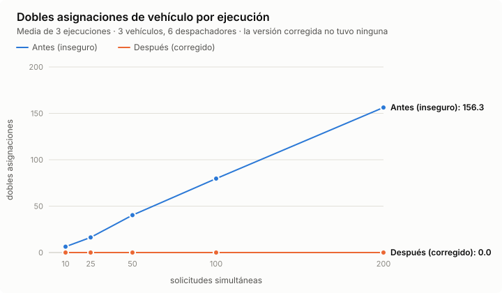
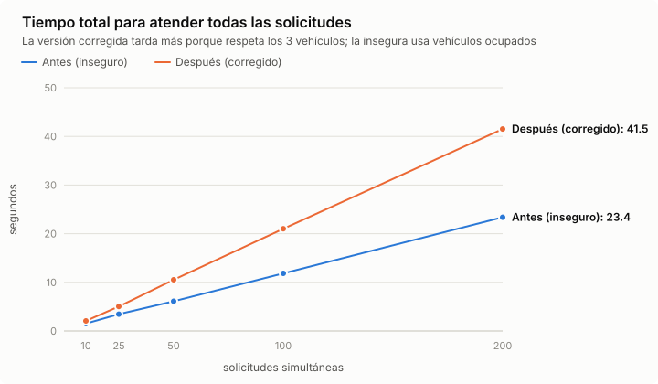
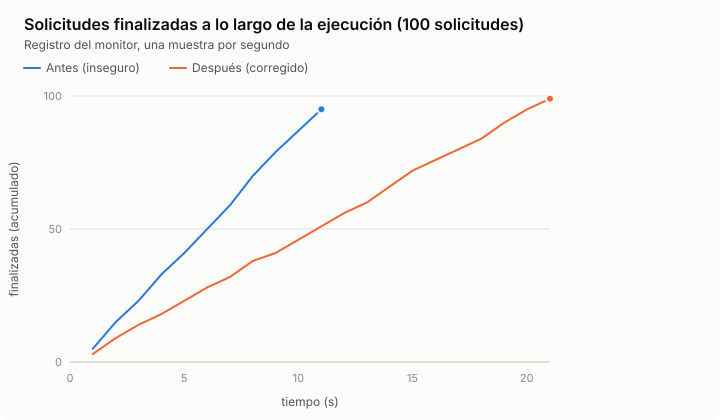
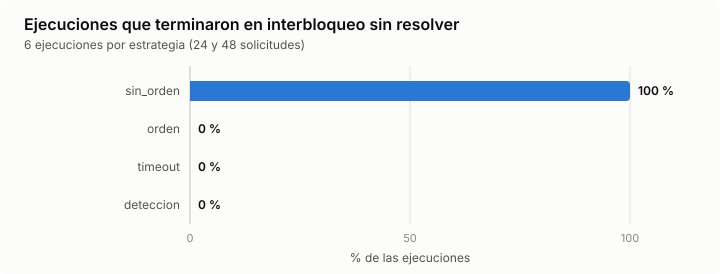
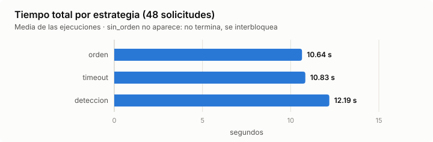
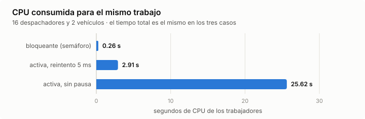
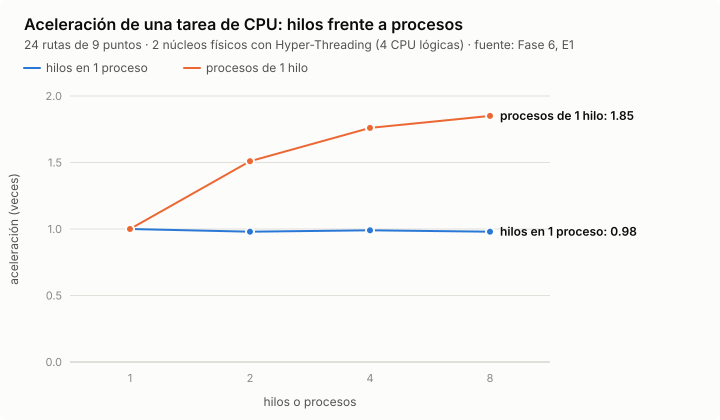
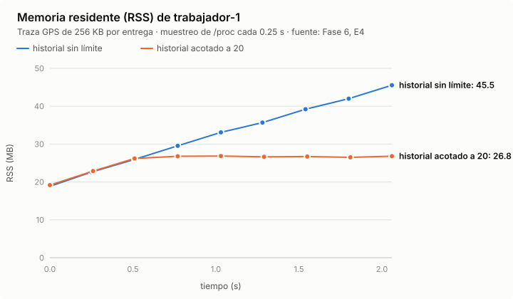

# Fase 8 — Resultados de la batería de experimentos

Generado por `experimentos/informe_fase8.py` a partir de `resultados.csv` (63 ejecuciones). Cada gráfica tiene su tabla gemela.

## 1. Antes / después con distinta cantidad de solicitudes simultáneas

2 trabajadores × 3 hilos, 3 vehículos, todas las solicitudes llegan en una ráfaga. 3 repeticiones por celda (media ± desviación).

| Solicitudes | Versión | Dobles asignaciones | % asignaciones en conflicto | Registros inconsistentes | Entregas simultáneas máx. (3 vehículos) | Tiempo total (s) | Rendimiento (sol/s) | Espera por vehículo (ms) | Exit 0 |
|---|---|---|---|---|---|---|---|---|---|
| 10 | Antes (inseguro) | 6.3 ± 0.6 | 63.3 ± 5.8 % | 7.7 ± 1.2 | 6.0 ± 0.0 | 1.52 ± 0.15 | 6.61 ± 0.68 | 11 ± 1 | 0/3 |
| 10 | Después (corregido) | 0.0 ± 0.0 | 0.0 ± 0.0 % | 0.0 ± 0.0 | 3.0 ± 0.0 | 2.08 ± 0.14 | 4.83 ± 0.32 | 396 ± 19 | 3/3 |
| 25 | Antes (inseguro) | 16.3 ± 3.2 | 65.3 ± 12.9 % | 18.0 ± 3.5 | 6.0 ± 0.0 | 3.46 ± 0.32 | 7.27 ± 0.69 | 11 ± 0 | 0/3 |
| 25 | Después (corregido) | 0.0 ± 0.0 | 0.0 ± 0.0 % | 0.0 ± 0.0 | 3.0 ± 0.0 | 5.04 ± 0.03 | 4.96 ± 0.03 | 522 ± 9 | 3/3 |
| 50 | Antes (inseguro) | 40.3 ± 0.6 | 80.7 ± 1.2 % | 41.0 ± 1.0 | 6.0 ± 0.0 | 6.10 ± 0.08 | 8.19 ± 0.12 | 11 ± 0 | 0/3 |
| 50 | Después (corregido) | 0.0 ± 0.0 | 0.0 ± 0.0 % | 0.0 ± 0.0 | 3.0 ± 0.0 | 10.53 ± 0.02 | 4.75 ± 0.01 | 596 ± 4 | 3/3 |
| 100 | Antes (inseguro) | 79.7 ± 5.0 | 79.7 ± 5.0 % | 80.7 ± 4.5 | 6.0 ± 0.0 | 11.84 ± 0.34 | 8.45 ± 0.24 | 11 ± 0 | 0/3 |
| 100 | Después (corregido) | 0.0 ± 0.0 | 0.0 ± 0.0 % | 0.0 ± 0.0 | 3.0 ± 0.0 | 21.02 ± 0.07 | 4.76 ± 0.02 | 614 ± 3 | 3/3 |
| 200 | Antes (inseguro) | 156.3 ± 13.9 | 78.2 ± 6.9 % | 157.0 ± 14.1 | 6.0 ± 0.0 | 23.38 ± 0.66 | 8.56 ± 0.25 | 11 ± 0 | 0/3 |
| 200 | Después (corregido) | 0.0 ± 0.0 | 0.0 ± 0.0 % | 0.0 ± 0.0 | 3.0 ± 0.0 | 41.53 ± 0.09 | 4.82 ± 0.01 | 621 ± 1 | 3/3 |

## 2. Estrategias frente al interbloqueo

Cargue (vehículo → andén) frente a inspección (andén → vehículo), 3 vehículos, 2 andenes, 1 inspector.

| Estrategia | Solicitudes | Ejecuciones | Interbloqueos sin resolver | Detectados | Recuperaciones | Reintentos por tiempo límite | Entregadas | Tiempo total (s) |
|---|---|---|---|---|---|---|---|---|
| sin_orden | 24 | 3 | 3/3 | 1.0 ± 0.0 | 0.0 ± 0.0 | 0.0 ± 0.0 | 12.7 ± 8.5 / 24 | — |
| sin_orden | 48 | 3 | 3/3 | 1.0 ± 0.0 | 0.0 ± 0.0 | 0.0 ± 0.0 | 20.3 ± 1.2 / 48 | — |
| orden | 24 | 3 | 0/3 | 0.0 ± 0.0 | 0.0 ± 0.0 | 0.0 ± 0.0 | 24.0 ± 0.0 / 24 | 5.18 ± 0.04 |
| orden | 48 | 3 | 0/3 | 0.0 ± 0.0 | 0.0 ± 0.0 | 0.0 ± 0.0 | 48.0 ± 0.0 / 48 | 10.64 ± 0.13 |
| timeout | 24 | 3 | 0/3 | 0.0 ± 0.0 | 0.0 ± 0.0 | 8.0 ± 2.6 | 24.0 ± 0.0 / 24 | 5.62 ± 0.20 |
| timeout | 48 | 3 | 0/3 | 0.0 ± 0.0 | 0.0 ± 0.0 | 9.3 ± 5.5 | 48.0 ± 0.0 / 48 | 10.83 ± 0.29 |
| deteccion | 24 | 3 | 0/3 | 3.7 ± 3.8 | 3.7 ± 3.8 | 0.0 ± 0.0 | 24.0 ± 0.0 / 24 | 9.55 ± 6.20 |
| deteccion | 48 | 3 | 0/3 | 3.0 ± 1.7 | 3.0 ± 1.7 | 0.0 ± 0.0 | 48.0 ± 0.0 / 48 | 12.19 ± 0.95 |

## 3. Espera bloqueante frente a espera activa

16 despachadores (4 × 4) compiten por 2 vehículos, 48 solicitudes, modo seguro.

| Espera | Tiempo total (s) | CPU de los trabajadores (s) | CPU media (%) | Cambios de contexto voluntarios | Reintentos de sondeo |
|---|---|---|---|---|---|
| bloqueante (semáforo) | 14.80 ± 0.04 | 0.26 ± 0.02 | 1.8 ± 0.2 | 1571 ± 76 | 0 ± 0 |
| activa, reintento 5 ms | 14.81 ± 0.15 | 2.91 ± 0.03 | 19.3 ± 0.1 | 49982 ± 1052 | 33064 ± 279 |
| activa, sin pausa | 14.87 ± 0.19 | 25.62 ± 0.32 | 169.3 ± 2.6 | 4223135 ± 48091 | 2025958 ± 12058 |

## 4. CPU: hilos frente a procesos (datos de la Fase 6, E1)

| Unidades | Aceleración con hilos (1 proceso) | Aceleración con procesos (1 hilo) |
|---|---|---|
| 1 | 1.0x | 1.0x |
| 2 | 0.98x | 1.51x |
| 4 | 0.99x | 1.76x |
| 8 | 0.98x | 1.85x |

## 5. Crecimiento de memoria (datos de la Fase 6, E4)

| t (s) | historial sin límite | historial acotado a 20 |
|---|---|---|
| 0.0 | 18.8 | 19.2 |
| 0.25 | 22.6 | — |
| 0.26 | — | 22.9 |
| 0.51 | 26.0 | 26.2 |
| 0.77 | 29.5 | 26.8 |
| 1.03 | 33.1 | 26.8 |
| 1.28 | 35.7 | — |
| 1.29 | — | 26.6 |
| 1.54 | 39.2 | — |
| 1.55 | — | 26.7 |
| 1.8 | 42.0 | — |
| 1.81 | — | 26.5 |
| 2.06 | 45.5 | 26.8 |

